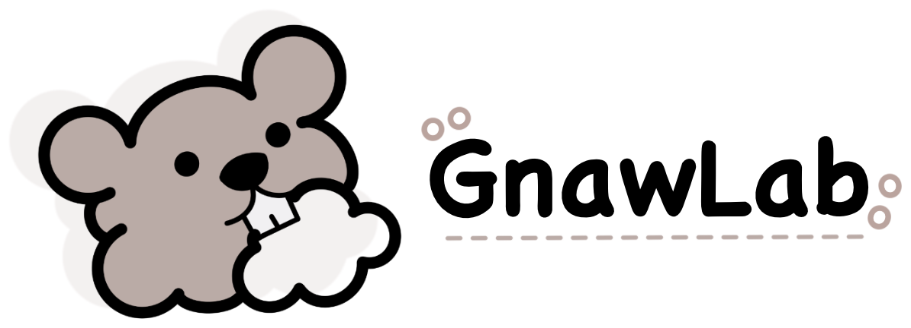

<p align="center">
  
</p>

<h1 align="center">GnawLab</h1>

<p align="center">
  <strong>A community-driven offensive cloud security training ground</strong><br>
  Master cloud exploitation through high-fidelity, real-world vulnerability scenarios
</p>

<p align="center">
  <a href="https://www.linkedin.com/groups/14865006/">Join us on LinkedIn</a>
</p>

---

## About Beaver Dam Community

**Beaver Dam Community** is a security community focused on offensive cloud security.

As cloud environments rapidly expand, security threats evolve alongside them. However, there's a significant gap in safe, hands-on learning environments for real cloud vulnerabilities. Most existing vulnerability labs focus on on-premise environments or fail to cover cloud-specific attack vectors like IAM privilege escalation, metadata service abuse, and cross-service trust relationship exploitation.

**GnawLab** was created to bridge this gap:

- Reproduce real-world cloud vulnerability scenarios in actual cloud environments
- Provide CTF-style hands-on learning experiences
- Offer progressive difficulty levels from beginner to advanced
- Enable easy deployment and cleanup with Terraform

Just as beavers build dams piece by piece, we build cloud security knowledge step by step.

---

## Scenarios

### AWS

| Category | Scenario | Status | Description |
|----------|----------|--------|-------------|
| **01-beginner** | [s3-data-heist](./scenarios/aws/01-beginner/01-single-hop/s3-data-heist/) | ✅ Available | S3 bucket misconfiguration exploitation |
| | [metadata-pivot](./scenarios/aws/01-beginner/02-single-hop-combo/metadata-pivot/) | ✅ Available | SSRF to IMDS credential theft |
| | [secrets-extraction](./scenarios/aws/01-beginner/02-single-hop-combo/secrets-extraction/) | ✅ Available | Secrets Manager extraction via command injection |
| | [ebs-snapshot-theft](./scenarios/aws/01-beginner/02-single-hop-combo/ebs-snapshot-theft/) | 🚧 Coming Soon | EBS snapshot exposure |
| | [policy-rollback](./scenarios/aws/01-beginner/02-single-hop-combo/policy-rollback/) | 🚧 Coming Soon | IAM policy version rollback |
| | [credential-chain](./scenarios/aws/01-beginner/03-multi-hop/credential-chain/) | 🚧 Coming Soon | Multi-hop credential pivoting |
| | [ec2-role-hijack](./scenarios/aws/01-beginner/04-multi-hop-combo/ec2-role-hijack/) | 🚧 Coming Soon | EC2 instance role hijacking |
| | [lambda-backdoor](./scenarios/aws/01-beginner/04-multi-hop-combo/lambda-backdoor/) | 🚧 Coming Soon | Lambda function backdoor injection |
| **02-shadow-api** | [legacy-bridge](./scenarios/aws/02-shadow-api/legacy-bridge/) | ✅ Available | Shadow API discovery and exploitation |
| **03-supply-chain** | [cicd-eic-pivot](./scenarios/aws/03-supply-chain/cicd-eic-pivot/) | ✅ Available | CI/CD pipeline exploitation via EIC |
| **04-ai-security** | [bedrock-kb-poisoning](./scenarios/aws/04-ai-security/bedrock-kb-poisoning/) | ✅ Available | Bedrock Knowledge Base data poisoning |
| **05-zero-trust** | [watchdog_trap](./scenarios/aws/05-zero-trust/watchdog_trap/) | ✅ Available | Zero trust bypass techniques |

---

## Quick Start

### Prerequisites

- [Terraform](https://www.terraform.io/downloads) >= 1.5.0
- [AWS CLI](https://aws.amazon.com/cli/) v2
- AWS Account with admin access (for resource creation)

### AWS CLI Profile Setup

All GnawLab scenarios use the `GnawLab` AWS CLI profile:

```bash
aws configure --profile GnawLab
# AWS Access Key ID: <your-admin-access-key>
# AWS Secret Access Key: <your-admin-secret-key>
# Default region name: us-east-1
# Default output format: json
```

### Deploy a Scenario

```bash
cd scenarios/aws/01-beginner/01-single-hop/s3-data-heist/terraform
terraform init
terraform apply
```

### Get Scenario Credentials

```bash
terraform output -json leaked_credentials
```

Configure a separate profile for the challenge:

```bash
aws configure --profile victim
# Use the leaked credentials from terraform output
```

### Cleanup

```bash
terraform destroy
```

---

## Community

- [LinkedIn Group](https://www.linkedin.com/groups/14865006/) — Join the Beaver Dam Community
- [GitHub Issues](../../issues) — Report bugs or request features

---

## Contributing

We welcome contributions! Whether it's a new scenario, bug fix, or documentation improvement.

See [CONTRIBUTING.md](./CONTRIBUTING.md) for guidelines.

---

## License

This project is for educational purposes only. Use responsibly and only in environments you own or have explicit permission to test.
