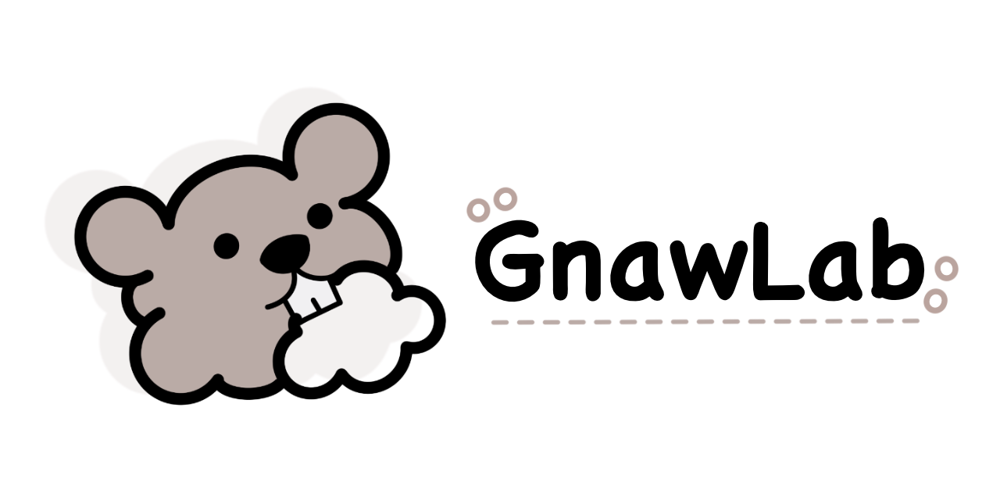

<p align="center">
  
</p>

<h1 align="center">GnawLab</h1>

<p align="center">
  <strong>A community-driven offensive cloud security training ground</strong><br>
  Master cloud exploitation through high-fidelity, real-world vulnerability scenarios
</p>

<p align="center">
  <a href="https://www.linkedin.com/groups/14865006/">Join us on LinkedIn</a>
</p>

---

## About Beaver Dam Community

**Beaver Dam Community** is a security community focused on offensive cloud security.

As cloud environments rapidly expand, security threats evolve alongside them. However, there's a significant gap in safe, hands-on learning environments for real cloud vulnerabilities. Most existing vulnerability labs focus on on-premise environments or fail to cover cloud-specific attack vectors like IAM privilege escalation, metadata service abuse, and cross-service trust relationship exploitation.

**GnawLab** was created to bridge this gap:

- Reproduce real-world cloud vulnerability scenarios in actual cloud environments
- Provide CTF-style hands-on learning experiences
- Offer progressive difficulty levels from beginner to advanced
- Enable easy deployment and cleanup with Terraform

Just as beavers build dams piece by piece, we build cloud security knowledge step by step.

---

## Scenarios

GnawLab currently contains **14 deployable AWS scenarios** and **3 planned scenarios**. An available scenario includes Terraform infrastructure and scenario-specific setup, walkthrough, and cleanup documentation.

| Category | Scenario | Difficulty | Status | Attack path |
|----------|----------|------------|--------|-------------|
| **01-beginner** | [s3-data-heist](./scenarios/aws/01-beginner/01-single-hop/s3-data-heist/) | Easy | ✅ Available | Leaked IAM credentials → S3 enumeration and data exfiltration |
| | [ebs-snapshot-theft](./scenarios/aws/01-beginner/01-single-hop/ebs-snapshot-theft/) | Easy | ✅ Available | Exposed EBS snapshot → attacker EC2 instance → data extraction |
| | [metadata-pivot](./scenarios/aws/01-beginner/02-single-hop-combo/metadata-pivot/) | Medium | ✅ Available | SSRF → IMDS credentials → S3 data exfiltration |
| | [secrets-extraction](./scenarios/aws/01-beginner/02-single-hop-combo/secrets-extraction/) | Easy | ✅ Available | Command injection → ECS task credentials → Secrets Manager |
| | [policy-rollback](./scenarios/aws/01-beginner/02-single-hop-combo/policy-rollback/) | Medium | ✅ Available | IAM policy version rollback → privilege escalation |
| | [credential-chain](./scenarios/aws/01-beginner/03-multi-hop/credential-chain/) | Hard | 🚧 Planned | Multi-service credential chaining and escalation |
| | [ec2-role-hijack](./scenarios/aws/01-beginner/04-multi-hop-combo/ec2-role-hijack/) | Hard | 🚧 Planned | PassRole → EC2 launch with a privileged role |
| | [lambda-backdoor](./scenarios/aws/01-beginner/04-multi-hop-combo/lambda-backdoor/) | Hard | 🚧 Planned | PassRole → privileged Lambda code execution |
| **02-shadow-api** | [legacy-bridge](./scenarios/aws/02-shadow-api/legacy-bridge/) | Easy | ✅ Available | SSRF into a legacy API → IMDSv1 credentials → S3 exfiltration |
| | [code-judge-escape](./scenarios/aws/02-shadow-api/code-judge-escape/) | Hard | ✅ Available | Pickle RCE → Docker socket → IMDSv2 → ECS Exec |
| **03-supply-chain** | [cicd-eic-pivot](./scenarios/aws/03-supply-chain/cicd-eic-pivot/) | Medium | ✅ Available | Atlantis CI/CD abuse → IAM credentials → EC2 Instance Connect |
| | [golden-drift](./scenarios/aws/03-supply-chain/golden-drift/) | Medium | ✅ Available | AMI name confusion → SSM pointer poisoning → ASG compromise |
| | [dam-breaks](./scenarios/aws/03-supply-chain/dam-breaks/) | Medium | ✅ Available | Cognito credentials → CodeBuild override → ECS task role |
| **04-ai-security** | [bedrock-kb-poisoning](./scenarios/aws/04-ai-security/bedrock-kb-poisoning/) | Hard | ✅ Available | RAG corpus poisoning → indirect prompt injection → unauthorized presigned URL |
| **05-zero-trust** | [watchdog-trap](./scenarios/aws/05-zero-trust/watchdog_trap/) | Hard | ✅ Available | SSTI/RCE → internal tool pivot → CI/CD and ECS compromise |
| **06-misconfiguration** | [obfuscated-policy](./scenarios/aws/06-misconfiguration/obfuscated-policy/) | Easy | ✅ Available | IAM action wildcard obfuscation → detector bypass → S3 access |
| **07-cve** | [hidden-track](./scenarios/aws/07-cve/hidden-track/) | Medium | ✅ Available | ExifTool CVE-2021-22204 → Lambda credentials → S3 version recovery |

Difficulty values and detailed prerequisites are maintained in each scenario's README and setup guide.

---

## Quick Start

### Prerequisites

- [Terraform](https://developer.hashicorp.com/terraform/install) >= 1.5.0
- [AWS CLI](https://docs.aws.amazon.com/cli/latest/userguide/getting-started-install.html) v2
- An AWS account with permissions to create the resources listed by the selected scenario
- Any additional tools listed in that scenario's `setup.md`

> [!CAUTION]
> These scenarios intentionally deploy vulnerable resources and may incur AWS charges. Deploy them only in an account you control, restrict access as described in the setup guide, and remove all resources when finished.

### Configure AWS Credentials

Most scenarios default to the `GnawLab` AWS CLI profile and the `us-east-1` region:

```bash
aws configure --profile GnawLab
aws sts get-caller-identity --profile GnawLab
```

You can select another profile where supported by passing a Terraform variable, for example `-var="profile=my-admin-profile"`. `watchdog-trap` instead uses the standard AWS credential chain (default profile or environment variables); see its setup guide.

### Deploy a Scenario

Read the scenario's `README.md` and `setup.md` before deploying. For example:

```bash
cd scenarios/aws/01-beginner/01-single-hop/s3-data-heist
cat setup.md
cd terraform
terraform init
terraform plan
terraform apply
```

Inspect the scenario-specific outputs after deployment:

```bash
terraform output
```

Output names, participant starting points, required post-deployment steps, and deployment times vary by scenario. Follow the selected scenario's setup guide rather than assuming credentials are always returned. For example, [`watchdog-trap`](./scenarios/aws/05-zero-trust/watchdog_trap/setup.md) recommends its automated `deploy.sh` flow.

### Cleanup

Read the scenario's `cleanup.md` first. Some challenges create participant-managed resources that must be removed before Terraform can destroy the lab infrastructure.

```bash
# Run any scenario-specific pre-cleanup steps first.
cd terraform
terraform destroy
```

Confirm that the destroy completed successfully and check the AWS account for any remaining scenario resources.

---

## Community

- [LinkedIn Group](https://www.linkedin.com/groups/14865006/) — Join the Beaver Dam Community
- [GitHub Issues](https://github.com/Beaver-Dam-Community/GnawLab/issues) — Report bugs or request features

---

## Contributing

We welcome contributions, whether they add a new scenario, fix a bug, or improve documentation.

See [CONTRIBUTING.md](./CONTRIBUTING.md) for guidelines.

---

## License

Licensed under the [Apache License 2.0](./LICENSE). These intentionally vulnerable scenarios are for educational use only. Use them responsibly and only in environments you own or have explicit permission to test.
