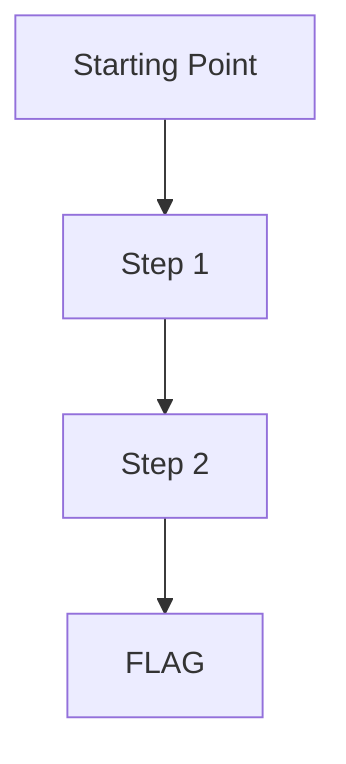

# Scenario Name

**Difficulty:** Easy | Medium | Hard | Expert
**Estimated Time:** 30 min
**Type:** single-hop | single-hop-combo | multi-hop | multi-hop-combo

## Overview

Brief description of the scenario. Include the fictional company name and the attacker's starting context.

### References

- **Real-world incident name (Year)** - Brief description of relevance
  - [Source Title](URL)
- MITRE ATT&CK: [TXXXX - Technique Name](https://attack.mitre.org/techniques/TXXXX/)

## Learning Objectives

- What the learner will understand after completing this scenario

## Scenario Resources

- AWS resources created by Terraform (e.g., 1 IAM User, 1 S3 Bucket)

## Starting Point

What is given to the learner:
- AWS Access Key ID
- AWS Secret Access Key

## Goal

What the learner must achieve (e.g., retrieve the flag from X).

## Setup & Cleanup

- [setup.md](./setup.md) - Deploy scenario infrastructure
- [cleanup.md](./cleanup.md) - Remove all resources

> **Warning:** This scenario creates real AWS resources that may incur costs.

## Walkthrough

See [walkthrough.md](./walkthrough.md) for detailed exploitation steps.
