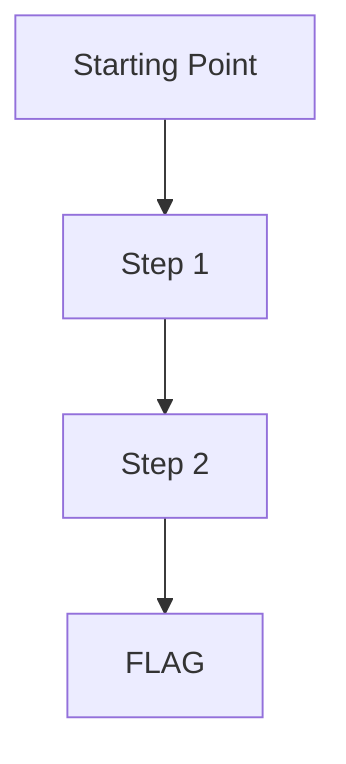

# Scenario Name - Walkthrough

## Attack Path

## Step 1: Identity Confirmation

(Verify who you are)

## Step 2: Permission Enumeration

(Enumerate all available permissions)

## Step 3: Exploit

(Execute attack based on discovered permissions)

## Step 4: Capture the Flag

(Retrieve the flag)
