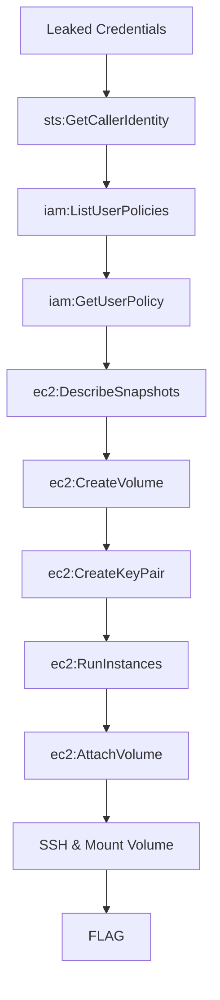

# EBS Snapshot Theft

**Difficulty:** Easy  
**Estimated Time:** 25 min  
**Type:** single-hop

## Overview

While scanning public repositories, you discovered AWS credentials from **Beaver Tech Inc.** in a commit history. Intelligence suggests a decommissioned server's backup snapshot might contain sensitive data.

Resurrect the dead volume and steal its secrets.

### References

- **DefCon 27 (2019)** - Ben Morris research: Hundreds of thousands of publicly exposed EBS snapshots containing sensitive data (encryption keys, passwords, authentication tokens, PII)
  - [Security Boulevard: Amazon EBS Snapshots Exposed Publicly](https://securityboulevard.com/2019/08/amazon-ebs-snapshots-exposed-publicly-leaking-sensitive-data-in-hundreds-of-thousands-security-analyst-reveals-at-defcon-27/)
- **Rhino Security Labs** - EBS snapshot exploration techniques
  - [Downloading and Exploring AWS EBS Snapshots](https://rhinosecuritylabs.com/aws/exploring-aws-ebs-snapshots/)
- **Datadog Security Labs** - Cloud Security Atlas
  - [Stealing an EBS Snapshot](https://securitylabs.datadoghq.com/cloud-security-atlas/attacks/sharing-ebs-snapshot/)
- MITRE ATT&CK: [T1530 - Data from Cloud Storage](https://attack.mitre.org/techniques/T1530/)

## Learning Objectives

- Understand EBS snapshot permissions and data exposure risks
- Learn EC2 instance creation with attached volumes
- Practice volume mounting and data extraction techniques

## Scenario Resources

- 1 IAM User with EC2/EBS permissions
- 1 EBS Snapshot containing sensitive data
- 1 VPC with public subnet

## Starting Point

Credentials discovered in a public repository:
- AWS Access Key ID
- AWS Secret Access Key

## Goal

Extract the flag hidden in the snapshot's buried data.

## Setup & Cleanup

- [setup.md](./setup.md) - Deploy scenario infrastructure
- [cleanup.md](./cleanup.md) - Remove all resources

> **Warning:** This scenario creates real AWS resources that may incur costs.

## Walkthrough

See [walkthrough.md](./walkthrough.md) for detailed exploitation steps.
