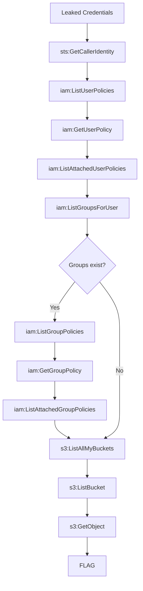

# S3 Data Heist

**Difficulty:** Easy  
**Estimated Time:** 20 min  
**Category:** single-hop

## Overview

While scanning public repositories, you discovered AWS credentials from **Beaver Rides Inc.** in a commit history. Intelligence suggests this company stores sensitive customer data somewhere in their cloud infrastructure.

Find the flag before the credentials get rotated.

### References

- **Uber Data Breach (2016)** - Credentials in GitHub → S3 access → 57M records stolen → $148M settlement
  - [Bloomberg: Uber Paid Hackers to Delete Stolen Data](https://www.bloomberg.com/news/articles/2017-11-21/uber-concealed-cyberattack-that-exposed-57-million-people-s-data)
- MITRE ATT&CK: [T1530 - Data from Cloud Storage](https://attack.mitre.org/techniques/T1530/)

## Learning Objectives

- Understand AWS credential configuration and identity verification
- Learn S3 bucket enumeration techniques
- Practice data exfiltration from cloud storage

## Scenario Resources

- 1 IAM User with programmatic access
- 1 S3 Bucket containing sensitive data

## Starting Point

Credentials discovered in a public repository:
- AWS Access Key ID
- AWS Secret Access Key

## Goal

Locate and retrieve the flag hidden in cloud storage.

## Setup & Cleanup

- [setup.md](./setup.md) - Deploy scenario infrastructure
- [cleanup.md](./cleanup.md) - Remove all resources

> **Warning:** This scenario creates real AWS resources that may incur costs.

## Walkthrough

See [walkthrough.md](./walkthrough.md) for detailed exploitation steps.
