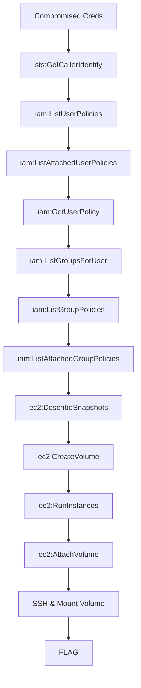

# EBS Snapshot Theft

**Difficulty:** Medium  
**Estimated Time:** 35 min  
**Category:** single-hop-combo

## Overview

You've compromised credentials at **Beaver Tech Inc.** with EC2 and EBS permissions. Initial reconnaissance reveals an interesting snapshot in the environment — it appears to be from a decommissioned server that once held sensitive data.

Resurrect the dead volume and steal its secrets.

### References

- **Datadog Security Labs Research (2024)** - EBS snapshot exfiltration techniques and data exposure risks
  - [Datadog: Stealing an EBS Snapshot](https://securitylabs.datadoghq.com/cloud-security-atlas/attacks/sharing-ebs-snapshot/)
- MITRE ATT&CK: [T1578.002 - Modify Cloud Compute Infrastructure: Create Snapshot](https://attack.mitre.org/techniques/T1578/002/)

## Learning Objectives

- Understand EBS snapshot permissions and data exposure risks
- Learn EC2 instance creation with attached volumes
- Practice volume mounting and data extraction techniques

## Scenario Resources

- 1 IAM User with EC2/EBS permissions
- 1 EBS Snapshot containing sensitive data
- 1 VPC with public subnet

## Starting Point

Compromised credentials with:
- AWS Access Key ID
- AWS Secret Access Key

## Goal

Extract the flag hidden in the snapshot's buried data.

## Setup & Cleanup

- [setup.md](./setup.md) - Deploy scenario infrastructure
- [cleanup.md](./cleanup.md) - Remove all resources

> **Warning:** This scenario creates real AWS resources that may incur costs.

## Walkthrough

See [walkthrough.md](./walkthrough.md) for detailed exploitation steps.
