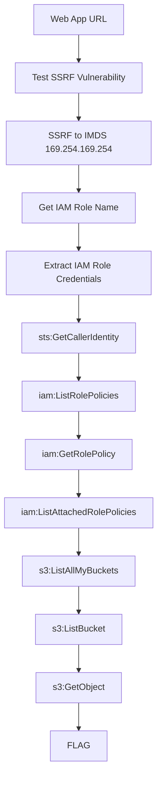

# Metadata Pivot

**Difficulty:** Medium  
**Estimated Time:** 40 min  
**Category:** single-hop-combo

## Overview

You've discovered a web application at **Beaver Dam Bank** running on EC2. The bank offers a "Custom Card Designer" feature that lets customers personalize their credit cards with custom images by providing an image URL.

The application doesn't properly validate user-supplied URLs before fetching them server-side.

Pivot through the metadata service to reach the treasure beyond.

### References

- **Capital One Data Breach (2019)** - SSRF → IMDS → S3 access → 100M+ records stolen → $80M fine
  - [Krebs on Security: Capital One Breach Analysis](https://krebsonsecurity.com/2019/07/capital-one-data-theft-impacts-106m-people/)
  - [Rhino Security: CloudGoat ec2_ssrf Walkthrough](https://rhinosecuritylabs.com/cloud-security/cloudgoat-aws-scenario-ec2_ssrf/)
- MITRE ATT&CK: [T1552.005 - Unsecured Credentials: Cloud Instance Metadata API](https://attack.mitre.org/techniques/T1552/005/)

## Learning Objectives

- Understand Server-Side Request Forgery (SSRF) vulnerabilities
- Learn EC2 Instance Metadata Service (IMDS) exploitation
- Practice credential extraction and lateral movement

## Scenario Resources

- 1 EC2 Instance with vulnerable web application
- 1 IAM Role attached to EC2 with S3 access
- 1 S3 Bucket containing sensitive data
- 1 VPC with public subnet

## Starting Point

You have discovered:
- A web application URL (Beaver Dam Bank - Custom Card Designer)

## Goal

Exploit the vulnerability chain to retrieve the flag from cloud storage.

## Setup & Cleanup

- [setup.md](./setup.md) - Deploy scenario infrastructure
- [cleanup.md](./cleanup.md) - Remove all resources

> **Warning:** This scenario creates real AWS resources that may incur costs.

## Walkthrough

See [walkthrough.md](./walkthrough.md) for detailed exploitation steps.
