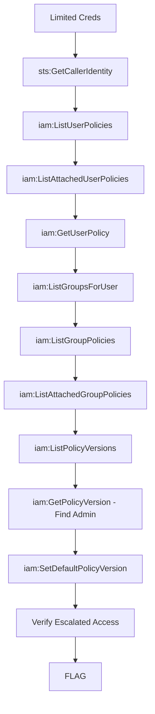

# Policy Rollback

**Difficulty:** Medium  
**Estimated Time:** 30 min  
**Type:** single-hop-combo

## Overview

**Beaver Dam Industries** recently restricted your access after a security review. However, you notice you still have permissions to manage policy versions.

Dig through the policy archaeology and find a way to escalate.

### References

- **CloudGoat: iam_privesc_by_rollback** - Rhino Security Labs documented privilege escalation via policy version rollback
  - [CloudGoat Scenario Walkthrough](https://rhinosecuritylabs.com/aws/aws-privilege-escalation-methods-mitigation/)
  - [Rhino Security: AWS IAM Privilege Escalation](https://github.com/RhinoSecurityLabs/AWS-IAM-Privilege-Escalation)
- MITRE ATT&CK: [T1098 - Account Manipulation](https://attack.mitre.org/techniques/T1098/)

## Learning Objectives

- Understand IAM policy versioning and its security implications
- Learn policy version enumeration techniques
- Practice privilege escalation via policy rollback

## Scenario Resources

- 1 IAM User with limited permissions
- 1 IAM Policy with multiple versions (including a permissive historical version)

## Starting Point

Credentials with restricted access:
- AWS Access Key ID
- AWS Secret Access Key

## Goal

Escalate privileges and retrieve the flag.

## Setup & Cleanup

- [setup.md](./setup.md) - Deploy scenario infrastructure
- [cleanup.md](./cleanup.md) - Remove all resources

> **Warning:** This scenario creates real AWS resources that may incur costs.

## Walkthrough

See [walkthrough.md](./walkthrough.md) for detailed exploitation steps.
