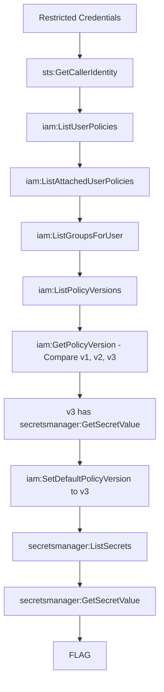

# Policy Rollback

**Difficulty:** Medium  
**Estimated Time:** 30 min  
**Type:** single-hop-combo

## Overview

During a production outage last month, the DevOps team at **Beaver Dam Industries** temporarily elevated your IAM permissions to help troubleshoot. After the incident, they created a new restricted policy version (v3) and set it as default.

However, they kept the old versions for "audit purposes" and forgot to remove your `iam:SetDefaultPolicyVersion` permission. AWS IAM policies retain up to 5 versions — and version 1 still has full access.

Roll back time.

### References

- **Rhino Security Labs (2018)** - First documented 21 AWS IAM privilege escalation methods including SetDefaultPolicyVersion
  - [AWS IAM Privilege Escalation – Methods and Mitigation](https://rhinosecuritylabs.com/aws/aws-privilege-escalation-methods-mitigation/)
  - [GitHub: AWS-IAM-Privilege-Escalation](https://github.com/RhinoSecurityLabs/AWS-IAM-Privilege-Escalation)
- **Detection Rules** - SetDefaultPolicyVersion is monitored as a critical security event
  - [Splunk: SetDefaultPolicyVersion Detection](https://research.splunk.com/attack_data/cc9b2643-efc9-11eb-926b-550bf0943fbb/)
  - [AlphaSoc: IAM Default Policy Version Anomaly](https://docs.alphasoc.com/detections_and_findings/alphasoc_detections/aws_set_default_policy_version_anomaly/)
- MITRE ATT&CK: [T1098.001 - Account Manipulation: Additional Cloud Credentials](https://attack.mitre.org/techniques/T1098/001/)

## Learning Objectives

- Understand AWS IAM managed policy versioning mechanism
- Learn to enumerate and compare policy versions
- Practice privilege escalation via SetDefaultPolicyVersion

## Scenario Resources

- 1 IAM User with restricted permissions
- 1 Customer Managed Policy with 3 versions
- 1 Secrets Manager Secret containing the flag

## Starting Point

Credentials for a restricted IAM user:
- AWS Access Key ID
- AWS Secret Access Key

## Goal

Escalate privileges by rolling back to a permissive policy version and retrieve the flag.

## Setup & Cleanup

- [setup.md](./setup.md) - Deploy scenario infrastructure
- [cleanup.md](./cleanup.md) - Remove all resources

> **Warning:** This scenario creates real AWS resources that may incur costs.

## Walkthrough

See [walkthrough.md](./walkthrough.md) for detailed exploitation steps.
