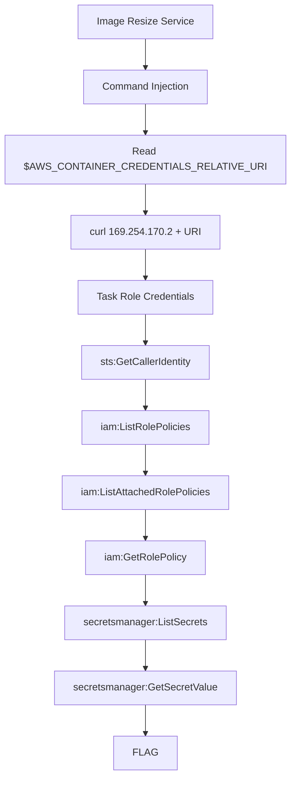

# Secrets Extraction

**Difficulty:** Easy  
**Estimated Time:** 30 min  
**Category:** single-hop

## Overview

**Beaver Finance Corp.** runs an internal image processing service on ECS. The service allows employees to resize images for reports and presentations.

During a routine security assessment, you discovered that the image resize endpoint passes user input directly to a shell command. Exploit this vulnerability to access the company's secrets vault.

### References

- **OS Command Injection** - PortSwigger Web Security Academy
  - [PortSwigger: OS Command Injection](https://portswigger.net/web-security/os-command-injection)
- **LexisNexis Data Breach (2025)** - React RCE → Overprivileged ECS Task Role → Secrets Manager access → 53 secrets stolen
  - [Aembit: How a Single Overprivileged Service Turned the LexisNexis Breach Into a Keys-to-the-Kingdom Moment](https://aembit.io/blog/lexisnexis-breach-highlights-risks-of-over-privileged-aws-secrets-manager-access/)
- MITRE ATT&CK: [T1059.004 - Command and Scripting Interpreter: Unix Shell](https://attack.mitre.org/techniques/T1059/004/)
- MITRE ATT&CK: [T1555.006 - Credentials from Password Stores: Cloud Secrets Management Stores](https://attack.mitre.org/techniques/T1555/006/)

## Learning Objectives

- Identify and exploit OS command injection vulnerabilities
- Understand ECS Task Role credential retrieval from container metadata
- Learn AWS Secrets Manager enumeration and extraction techniques

## Scenario Resources

- 1 ECS Service running a vulnerable image resize web application
- 1 Application Load Balancer exposing the service
- 1 ECS Task Role with overprivileged Secrets Manager access
- 1 Secrets Manager secret containing sensitive data
- 1 KMS Key for secret encryption

## Starting Point

URL to the image resize service:
- `http://<alb-dns-name>/resize`

## Goal

Extract the flag stored in AWS Secrets Manager.

## Setup & Cleanup

- [setup.md](./setup.md) - Deploy scenario infrastructure
- [cleanup.md](./cleanup.md) - Remove all resources

> **Warning:** This scenario creates real AWS resources that may incur costs.

## Walkthrough

See [walkthrough.md](./walkthrough.md) for detailed exploitation steps.
