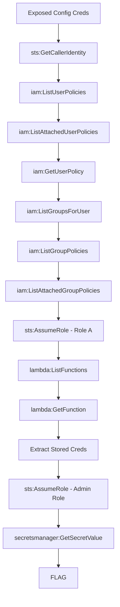

# Credential Chain

**Difficulty:** Hard  
**Estimated Time:** 45 min  
**Category:** multi-hop

## Overview

You've obtained credentials from an exposed configuration file at **Beaver Cloud Services**. The initial access seems limited, but in cloud environments, one credential often leads to another.

Chain your way through the environment. The flag awaits at the end of the path.

### References

- **Sysdig TRT: 8-Minute Cloud Compromise (2025)** - Credential chain attack → 19 principals compromised → Full admin in 8 minutes
  - [CSO Online: AI Supercharges AWS Attack Chain](https://www.csoonline.com/article/4126336/from-credentials-to-cloud-admin-in-8-minutes-ai-supercharges-aws-attack-chain.html)
  - [The Register: AWS Cloud Break-in](https://www.theregister.com/2026/02/04/aws_cloud_breakin_ai_assist/)
- MITRE ATT&CK: [T1078.004 - Valid Accounts: Cloud Accounts](https://attack.mitre.org/techniques/T1078/004/)

## Learning Objectives

- Understand IAM permission enumeration techniques
- Learn credential discovery across AWS services
- Practice multi-step privilege escalation

## Scenario Resources

- 1 IAM User with limited initial permissions
- Multiple IAM Roles with varying privileges
- 1 Lambda Function with stored credentials
- 1 Secrets Manager secret (final target)

## Starting Point

Credentials discovered in exposed config:
- AWS Access Key ID
- AWS Secret Access Key

## Goal

Navigate the credential chain to retrieve the final flag.

## Setup & Cleanup

- [setup.md](./setup.md) - Deploy scenario infrastructure
- [cleanup.md](./cleanup.md) - Remove all resources

> **Warning:** This scenario creates real AWS resources that may incur costs.

## Walkthrough

See [walkthrough.md](./walkthrough.md) for detailed exploitation steps.
