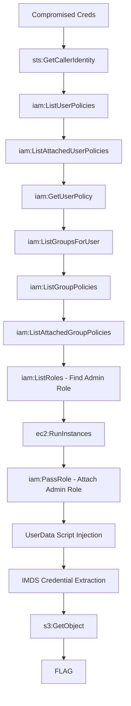

# EC2 Role Hijack

**Difficulty:** Hard  
**Estimated Time:** 55 min  
**Category:** multi-hop-combo

## Overview

You've compromised credentials at **Beaver Compute Corp.** with EC2 management permissions. The environment has a powerful IAM role designed for administrative tasks — but it's not attached to anything you control. Yet.

Spin up your own instance. Hijack the role. Own the environment.

### References

- **AWS IAM Privilege Escalation Research** - PassRole + RunInstances → Instance Profile hijacking
  - [Rhino Security: AWS IAM Privilege Escalation Methods](https://rhinosecuritylabs.com/aws/aws-privilege-escalation-methods-mitigation/)
  - [CyberSecPentesting: 7 Key IAM Escalation Paths](https://cybersecpentesting.com/blog/aws-iam-privilege-escalation.html)
- MITRE ATT&CK: [T1078.004 - Valid Accounts: Cloud Accounts](https://attack.mitre.org/techniques/T1078/004/)

## Learning Objectives

- Understand EC2 instance profile and role attachment
- Learn UserData script injection techniques
- Practice compute-based privilege escalation

## Scenario Resources

- 1 IAM User with EC2 and PassRole permissions
- 1 High-privilege IAM Role (instance profile)
- 1 VPC with public subnet
- 1 S3 Bucket containing sensitive data

## Starting Point

Compromised credentials with:
- AWS Access Key ID
- AWS Secret Access Key

## Goal

Launch your attack infrastructure and retrieve the flag.

## Setup & Cleanup

- [setup.md](./setup.md) - Deploy scenario infrastructure
- [cleanup.md](./cleanup.md) - Remove all resources

> **Warning:** This scenario creates real AWS resources that may incur costs.

## Walkthrough

See [walkthrough.md](./walkthrough.md) for detailed exploitation steps.
