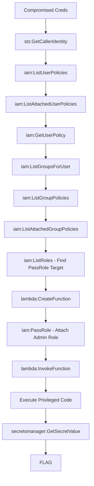

# Lambda Backdoor

**Difficulty:** Hard  
**Estimated Time:** 50 min  
**Category:** multi-hop-combo

## Overview

You've discovered credentials at **Beaver Serverless Co.** with permissions to interact with Lambda functions. More interestingly, there's a powerful IAM role sitting unused in the environment — one that can be passed to Lambda functions.

Create your own backdoor. Make the serverless infrastructure work for you.

### References

- **CloudGoat: lambda_privesc** - PassRole + Lambda privilege escalation technique
  - [CloudGoat Lambda Privesc Walkthrough](https://pswalia2u.medium.com/cloudgoat-aws-ctf-solution-scenerio-3-lambda-privesc-cbae38e60050)
  - [HackTricks: AWS Lambda Privilege Escalation](https://cloud.hacktricks.xyz/pentesting-cloud/aws-security/aws-privilege-escalation/aws-lambda-privesc)
- MITRE ATT&CK: [T1098.003 - Account Manipulation: Additional Cloud Roles](https://attack.mitre.org/techniques/T1098/003/)

## Learning Objectives

- Understand iam:PassRole permission implications
- Learn Lambda function creation and role attachment
- Practice serverless privilege escalation techniques

## Scenario Resources

- 1 IAM User with Lambda and PassRole permissions
- 1 High-privilege IAM Role (passable to Lambda)
- 1 Secrets Manager secret (target)
- 1 KMS Key for encryption

## Starting Point

Compromised credentials with:
- AWS Access Key ID
- AWS Secret Access Key

## Goal

Leverage the serverless infrastructure to retrieve the flag.

## Setup & Cleanup

- [setup.md](./setup.md) - Deploy scenario infrastructure
- [cleanup.md](./cleanup.md) - Remove all resources

> **Warning:** This scenario creates real AWS resources that may incur costs.

## Walkthrough

See [walkthrough.md](./walkthrough.md) for detailed exploitation steps.
