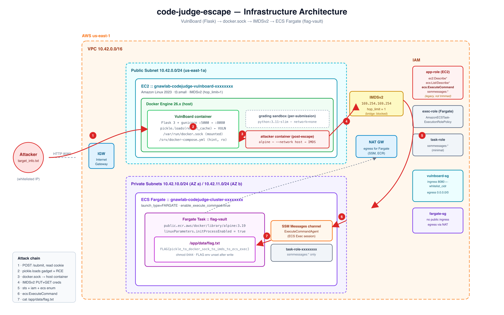
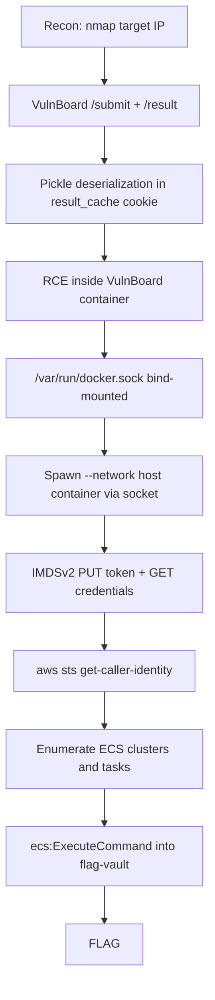

# Code Judge Escape

**Difficulty:** Hard  
**Estimated Time:** 60-90 min  
**Type:** multi-hop-chain

## Overview

**Beaver Recruit Inc.** built **VulnBoard**, an internal Python coding-evaluation platform, to assess engineering candidates and run quarterly internal evaluations. The platform was originally locked behind a VPN; when the recruitment team expanded the program to external applicants, the platform team opened ingress to `0.0.0.0/0` "just for the recruiting window." The change was never rolled back, leaving an internal grading service permanently exposed on the public internet.

VulnBoard grades each submission by spawning an ephemeral `python:3.11-slim` container per request. To do that, the app container needs to reach the host Docker daemon, so `/var/run/docker.sock` is bind-mounted into it — a HIGH-severity anti-pattern documented by Aqua AVD-KSV-0006 and the Trail of Bits container-escape post. An early developer also pickled the custom `GradeResult` class into a `result_cache` cookie to skip a JSON migration; the `SECURITY-142` ticket to move to signed JSON is still open. Both shortcuts shipped to production.

Starting from nothing but the public IP in `target_info.txt`, players must exploit pickle deserialization on the `result_cache` cookie to gain RCE inside the VulnBoard container, abuse the bind-mounted Docker socket to spawn a host-network container that reaches IMDSv2 with `hop_limit = 1`, steal the EC2 instance role's temporary credentials, enumerate ECS, and use the role's left-over `ecs:ExecuteCommand` permission to drop a shell inside the private Fargate `flag-vault` task that holds the flag.

### References

- **T1611 - Escape to Host**
  - [MITRE ATT&CK: T1611](https://attack.mitre.org/techniques/T1611/)
- **T1552.005 - Unsecured Credentials: Cloud Instance Metadata API**
  - [MITRE ATT&CK: T1552.005](https://attack.mitre.org/techniques/T1552/005/)
- **T1021.008 - Remote Services: Direct Cloud VM Connections**
  - [MITRE ATT&CK: T1021.008](https://attack.mitre.org/techniques/T1021/008/)
- **Judge0 Sandbox Escape Series** (Tanto Security, 2024) — CVE-2024-28185 / 28189 / 29021. A Python coding-evaluation system broken out of its sandbox via privileged Docker access; the closest real-world analogue to this scenario.
  - [Tanto Security technical writeup](https://tantosec.com/blog/judge0/)
- **CVE-2021-33026** — Flask-Caching pickle deserialization RCE (canonical Flask + pickle anti-pattern).
  - [GHSA-656c-6cxf-hvcv](https://github.com/advisories/GHSA-656c-6cxf-hvcv)
- **Trail of Bits: Understanding Docker Container Escapes** (2019) — the reference write-up for "docker.sock = root."
  - [blog.trailofbits.com/2019/07/19](https://blog.trailofbits.com/2019/07/19/understanding-docker-container-escapes/)
- **Aqua AVD-KSV-0006: No Docker Sock Mount** — HIGH-severity misconfig encoded in Trivy policy.
- **Datadog Security Labs: IMDSv2 hop_limit in containers** (Frichette, 2023) — documents why `hop_limit = 1` matters and how Docker bridges interact with the metadata service.
  - [securitylabs.datadoghq.com/articles/misconfiguration-spotlight-imds](https://securitylabs.datadoghq.com/articles/misconfiguration-spotlight-imds/)
- **Wiz Research: The Many Ways to Obtain Credentials in AWS** (Piper, 2024) — canonical reference for ECS task metadata at `169.254.170.2` and EC2 IMDS pivots.
  - [wiz.io/blog/the-many-ways-to-obtain-credentials-in-aws](https://www.wiz.io/blog/the-many-ways-to-obtain-credentials-in-aws)
- **AWS Documentation: Using Amazon ECS Exec for debugging** — canonical reference for the `ecs:ExecuteCommand` + `ssmmessages:*` channel mechanism that the final step exercises.
  - [docs.aws.amazon.com/AmazonECS/.../ecs-exec.html](https://docs.aws.amazon.com/AmazonECS/latest/developerguide/ecs-exec.html)
- **Wiz Research: Tracking TeamPCP** (2026) — in-the-wild threat-actor abuse of ECS Exec (SSM Agent-backed) for post-compromise command execution inside running containers.
  - [wiz.io/blog/tracking-teampcp-investigating-post-compromise-attacks-seen-in-the-wild](https://www.wiz.io/blog/tracking-teampcp-investigating-post-compromise-attacks-seen-in-the-wild)
- **ECScape** (Sweet Security / Naor Haziz, Black Hat USA 2025) — cross-task ECS credential theft on EC2 launch type. Explains why this lab uses Fargate (per-task microVM isolation) so the blast radius is bounded to the compromised task.
  - [GitHub PoC: naorhaziz/ecscape](https://github.com/naorhaziz/ecscape)

## Learning Objectives

- Recognise Python `pickle` framing inside an HTTP cookie (the `\x80\x04` magic that follows base64 `gASV...`) and build a `__reduce__` gadget that triggers code execution the moment `pickle.loads` is called
- Identify a bind-mounted `/var/run/docker.sock` from inside a workload container and use the host Docker daemon as a privilege primitive — without breaking the sandbox itself
- Bypass IMDSv2 `hop_limit = 1` by spawning a `--network host` container through the Docker socket; understand why AWS-recommended hardening defaults are necessary but not by themselves sufficient
- Enumerate an EC2 instance role's IAM policy, identify left-over `ecs:ExecuteCommand` / `ssmmessages:*` permissions, and use them to land an interactive shell inside a private Fargate task without ever needing the task role's own credentials

## Scenario Resources

- 1 VPC (10.42.0.0/16) with one public subnet and two private subnets across AZ a/b
- 1 NAT Gateway (egress for Fargate pulls and ECS Exec SSM channels)
- 1 EC2 instance hosting VulnBoard (Amazon Linux 2023, IMDSv2 required, `hop_limit = 1`, `/var/run/docker.sock` mounted into the app container)
- 1 ECS Fargate cluster + 1 task definition + 1 service running the private `flag-vault` container
- 2 IAM Roles + 1 EC2 Instance Profile (overprivileged EC2 role; minimal task role)
- 2 Security Groups (VulnBoard ingress whitelisted to the learner IP; Fargate egress-only)
- 1 SSM Parameter (SecureString) holding the flag value; injected into the Fargate task via the task definition's `secrets` field so the literal flag never appears in `aws ecs describe-task-definition` output

## Starting Point

After `terraform apply`, the learner is given **only** the EC2 public IP, materialized into `assets/target_info.txt`:

```text
Target IP : <EC2 public IP>
Web URL   : http://<EC2 public IP>:8080
Region    : us-east-1
```

No AWS credentials. No SSH key. No other endpoint.

## Goal

Read the contents of `/app/data/flag.txt` inside the private Fargate `flag-vault` container.

## Setup & Cleanup

- [setup.md](./setup.md) - Deploy scenario infrastructure
- [cleanup.md](./cleanup.md) - Remove all resources

> **Warning:** This scenario creates real AWS resources (EC2, NAT Gateway, Fargate, CloudWatch Logs) that incur cost while running — approximately $0.20-0.40 / hour. Always `terraform destroy` when done; a leftover NAT Gateway alone is ~$1/day.

## Infrastructure Architecture



## Real-world Reference

> **Coding-evaluation sandbox escape via privileged Docker access:** A pattern where a self-hosted code-grading service spawns user code in containers, mounts the host Docker daemon into the app container so it can launch those sandboxes, and accidentally turns *any* RCE inside the app into host-equivalent privilege — including reach to the cloud instance metadata service. Judge0, the most widely-deployed open-source code-evaluation system, shipped three Critical CVEs in 2024 (CVE-2024-28185 / 28189 / 29021) under exactly this shape: an attacker-submitted program escaped the evaluation container via symlink primitives and a privileged Docker container, then read host credentials from IMDS. This lab reproduces the same end-to-end primitive — *user code execution + privileged Docker daemon reachable + IMDS reachable* — but switches the entry trigger to a Flask `pickle.loads` cookie (the canonical CVE-2021-33026 pattern), so the initial-access step is itself a recognisable industry anti-pattern rather than a Judge0-specific CVE replay.

## Walkthrough



See [walkthrough.md](./walkthrough.md) for detailed exploitation steps.
