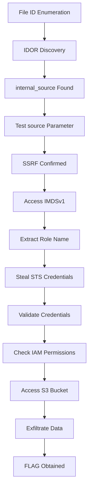

# legacy-bridge

**Difficulty:** Easy  
**Estimated Time:** 30 min  
**Category:** Shadow API

## Overview

Beaver Finance, a US credit card issuer, consolidated multiple systems through rapid acquisitions and merged them into a centralized cloud environment. A modern v5 customer portal serves as the public entry point, but to maintain compatibility with legacy services, undocumented v1 systems (IVR, older mobile app, batch jobs) continue operating on the internal network.

The security team believed these legacy systems were isolated, but a misconfiguration in the v5 portal's URL forwarding exposed an internal "Shadow API" connection, allowing attackers from the public internet to reach the v1 backend.

### References

- [Capital One 2019 Breach](https://www.capitalone.com/digital/facts2019/) - Large-scale PII theft via SSRF-based IMDSv1 metadata access and over-privileged IAM roles
- [AWS EC2 Metadata Service (IMDSv1)](https://docs.aws.amazon.com/AWSEC2/latest/UserGuide/instancedata-data-retrieval.html)
- [OWASP API Security Top 10 - IDOR](https://owasp.org/www-project-api-security/API3-2023-Broken-Object-Level-Authorization.html)
- [OWASP API Security Top 10 - SSRF](https://owasp.org/www-project-api-security/API7-2023-Server-Side-Request-Forgery-SSRF.html)

## Learning Objectives

- Understand security risks created by integrating legacy systems
- Identify access control flaws (IDOR) in API design
- Access internal services through SSRF vulnerabilities
- Steal AWS credentials from the IMDSv1 metadata service
- Use stolen credentials to access data in S3

## Scenario Resources

- 1 EC2 instance (Public-Gateway-Server) - v5 portal with forwarding vulnerability
- 1 EC2 instance (Shadow-API-Server) - unprotected v1 legacy node
- 1 S3 bucket (beaver-pii-vault) - stores customer credit card application data
- 1 IAM role (Gateway-App-Role) - SSM access only
- 1 IAM role (Shadow-API-Role) - S3 bucket read access

## Starting Point

A public gateway URL is provided. No authentication is required.

```
http://<gateway-ip>
```

## Goal

Download the flag file from S3.

## Setup & Cleanup

- [[setup.md](./setup.md)] - Deploy scenario infrastructure with Terraform
- [[cleanup.md](./cleanup.md)] - Remove all resources

> **Warning:** This scenario creates real AWS resources that may incur costs. Be sure to clean up after the exercise.

## Walkthrough



See [[walkthrough.md](./walkthrough.md)] for detailed exploitation steps.