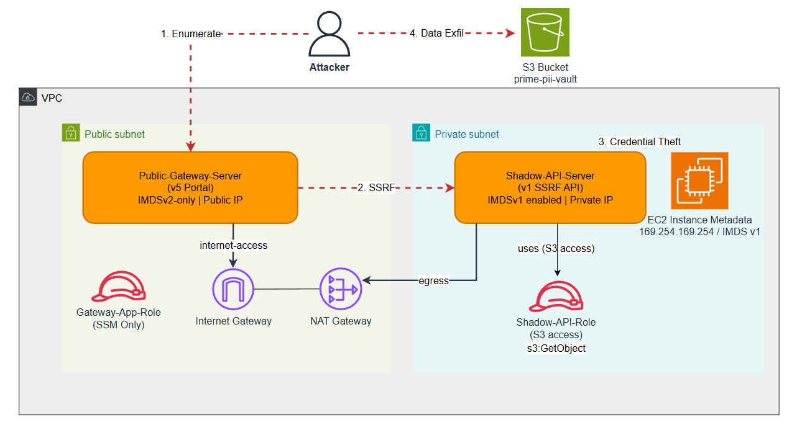
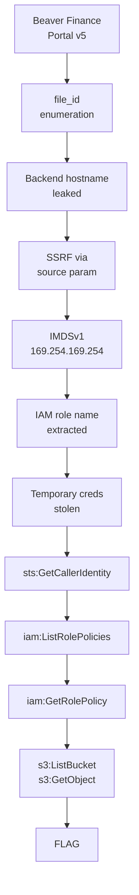

# Legacy Bridge

**Difficulty:** Easy  
**Estimated Time:** 30 min  
**Type:** multi-hop

## Overview

Beaver Finance, a US credit card issuer, consolidated multiple systems through rapid acquisitions and merged them into a centralized cloud environment.

**v5 Portal** is the modernized public-facing customer portal. It runs on a public EC2 instance with IMDSv2 enforced, handles document lookups, and forwards certain requests to the internal v1 backend for legacy compatibility.

**v1 Shadow API** is an undocumented legacy backend originally built for IVR systems, older mobile apps, and batch jobs. It was never decommissioned — it runs on a private EC2 instance with no authentication, IMDSv1 enabled, and is only supposed to be reachable from within the internal network.

The security team believed the v1 backend was isolated behind the private subnet. However, a misconfiguration in the v5 portal's URL forwarding parameter exposed a direct path to the v1 backend, allowing attackers from the public internet to reach it via SSRF.

### References

- **Capital One 2019 Breach** - Large-scale PII theft via SSRF-based IMDSv1 metadata access and over-privileged IAM roles
  - [Capital One: Facts 2019](https://www.capitalone.com/digital/facts2019/)
- **AWS EC2 Metadata Service (IMDSv1)** - Official documentation for retrieving instance metadata including IAM role credentials
  - [AWS Docs: Instance Metadata Retrieval](https://docs.aws.amazon.com/AWSEC2/latest/UserGuide/instancedata-data-retrieval.html)
- **OWASP API Security Top 10 - SSRF** - Server-side request forgery vulnerability allowing attackers to induce the server to make requests to unintended locations
  - [OWASP: API7:2023 SSRF](https://owasp.org/www-project-api-security/API7-2023-Server-Side-Request-Forgery-SSRF.html)

## Learning Objectives

- Understand security risks created by integrating legacy systems
- Identify unauthenticated API endpoints that expose internal service information
- Access internal services through SSRF vulnerabilities
- Steal AWS credentials from the IMDSv1 metadata service
- Use stolen credentials to access data in S3

## Scenario Resources

- 1 EC2 instance (Public-Gateway-Server) - v5 portal with forwarding vulnerability
- 1 EC2 instance (Shadow-API-Server) - unprotected v1 legacy node
- 1 S3 bucket (legacy-bridge-pii-vault-`<suffix>`) - stores customer credit card application data
- 1 IAM role (Gateway-App-Role) - SSM access only
- 1 IAM role (Shadow-API-Role) - S3 bucket read access

## Starting Point

A public gateway URL is provided. No authentication is required.

```
http://<gateway-ip>
```

## Goal

Download the flag file from S3.

## Infrastructure Architecture



## Setup & Cleanup

- [setup.md](./setup.md) - Deploy scenario infrastructure with Terraform
- [cleanup.md](./cleanup.md) - Remove all resources

> **Warning:** This scenario creates real AWS resources that may incur costs. Be sure to clean up after the exercise.

## Walkthrough



See [walkthrough.md](./walkthrough.md) for detailed exploitation steps.