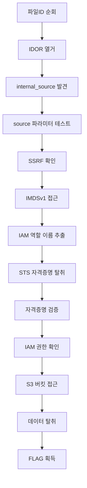

# legacy-bridge

**난이도:** 초급  
**예상 시간:** 30분  
**카테고리:** Shadow API

## Overview

미국 신용카드 발급사인 Beaver Finance는 급속한 인수합병으로 여러 다른 시스템을 클라우드에 통합했습니다. 최신의 v5 고객 포탈이 공개 진입점이지만, 기존 서비스와의 호환성을 위해 내부 네트워크에서는 문서화되지 않은 v1 레거시 시스템들(IVR, 구형 모바일 앱, 배치 작업)이 계속 운영 중입니다.

보안팀은 이 레거시 시스템이 격리되어 있다고 생각했지만, v5 포탈의 URL 포워딩 설정 오류가 "Shadow API"라는 내부 연결을 노출시켜 공격자가 공개 인터넷에서 v1 백엔드에 접근할 수 있게 되었습니다.

### References

- [Capital One 2019 사건](https://www.capitalone.com/digital/facts2019/) - SSRF를 통한 IMDSv1 메타데이터 접근과 과권한 IAM 역할로 인한 대규모 PII 탈취
- [AWS EC2 메타데이터 서비스 (IMDSv1)](https://docs.aws.amazon.com/AWSEC2/latest/UserGuide/instancedata-data-retrieval.html)
- [OWASP API Security Top 10 - IDOR](https://owasp.org/www-project-api-security/API3-2023-Broken-Object-Level-Authorization.html)
- [OWASP API Security Top 10 - SSRF](https://owasp.org/www-project-api-security/API7-2023-Server-Side-Request-Forgery-SSRF.html)

## Learning Objectives

- 레거시 시스템 통합이 만드는 보안 위험 이해
- API 설계의 접근 제어 결함(IDOR) 찾기
- SSRF 취약점을 통한 내부 서비스 접근
- IMDSv1 메타데이터 서비스에서 AWS 자격증명 탈취
- 탈취한 자격증명으로 S3 데이터에 접근

## Scenario Resources

- 1 EC2 instance (Public-Gateway-Server) - 포워딩 취약점이 있는 v5 포탈
- 1 EC2 instance (Shadow-API-Server) - 보호되지 않은 v1 레거시 노드
- 1 S3 bucket (beaver-pii-vault) - 고객 신용카드 신청 정보 저장
- 1 IAM role (Gateway-App-Role) - SSM 접근만 허용
- 1 IAM role (Shadow-API-Role) - S3 버킷 접근 권한 보유

## Starting Point

공개 게이트웨이 URL이 제공됩니다. 별도의 인증은 필요하지 않습니다.

```
http://<gateway-ip>
```

## Goal

S3에서 플래그 파일을 다운로드하세요.

## Setup & Cleanup

- [[setup.md](./setup.md)] - Terraform으로 시나리오 인프라 배포
- [[cleanup.md](./cleanup.md)] - 모든 리소스 제거

> **Warning:** 이 시나리오는 실제 AWS 리소스를 생성하며 비용이 발생할 수 있습니다. 실습 완료 후 반드시 정리하세요.

## Walkthrough



자세한 풀이는 [[walkthrough_ko.md](./walkthrough_ko.md)]를 참고하세요.