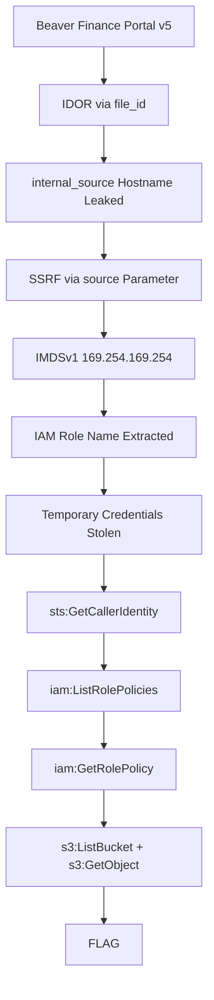

# legacy-bridge

**난이도:** 초급  
**예상 소요 시간:** 30분  
**카테고리:** Shadow API

## 개요

미국 신용카드 발급사 Beaver Finance는 빠른 인수합병을 통해 여러 시스템을 통합하고 중앙화된 클라우드 환경으로 이전했습니다. 현재 모던 v5 고객 포털이 외부 접점으로 운영되고 있지만, 레거시 서비스와의 호환성 유지를 위해 IVR, 구형 모바일 앱, 배치 작업 등 문서화되지 않은 v1 시스템이 내부 네트워크에서 계속 가동 중입니다.

보안팀은 이 레거시 시스템이 격리되어 있다고 판단했지만, v5 포털의 URL 포워딩 설정 오류로 인해 내부 "Shadow API" 연결이 외부에 노출되었습니다. 공격자는 공개 인터넷에서 v1 백엔드에 직접 접근할 수 있습니다.

### 참고 자료

- [Capital One 2019 침해 사고](https://www.capitalone.com/digital/facts2019/) - SSRF 기반 IMDSv1 메타데이터 접근과 과도한 IAM 권한을 통한 대규모 PII 탈취
- [AWS EC2 메타데이터 서비스 (IMDSv1)](https://docs.aws.amazon.com/AWSEC2/latest/UserGuide/instancedata-data-retrieval.html)
- [OWASP API Security Top 10 - IDOR](https://owasp.org/www-project-api-security/API3-2023-Broken-Object-Level-Authorization.html)
- [OWASP API Security Top 10 - SSRF](https://owasp.org/www-project-api-security/API7-2023-Server-Side-Request-Forgery-SSRF.html)

## 학습 목표

- 레거시 시스템 통합으로 발생하는 보안 위협 이해
- API 설계의 접근 제어 결함(IDOR) 식별
- SSRF 취약점을 통한 내부 서비스 접근
- IMDSv1 메타데이터 서비스에서 AWS 자격증명 탈취
- 탈취한 자격증명으로 S3 데이터 접근

## 시나리오 리소스

- EC2 인스턴스 1개 (Public-Gateway-Server) - 포워딩 취약점이 있는 v5 포털
- EC2 인스턴스 1개 (Shadow-API-Server) - 보호되지 않은 v1 레거시 노드
- S3 버킷 1개 (legacy-bridge-pii-vault-`<suffix>`) - 고객 신용카드 신청 데이터 저장
- IAM 역할 1개 (Gateway-App-Role) - SSM 접근만 허용
- IAM 역할 1개 (Shadow-API-Role) - S3 버킷 읽기 접근

## 시작점

공개 게이트웨이 URL이 제공됩니다. 인증은 필요하지 않습니다.

```
http://<gateway-ip>
```

## 목표

S3에서 플래그 파일을 다운로드합니다.

## 설치 및 정리

- [setup.md](./setup.md) - Terraform으로 시나리오 인프라 배포
- [cleanup.md](./cleanup.md) - 모든 리소스 제거

> **경고:** 이 시나리오는 실제 AWS 리소스를 생성하며 비용이 발생할 수 있습니다. 실습 후 반드시 정리해주세요.

## 워크스루



자세한 익스플로잇 단계는 [walkthrough_ko.md](./walkthrough_ko.md)를 참고하세요.