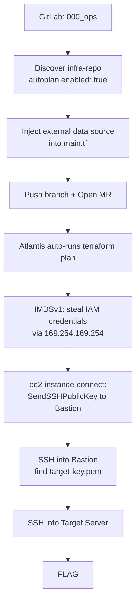

# CI/CD EIC Pivot

**Difficulty:** Medium  
**Estimated Time:** 60 min  
**Type:** multi-hop

## Overview

**BeaverOps Corp.** uses GitLab CE for source control and Atlantis for automated Terraform runs. A routine audit of third-party developer tooling revealed that a malicious package in the internal developer environment had silently exfiltrated a GitLab developer account's credentials (`000_ops`) to an external server — a textbook software supply chain compromise.

With those leaked credentials in hand, the attacker discovers a critical CI/CD misconfiguration: `autoplan.enabled: true` in `atlantis.yaml` with no approval gate on plan. Any Merge Request touching a `.tf` file triggers a live `terraform plan` on the Atlantis runner with full IAM access. The runner pulls instance credentials directly from IMDSv1 with no token requirement.

Starting from the leaked GitLab developer account, players must poison the CI/CD pipeline to exfiltrate IAM credentials, use a legitimate AWS API to inject SSH access onto the Bastion Host, and pivot into an isolated private subnet to retrieve the flag.

### References

- **T1072 - Software Deployment Tools**
  - [MITRE ATT&CK: T1072](https://attack.mitre.org/techniques/T1072/)
- **T1059.004 - Command and Scripting Interpreter: Unix Shell**
  - [MITRE ATT&CK: T1059.004](https://attack.mitre.org/techniques/T1059/004/)
- **T1552.005 - Unsecured Credentials: Cloud Instance Metadata API**
  - [MITRE ATT&CK: T1552.005](https://attack.mitre.org/techniques/T1552/005/)
- **T1098.004 - Account Manipulation: SSH Authorized Keys**
  - [MITRE ATT&CK: T1098.004](https://attack.mitre.org/techniques/T1098/004/)
- **T1021.004 - Remote Services: SSH**
  - [MITRE ATT&CK: T1021.004](https://attack.mitre.org/techniques/T1021/004/)
- **Poisoned Pipeline Execution (PPE)** — Research on abusing CI/CD pipeline permissions to inject malicious code and execute commands in build environments
  - [Cider Security: Poisoned Pipeline Execution](https://www.cidersecurity.io/blog/research/poisoned-pipeline-execution-understanding-an-emerging-attack-vector/)
- **Atlantis Security Best Practices** — Official guidance on why `autoplan.enabled: true` without plan approval creates an unauthenticated code execution vector
  - [Atlantis Docs: Security](https://www.runatlantis.io/docs/security.html)

## Learning Objectives

- Understand how `autoplan.enabled: true` in Atlantis creates an unauthenticated code execution primitive on any Merge Request
- Exploit IMDSv1 via a malicious Terraform `external` data source to exfiltrate IAM credentials from a CI/CD runner
- Abuse `ec2-instance-connect:SendSSHPublicKey` to gain SSH access to an EC2 instance without a pre-shared key
- Perform lateral movement from a public Bastion Host into an isolated private subnet using discovered credentials

## Scenario Resources

- 1 GitLab CE server hosting `infra-repo` with `atlantis.yaml`
- 1 Atlantis server with `autoplan.enabled: true` and IMDSv1 accessible
- 1 Bastion Host (public subnet) holding `target-key.pem`
- 1 Target Server (private subnet) holding the flag
- 1 IAM role with overprivileged `ec2-instance-connect:SendSSHPublicKey` on all instances

## Starting Point

GitLab CE is accessible at `http://<GITLAB_IP>` after deployment. Log in with:

- **Username:** `000_ops`
- **Password:** `BeaverPassword123!`

## Goal

Read the contents of `/home/ubuntu/flag.txt` on the Target Server in the private subnet.

## Setup & Cleanup

- [setup.md](./setup.md) - Deploy scenario infrastructure
- [cleanup.md](./cleanup.md) - Remove all resources

> **Warning:** This scenario creates real AWS resources that may incur costs. The GitLab server uses a `t3.large` instance and takes approximately 15–20 minutes to fully initialize after `terraform apply`.

## Infrastructure Architecture

## Real-world Reference

> **Poisoned Pipeline Execution (PPE):** A technique where an attacker with write access to a repository injects malicious code into a CI/CD pipeline configuration, causing the pipeline to execute attacker-controlled commands in the build environment. Since CI/CD runners operate with elevated cloud credentials, a single malicious commit can exfiltrate IAM keys, tokens, and secrets to an attacker-controlled server — without ever touching the production environment directly. Atlantis's `autoplan.enabled: true` is a direct instance of this pattern: any `.tf` change in a Merge Request becomes arbitrary code execution on the runner.

## Walkthrough

See [walkthrough.md](./walkthrough.md) for detailed exploitation steps.
