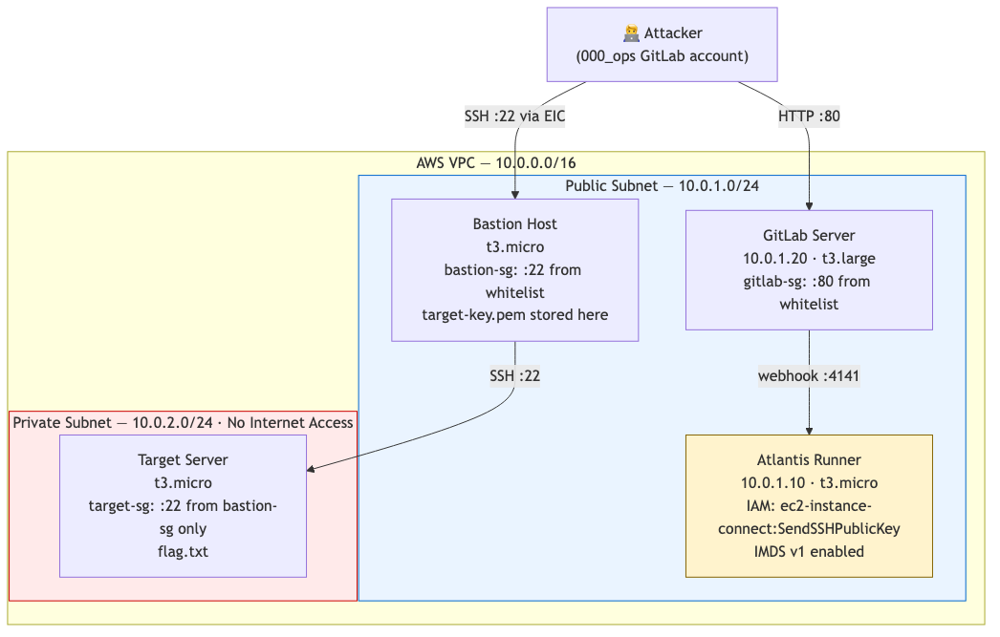
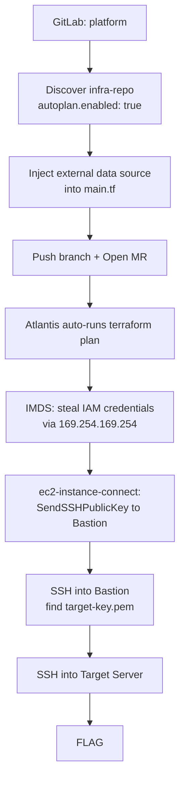

# CI/CD EIC Pivot

**Difficulty:** Medium  
**Estimated Time:** 60 min  
**Type:** multi-hop

## Company Background

**BeaverOps Corp.** is a mid-size SaaS startup running on AWS. The engineering team is in the middle of an infrastructure modernization — transitioning from manual SSH-based deployments to GitOps — but the migration is not complete.

The application is **not yet containerized**. It runs directly on EC2 instances and deploys through a hand-written `deploy.sh` script that handles Docker operations, database migrations, and service restarts on the running instance. When the Platform Engineering team adopted Terraform and Atlantis in Q3 to manage infrastructure as code, the application deployment process did not move with it. There are no containers, no rolling update mechanism, and no dedicated CD pipeline yet.

To bridge the gap, the team configured the Atlantis runner to execute `deploy.sh` directly on the EC2 application server after each Terraform apply — using **EC2 Instance Connect** to inject a temporary SSH key and run the script over SSH. This required adding `ec2-instance-connect:SendSSHPublicKey` to the Atlantis IAM role. The team scoped the permission broadly to avoid updating ARN mappings every time instances rotate.

Three alternatives were evaluated before landing on EIC: `user_data` runs only once at first boot; Ansible required a controller and playbooks the team didn't have bandwidth to set up; AWS CodeDeploy required installing an agent on every instance and maintaining a buildspec — more overhead than was feasible mid-launch. EIC was the fastest path that didn't require a persistent SSH key on disk. The team acknowledged the risk and tracked the migration to CodeDeploy under PLAT-1203, targeting Q1.

Engineering leadership chose GitLab CE over SaaS alternatives to meet SOC 2 Type II data residency requirements — all source code and CI/CD artifacts must remain within the company's own AWS environment.

To accelerate developer feedback loops, the Platform Engineering team enabled `autoplan.enabled: true` in Atlantis. The decision was framed as a developer velocity initiative: every Merge Request touching Terraform should trigger a live plan automatically. No approval gate was added — the team was small, the repo was private, and the assumption was that access control at the GitLab level was sufficient. The PLAT-1203 migration had not yet started when the incident occurred.

## Overview

**BeaverOps Corp.** uses GitLab CE for source control and Atlantis for automated Terraform runs. A routine audit of third-party developer tooling revealed that a malicious package in the internal developer environment had silently exfiltrated a GitLab developer account's credentials (`platform`) to an external server — a textbook software supply chain compromise.

With those leaked credentials in hand, the attacker discovers a critical CI/CD misconfiguration: `autoplan.enabled: true` in `atlantis.yaml` with no approval gate on plan. Any Merge Request touching a `.tf` file triggers a live `terraform plan` on the Atlantis runner with full IAM access.

Starting from the leaked GitLab developer account, players must poison the CI/CD pipeline to exfiltrate IAM credentials, use a legitimate AWS API to inject SSH access onto the Bastion Host, and pivot into an isolated private subnet to retrieve the flag.

### References

- **T1072 - Software Deployment Tools**
  - [MITRE ATT&CK: T1072](https://attack.mitre.org/techniques/T1072/)
- **T1059.004 - Command and Scripting Interpreter: Unix Shell**
  - [MITRE ATT&CK: T1059.004](https://attack.mitre.org/techniques/T1059/004/)
- **T1552.005 - Unsecured Credentials: Cloud Instance Metadata API**
  - [MITRE ATT&CK: T1552.005](https://attack.mitre.org/techniques/T1552/005/)
- **T1098.004 - Account Manipulation: SSH Authorized Keys**
  - [MITRE ATT&CK: T1098.004](https://attack.mitre.org/techniques/T1098/004/)
- **T1021.004 - Remote Services: SSH**
  - [MITRE ATT&CK: T1021.004](https://attack.mitre.org/techniques/T1021/004/)
- **Poisoned Pipeline Execution (PPE)** — Research on abusing CI/CD pipeline permissions to inject malicious code and execute commands in build environments
  - [Cider Security: Poisoned Pipeline Execution](https://www.cidersecurity.io/blog/research/poisoned-pipeline-execution-understanding-an-emerging-attack-vector/)
- **Atlantis Security Best Practices** — Official guidance on why `autoplan.enabled: true` without plan approval creates an unauthenticated code execution vector
  - [Atlantis Docs: Security](https://www.runatlantis.io/docs/security.html)

## Learning Objectives

- Understand how `autoplan.enabled: true` in Atlantis creates an unauthenticated code execution primitive on any Merge Request
- Steal EC2 instance role credentials via IMDS by executing a malicious shell program inside a poisoned Terraform `external` data source
- Abuse `ec2-instance-connect:SendSSHPublicKey` to gain SSH access to an EC2 instance without a pre-shared key
- Perform lateral movement from a public Bastion Host into an isolated private subnet using discovered credentials

## Scenario Resources

- 1 GitLab CE server hosting `infra-repo` with `atlantis.yaml`
- 1 Atlantis server with `autoplan.enabled: true` and an over-privileged IAM role
- 1 Bastion Host (public subnet) holding `target-key.pem`
- 1 Target Server (private subnet) holding the flag
- 1 IAM role with overprivileged `ec2-instance-connect:SendSSHPublicKey` on all instances

## Starting Point

GitLab CE is accessible at `http://<GITLAB_IP>` after deployment. Log in with:

- **Username:** `platform`
- **Password:** `BvrOps@2024`

## Goal

Read the contents of `/home/ubuntu/flag.txt` on the Target Server in the private subnet.

## Setup & Cleanup

- [setup.md](./setup.md) - Deploy scenario infrastructure
- [cleanup.md](./cleanup.md) - Remove all resources

> **Warning:** This scenario creates real AWS resources that may incur costs. The GitLab server uses a `t3.large` instance and takes approximately 15–20 minutes to fully initialize after `terraform apply`.

## Infrastructure Architecture

## Real-world Reference

> **Poisoned Pipeline Execution (PPE):** A technique where an attacker with write access to a repository injects malicious code into a CI/CD pipeline configuration, causing the pipeline to execute attacker-controlled commands in the build environment. Since CI/CD runners operate with elevated cloud credentials, a single malicious commit can exfiltrate IAM keys, tokens, and secrets to an attacker-controlled server — without ever touching the production environment directly. Atlantis's `autoplan.enabled: true` is a direct instance of this pattern: any `.tf` change in a Merge Request becomes arbitrary code execution on the runner.

## Incident Timeline

| Time | Attacker | Platform | Defender |
|------|----------|----------|----------|
| T−∞ | Malicious npm package installed in developer tooling | `autoplan.enabled: true` deployed; PLAT-1203 opened (EIC deployment mechanism — `SendSSHPublicKey` scope unresolved) | No anomaly detected |
| T+0h | `platform` credentials exfiltrated to attacker-controlled server | — | — |
| T+2h | Opens MR with malicious `external` data source in `main.tf` | Atlantis autoplan triggers `terraform plan` — no human review required | — |
| T+2h | `terraform plan` executes shell; IMDS returns `AccessKeyId`, `SecretAccessKey`, `Token` | — | — |
| T+3h | Calls `ec2-instance-connect:SendSSHPublicKey` on Bastion; SSHes in; finds `target-key.pem` | — | — |
| T+4h | SSHes into Target Server via private subnet; reads `flag.txt` | — | — |
| T+20h | — | Rotates Atlantis IAM credentials. Scopes `SendSSHPublicKey` to specific instance ARNs. Schedules PLAT-1203 migration | Suspends `platform` account pending investigation |

> The platform team's `autoplan` — designed to accelerate developer feedback — became the execution primitive. The combination of a compromised developer account, an auto-executing CI/CD pipeline, and an over-privileged instance role created a chain of decisions that individually seemed reasonable and collectively enabled a full credential exfiltration.

## Walkthrough

```mermaid
flowchart TB
    A[GitLab: platform] --> B[Discover infra-repo\nautoplan.enabled: true]
    B --> C[Inject external data source\ninto main.tf]
    C --> D[Push branch + Open MR]
    D --> E[Atlantis auto-runs terraform plan]
    E --> F[IMDS: steal IAM credentials\nvia 169.254.169.254]
    F --> G[ec2-instance-connect:\nSendSSHPublicKey to Bastion]
    G --> H[SSH into Bastion\nfind target-key.pem]
    H --> I[SSH into Target Server]
    I --> J[FLAG]
```

See [walkthrough.md](./walkthrough.md) for detailed exploitation steps.
