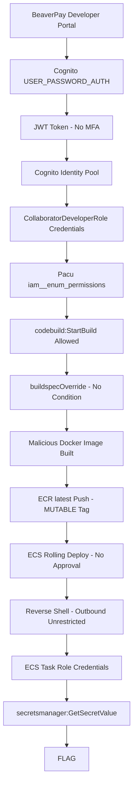

# Dam Breaks

**Difficulty:** Medium

**Estimated Time:** 60 min

**Category:** supply-chain

## Overview

**BeaverPay Inc.** is a fintech startup that began as a B2B payment API provider.
After pivoting to B2C with a consumer wallet app launch, the team focused
entirely on the new service — leaving the old B2B collaborator portal and
its CI/CD pipeline untouched.

A collaborator account at partner firm OtterCode was compromised via
credential stuffing. The attacker used that foothold to enumerate AWS
permissions, discover a misconfigured CodeBuild pipeline, and inject a
malicious Docker image using `buildspecOverride` — without touching a
single line in Git.

The build succeeded. The logs were clean. Nobody noticed.

### References

- **CodeBreach (2025)** - AWS CodeBuild misconfiguration enabling unauthorized privileged builds and CI/CD supply chain attack
  - [Wiz Research: CodeBreach](https://www.wiz.io/blog/wiz-research-codebreach-vulnerability-aws-codebuild)
- **SolarWinds Supply Chain Attack (2020)** - Build process poisoning via compromised developer credentials
  - [TechTarget: SolarWinds Attack Explained](https://www.techtarget.com/searchsecurity/ehandbook/SolarWinds-supply-chain-attack-explained-Need-to-know-info)
- **AWS Cognito Credential Stuffing** - MFA-absent Cognito pools vulnerable to automated login attacks
  - [SUDO Consultants: Pentesting AWS Cognito](https://sudoconsultants.com/pentesting-aws-cognito-user-authentication-risks/)
- **Cognito Identity Pool Excessive Privileges** - Abusing overpermissioned Identity Pools to obtain IAM credentials via JWT exchange
  - [Hacking the Cloud: Cognito Identity Pool Excessive Privileges](https://hackingthe.cloud/aws/exploitation/cognito_identity_pool_excessive_privileges/)

## Learning Objectives

- Understand how Cognito Identity Pool converts JWT into AWS IAM credentials
- Enumerate AWS permissions using Pacu against a real IAM role
- Exploit `buildspecOverride` to hijack a CodeBuild pipeline without modifying Git
- Understand why MUTABLE ECR tags and Rolling ECS deployment create risk
- Understand how ECS Task Role credentials are inherited by containers automatically
- Exfiltrate secrets from AWS Secrets Manager via CloudWatch Logs using the inherited Task Role

## Scenario Resources

- 1 EC2 instance (Developer-Portal) — BeaverPay collaborator portal
- 1 Cognito User Pool — collaborator authentication (MFA: OFF)
- 1 Cognito Identity Pool — JWT → IAM credential exchange
- 1 IAM Role (CollaboratorDeveloperRole) — overly permissive, wildcard resource
- 1 CodeBuild project (webapp-prod-build) — production pipeline, no buildspec condition
- 1 CodeBuild project (webapp-qa-build) — QA pipeline
- 1 ECR repository (beaverpay-webapp) — MUTABLE image tags
- 1 ECS Fargate cluster + service — Rolling deployment, no approval gate
- 1 IAM Role (beaverpay-ecs-task-role) — Secrets Manager read access
- 3 Secrets Manager secrets — db credentials, payment gateway key, flag

## Starting Point

A developer portal URL and collaborator credentials are provided.
Portal   : http://<portal-ip>/
Email    : j.park@ottercode.kr
Password : Otter2022!

## Goal

Extract the FLAG from AWS Secrets Manager.
Secret path: beaverpay/prod/flag-<suffix>

## Setup & Cleanup

- [setup.md](./setup.md) - Deploy scenario infrastructure with Terraform
- [cleanup.md](./cleanup.md) - Remove all resources

> **Warning:** This scenario creates real AWS resources that may incur costs.
> Be sure to clean up after the exercise.

## Walkthrough

See [walkthrough.md](./walkthrough.md) for detailed exploitation steps.