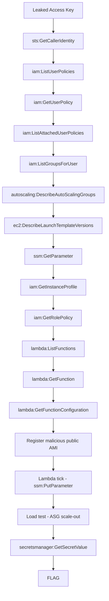

# Golden Drift

**Difficulty:** Medium  
**Estimated Time:** 60 min  
**Type:** single-hop

## Overview

**BeaverDam Corp.** runs a ticketing platform on AWS. The platform team follows AWS best practice for golden AMI management: a Lambda function runs every minute, discovers the latest approved AMI by name, and updates an SSM parameter that the Auto Scaling Group uses as its image source via a Launch Template `resolve:ssm:` reference.

You have obtained read-only AWS credentials from a leaked access key. The ticketing site is experiencing a sudden traffic spike today.

The Lambda that maintains the golden AMI pointer performs its AMI lookup by name — but it omits the `Owners` filter. Any public AMI registered in any AWS account that matches the configured name prefix will be returned by the query. If that AMI has a newer `CreationDate`, the Lambda will silently promote it to the golden pointer.

Corrupt the golden image pipeline. Let the infrastructure do the rest.

### References

- **Datadog Security Labs (2024)** - WhoAMI: a Cloud Image Name Confusion Attack
  - [securitylabs.datadoghq.com/articles/whoami-a-cloud-image-name-confusion-attack](https://securitylabs.datadoghq.com/articles/whoami-a-cloud-image-name-confusion-attack/)
- **AWS Blog** - Manage AMI updates for Auto Scaling groups with AWS Lambda and Systems Manager
  - [aws.amazon.com/blogs/mt/manage-ami-updates-for-aws-auto-scaling-groups-with-aws-lambda-and-aws-systems-manager](https://aws.amazon.com/blogs/mt/manage-ami-updates-for-aws-auto-scaling-groups-with-aws-lambda-and-aws-systems-manager/)
- **AWS Sample Repository** - Update AMIs for ASGs using SSM Automation, Lambda, and Parameter Store
  - [github.com/aws-samples/Update-AMIs-for-ASGs-by-using-SSM-Automation-AWS-Lambda-and-SSM-Parameter-Store](https://github.com/aws-samples/Update-AMIs-for-ASGs-by-using-SSM-Automation-AWS-Lambda-and-SSM-Parameter-Store)
- MITRE ATT&CK: [T1078.004 - Valid Accounts: Cloud Accounts](https://attack.mitre.org/techniques/T1078/004/)

## Learning Objectives

- Understand how the `resolve:ssm:` pattern in Launch Templates creates a dynamic dependency on an SSM parameter
- Identify the security implication of omitting the `Owners` filter in an EC2 `describe_images` call
- Understand how EC2 IAM instance profiles are inherited by every instance the ASG launches, including attacker-controlled ones
- Practice the complete WhoAMI attack chain: reconnaissance → AMI name confusion → Lambda-mediated SSM poisoning → ASG scale-out exploitation

## Scenario Resources

- 1 IAM User with leaked Access Key (read-only permissions)
- 1 VPC with 2 public subnets across different Availability Zones
- 1 Application Load Balancer (HTTP, IP-whitelisted to the participant)
- 1 Auto Scaling Group (`min=1`, `desired=1`, `max=2`, CPU target 30%)
- 1 Launch Template (ImageId via `resolve:ssm:` reference)
- 1 SSM Parameter storing the current golden AMI ID
- 1 Legitimate golden AMI (baked during deployment)
- 1 Lambda function updating the golden AMI pointer every minute (vulnerable: no `Owners` filter)
- 1 EC2 IAM Instance Profile granting `secretsmanager:GetSecretValue` on the flag secret
- 1 Secrets Manager secret containing the flag

## Starting Point

A leaked AWS Access Key is provided via Terraform output:
- AWS Access Key ID
- AWS Secret Access Key

> **Note:** This scenario also requires a **separate personal AWS account** to register the malicious public AMI. See [setup.md](./setup.md) for details.

## Goal

Exfiltrate the flag from AWS Secrets Manager by getting your malicious AMI promoted as the golden image and launched by the Auto Scaling Group.

## Setup & Cleanup

- [setup.md](./setup.md) - Deploy scenario infrastructure
- [cleanup.md](./cleanup.md) - Remove all resources

> **Warning:** This scenario creates real AWS resources that may incur costs.

## Walkthrough

See [walkthrough.md](./walkthrough.md) for detailed exploitation steps.
