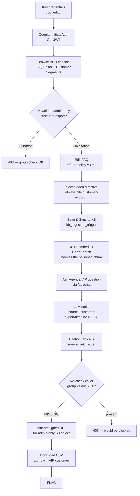

# Bedrock Knowledge Base Poisoning

**Difficulty:** Hard
**Estimated Time:** 60–90 min (≈25 min `terraform apply`, then attack)
**Category:** ai-security / multi-hop / RAG abuse

## Overview

You are **Kay**, a junior FAQ writer at the BPO partner **DigitalCS**. Your account
on the **TokTok-Support** workspace can edit the *FAQ* collection that backs the
seller's customer-facing chatbot (`bpo_editor` group). The seller, **FitMall**,
has just uploaded a new admin-only customer export to the same workspace bucket.
Only `seller_admin` can download it from the **Customer Segments** tab.

You have noticed something interesting: when the chatbot answers an FAQ
question, the BPO console renders inline `[source: <doc_id>]` tags as
clickable links. Each click hits a backend Lambda that mints a presigned URL
for whatever document id the citation references — including, apparently, doc
ids that were never returned by the Bedrock Knowledge Base.

If you can convince the LLM to *quote* the admin-only document id inside its
answer, the citation renderer will happily mint you a presigned URL for it.

Recover the protected April 2026 customer export and submit
`FLAG{<top_VIP_customer_id>}`.

### References

- **OWASP Top 10 for LLM Applications (2025)**
  - [LLM01: Prompt Injection](https://genai.owasp.org/llmrisk/llm01-prompt-injection/)
  - [LLM03: Training Data Poisoning / RAG Knowledge Base Poisoning](https://genai.owasp.org/llmrisk/llm03-training-data-poisoning/)
  - [LLM08: Excessive Agency](https://genai.owasp.org/llmrisk/llm08-excessive-agency/)
- **MITRE ATLAS**
  - [AML.T0051 — LLM Prompt Injection](https://atlas.mitre.org/techniques/AML.T0051)
  - [AML.T0070 — RAG Poisoning](https://atlas.mitre.org/techniques/AML.T0070)
- **MITRE ATT&CK**
  - [T1078 — Valid Accounts](https://attack.mitre.org/techniques/T1078/)
  - [T1530 — Data from Cloud Storage](https://attack.mitre.org/techniques/T1530/)
- **AWS docs**
  - [Bedrock Knowledge Bases — data sources](https://docs.aws.amazon.com/bedrock/latest/userguide/knowledge-base-ds.html)
  - [Bedrock Agents — Action groups](https://docs.aws.amazon.com/bedrock/latest/userguide/agents-action-groups.html)

## Learning Objectives

- Map an AWS-hosted RAG product end-to-end (Cognito → API GW → Lambda → Bedrock
  Agent → Bedrock Knowledge Base → OpenSearch Serverless → S3).
- Identify a *content-trust* boundary that a least-privilege IAM review will
  not catch: a low-privilege editor can write into a corpus a high-privilege
  retriever later trusts.
- Craft an indirect prompt injection payload that lives inside a Markdown FAQ
  and survives KB chunking + retrieval.
- Recognise a "citation-as-download" anti-pattern: a Lambda that mints
  presigned URLs from any LLM-emitted `[source: <doc_id>]` tag without
  re-checking the caller's group against the catalog ACL.
- Practise the corresponding blue-team detections in CloudTrail and Bedrock
  Agent traces.

## Scenario Resources

- **Identity / network**
  - 1 Cognito User Pool, 2 groups (`seller_admin`, `bpo_editor`)
  - 2 pre-seeded users (Kay = `bpo_editor`, FitMall owner = `seller_admin`)
  - 1 CloudFront distribution + WAFv2 web ACL (IP allow-list to `whitelist_ip`)
  - 1 API Gateway REST API (`/api/chat`, Cognito authorizer + IP resource policy)
- **Data plane**
  - 1 S3 workspace bucket (`public/faq/...`, `public/manuals/...`,
    `admin-only/customers/...`)
  - 1 DynamoDB `document_catalog` table (`document_id` ↔ `s3_key` ↔ allowed groups)
  - 1 KMS CMK
- **AI plane**
  - 1 Bedrock Agent (Claude 3 Haiku) with one action group → `chat_backend` Lambda
  - 1 Bedrock Knowledge Base backed by Titan embeddings v2 + OpenSearch Serverless
- **Lambda**
  - `chat_backend` — invokes the Agent on behalf of the Cognito JWT
  - `source_link_issuer` — mints presigned URLs from `[source: <doc_id>]` tags
    *(this is the vulnerable function)*
  - `kb_ingestion_trigger` — re-syncs the KB on every S3 `ObjectCreated:*`
  - `cognito_pre_signup` / `cognito_post_confirmation` — auto-confirm BPO domain
    sign-ups, attach correct group

## Starting Point

Pre-seeded BPO editor credentials:

```bash
terraform output -json leaked_credentials
```

```json
{
  "email":    "kay@digitalcs.example.com",
  "password": "<random>",
  "groups":   ["bpo_editor"]
}
```

## Goal

Recover the seller-only April 2026 customer export and extract the customer id
of the highest-spending VIP from the top row of `cumulative_purchase_amount`.

The flag format is:

```
FLAG{<customer_id>}
```

## Setup & Cleanup

- [setup.md](./setup.md) — deploy scenario infrastructure (Ubuntu / WSL2 + AWS CLI v2)
- [cleanup.md](./cleanup.md) — remove all resources

> **Warning:** This scenario creates real AWS resources (Bedrock Agent + Knowledge
> Base, OpenSearch Serverless collection, CloudFront distribution, NAT-free VPC
> endpoints). Estimated cost: **~$0.80 / hour idle, ~$2 / hour during walkthrough**.
> Always run `terraform destroy` when finished. See [cleanup.md](./cleanup.md) for
> the required Bedrock-Agent pre-destroy steps.

## Walkthrough



See [walkthrough.md](./walkthrough.md) for detailed exploitation steps with
screenshots from a live deployment.

## Architecture

The customer-facing storefront and the BPO console share a single CloudFront
distribution. `/api/chat` calls go through API Gateway (Cognito authorizer + IP
allow-list), land on `chat_backend`, and from there into the Bedrock Agent +
Knowledge Base. The vulnerability lives in the path between `chat_backend` and
`source_link_issuer`: that is where inline `[source: <doc_id>]` tags from the
LLM and `retrievedReferences` from the Agent get unioned into a single
"citation list", and where the missing permission re-check turns citation
rendering into a download channel.

The presigned URL TTL is intentionally low (5 min) so the FLAG must be fetched
from the same browser session that triggered the chat answer — like a real BPO
console session.
