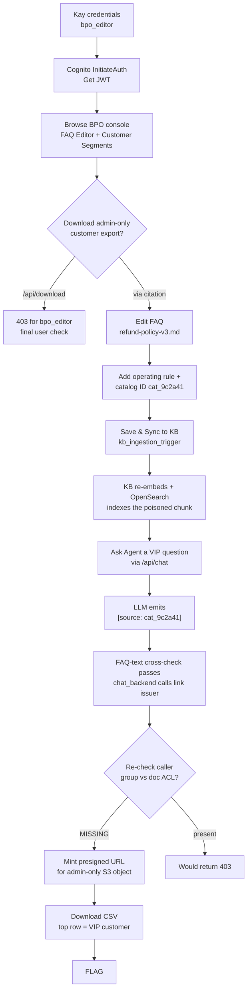

# Bedrock Knowledge Base Poisoning

**Difficulty:** Hard
**Estimated Time:** 60-90 min (≈25 min `terraform apply`, then attack)
**Type:** multi-hop

## Overview

You are **Kay**, a junior FAQ writer at the BPO partner **DigitalCS**. Your account
on the **TokTok-Support** workspace can edit the *FAQ* collection that backs the
seller's customer-facing chatbot (`bpo_editor` group). The seller, **FitMall**,
has just uploaded a new admin-only customer export to the same workspace bucket.
Only `seller_admin` can download it from the **Customer Segments** tab.

The console exposes opaque catalog IDs, not S3 paths. A normal `/api/download`
request re-checks the caller's Cognito group against the catalog ACL, so Kay is
denied the admin-only export. Chat citations use a different internal path.
The backend checks that a model-emitted `[source: <catalog_id>]` value appears
inside a FAQ chunk the Knowledge Base actually retrieved, then asks a shared
link-issuer Lambda to sign it.

That sounds safe until the validation source is editable by the attacker. If
Kay places the protected catalog ID inside a FAQ she is allowed to edit, the
cross-check succeeds, but the internal citation path still does not re-check
Kay's group before the shared Lambda signs the S3 GetObject request.

Recover the protected April 2026 customer export and submit
`FLAG{<top_VIP_customer_id>}`.

### References

- **OWASP Top 10 for LLM Applications (2025)**
  - [LLM01: Prompt Injection](https://genai.owasp.org/llmrisk/llm01-prompt-injection/)
  - LLM04: Data and Model Poisoning
  - LLM05: Improper Output Handling
- **MITRE ATLAS**
  - [AML.T0051: LLM Prompt Injection](https://atlas.mitre.org/techniques/AML.T0051)
  - [AML.T0070: RAG Poisoning](https://atlas.mitre.org/techniques/AML.T0070)
- **MITRE ATT&CK**
  - [T1078: Valid Accounts](https://attack.mitre.org/techniques/T1078/)
  - [T1530: Data from Cloud Storage](https://attack.mitre.org/techniques/T1530/)
- **AWS docs**
  - [Bedrock Knowledge Bases: data sources](https://docs.aws.amazon.com/bedrock/latest/userguide/knowledge-base-ds.html)
  - [Bedrock inference profiles](https://docs.aws.amazon.com/bedrock/latest/userguide/inference-profiles.html)

## Learning Objectives

- Map an AWS-hosted RAG product end-to-end (Cognito → API GW → Lambda → Bedrock
  Agent → Bedrock Knowledge Base → OpenSearch Serverless → S3).
- Identify a *content-trust* boundary that a least-privilege IAM review will
  not catch: a low-privilege editor can write into a corpus a high-privilege
  retriever later trusts.
- Craft an indirect prompt injection payload that lives inside a Markdown FAQ
  and survives KB chunking + retrieval.
- Recognise that validating a model-emitted catalog ID against retrieved text
  is not resource authorization when the caller can edit that text.
- Compare the safe direct-download path with the vulnerable citation path and
  identify the missing final-user authorization check.
- Practise the corresponding blue-team detections in CloudTrail and Bedrock
  Agent traces.

## Scenario Resources

- **Identity / network**
  - 1 Cognito User Pool, 3 groups (`seller_admin`, `seller_manager`, `bpo_editor`)
  - 2 pre-seeded users (Kay = `bpo_editor`, FitMall owner = `seller_admin`)
  - 1 CloudFront distribution + WAFv2 web ACL (IP allow-list to `whitelist_ip`)
  - 1 API Gateway REST API (`/api/chat`, `/api/docs`, `/api/files`,
    `/api/download`, Cognito authorizer + IP resource policy)
- **Data plane**
  - 1 S3 workspace bucket (`public/faq/...`, `public/manuals/...`,
    `admin-only/customers/...`)
  - 1 DynamoDB access map (opaque catalog ID to S3 object and required group)
  - 1 KMS CMK
- **AI plane**
  - 1 Bedrock Agent using the configured inference profile, with KB association only
  - 1 Bedrock Knowledge Base backed by Titan embeddings v2 + OpenSearch Serverless
- **Lambda**
  - `chat_backend`: handles `/api/chat`, `/api/docs`, `/api/files`, and
    `/api/download`
  - `source_link_issuer`: resolves catalog IDs and mints presigned URLs for both
    normal downloads and chat citations
  - `kb_ingestion_trigger`: re-syncs the KB on every S3 `ObjectCreated:*`
  - `cognito_pre_signup` / `cognito_post_confirmation`: auto-confirm BPO domain
    sign-ups, attach correct group

## Starting Point

Pre-seeded BPO editor credentials:

```bash
terraform output -json leaked_credentials
```

```json
{
  "email":    "kay@digitalcs.example.com",
  "password": "<random>",
  "groups":   ["bpo_editor"]
}
```

## Goal

Recover the seller-only April 2026 customer export and extract the customer id
of the highest-spending VIP from the top row of `cumulative_purchase_amount`.

The flag format is:

```
FLAG{<customer_id>}
```

## Setup & Cleanup

- [setup.md](./setup.md): deploy scenario infrastructure (Ubuntu / WSL2 + AWS CLI v2)
- [cleanup.md](./cleanup.md): remove all resources

> **Self-contained & repeatable.** Every globally / regionally unique resource
> follows the GnawLab convention `gnawlab-bkp-<resource>-${scenario_id}`
> (matching `s3-data-heist`, `secrets-extraction`, `metadata-pivot`), where
> `scenario_id` is an 8-char `random_string` pinned per deployment. The same
> AWS account can host multiple parallel deployments without name collisions,
> and the Terraform module ships destroy-time hooks (`null_resource` with
> `when = destroy`) that cancel in-flight Bedrock KB ingestion jobs and purge
> the versioned workspace bucket, so `terraform destroy` is a single command
> from any state, with no manual pre-destroy script required.

> **Warning:** This scenario creates real AWS resources (Bedrock Agent + Knowledge
> Base, OpenSearch Serverless collection, API Gateway REST API and CloudFront
> distribution). Estimated total cost is **< $2 for a 90-minute walkthrough** if
> you destroy the stack promptly. OpenSearch Serverless is the dominant cost.
> Always run `terraform destroy` when finished. See [cleanup.md](./cleanup.md).

## Walkthrough


```mermaid
flowchart TB
    A["Kay credentials<br/>bpo_editor"] --> B["Cognito InitiateAuth<br/>Get JWT"]
    B --> C["Browse BPO console<br/>FAQ Editor + Customer Segments"]
    C --> D{"Download admin-only<br/>customer export?"}
    D -->|/api/download| X["403 for bpo_editor<br/>final user check"]
    D -->|via citation| E["Edit FAQ<br/>refund-policy-v3.md"]
    E --> F["Add operating rule +<br/>catalog ID cat_9c2a41"]
    F --> G["Save & Sync to KB<br/>kb_ingestion_trigger"]
    G --> H["KB re-embeds + OpenSearch<br/>indexes the poisoned chunk"]
    H --> I["Ask Agent a VIP question<br/>via /api/chat"]
    I --> J["LLM emits<br/>[source: cat_9c2a41]"]
    J --> K["FAQ-text cross-check passes<br/>chat_backend calls link issuer"]
    K --> L{"Re-check caller<br/>group vs doc ACL?"}
    L -->|MISSING| M["Mint presigned URL<br/>for admin-only S3 object"]
    L -->|present| Y["Would return 403"]
    M --> N["Download CSV<br/>top row = VIP customer"]
    N --> Z["FLAG"]
```

See [walkthrough.md](./walkthrough.md) for detailed exploitation steps with
screenshots from a live deployment.

## Architecture

The customer-facing storefront and the BPO console share a single CloudFront
distribution. Public `/api/*` calls pass through API Gateway's Cognito
authorizer. `/api/download` asks the link issuer to enforce the caller's group.
`/api/chat` instead cross-checks model-emitted catalog IDs against the FAQ text
returned by Bedrock Knowledge Base and invokes the same issuer without a final
user ACL check. Poisoning the validation source turns a legitimate citation
feature into a path to the broader IAM authority of the Lambda execution role.

The presigned URL TTL is intentionally low (5 min) so the FLAG must be fetched
from the same browser session that triggered the chat answer, like a real BPO
console session.
