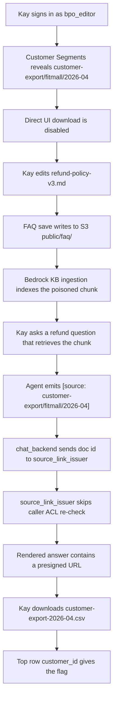

# Bedrock Knowledge Base Poisoning

**Difficulty:** Hard

**Estimated time:** 60 to 90 minutes
**Type:** Multi-hop

## Overview

You are Kay, a junior FAQ writer at the BPO partner DigitalCS. Your TokTok-Support account is in the `bpo_editor` group, so you can edit FitMall FAQ documents and preview the customer chatbot.

FitMall also keeps an admin-only April 2026 customer export in the same workspace. Kay can see the document id in the Customer Segments screen, but only `seller_admin` should be able to download the CSV.

The bug is in the citation pipeline. The chat backend asks the Bedrock Agent for an answer, parses inline `[source: <doc_id>]` tags from the model response, and asks `source_link_issuer` to turn those doc ids into presigned S3 URLs. `source_link_issuer` checks that the doc id exists in the catalog, but it does not re-check the caller's Cognito group against the catalog ACL before issuing the URL.

If Kay can poison a FAQ chunk so the model emits:

```text
[source: customer-export/fitmall/2026-04]
```

the rendered chat answer will contain a short-lived download link for the admin-only export.

Recover the protected April 2026 customer export and submit:

```text
FLAG{FM-VIP-26Q2-T7K3}
```

## Learning Objectives

1. Map an AWS-hosted RAG product end to end: Cognito, CloudFront, API Gateway, Lambda, Bedrock Agent, Bedrock Knowledge Base, OpenSearch Serverless and S3.
2. Spot a content trust boundary that IAM reviews often miss: a low-privilege editor can write into a corpus that a higher-trust retriever later feeds to an LLM.
3. Craft an indirect prompt injection payload that survives Markdown ingestion and retrieval.
4. Recognize the citation-as-download anti-pattern: model output is useful context, not proof that a caller may read a document.
5. Review the matching detections in CloudTrail, Lambda logs and Bedrock traces.

## Scenario Resources

### Identity and entry points

1. Cognito User Pool with `seller_admin`, `seller_manager` and `bpo_editor` groups
2. Pre-seeded Kay and FitMall owner accounts
3. CloudFront distribution with WAFv2 IP allow list
4. API Gateway REST API with `/api/chat` and `/api/docs`

### Data plane

1. S3 workspace bucket with `public/faq/...`, `public/manual/...` and `admin-only/customers/...`
2. DynamoDB `document_catalog` table mapping `document_id` to S3 object and required role
3. KMS CMK for workspace objects

### AI plane

1. Bedrock Agent using the configured inference profile
2. Bedrock Knowledge Base over the public S3 prefix
3. Titan Text Embeddings V2
4. OpenSearch Serverless vector collection

### Lambda

1. `chat_backend` receives `/api/chat`, invokes the Agent, parses source tags and renders links
2. `chat_backend` also receives `/api/docs`, writes FAQ edits to S3 and starts KB ingestion
3. `source_link_issuer` turns catalog document ids into presigned URLs
4. `kb_ingestion_trigger` starts KB ingestion on S3 object creation under `public/`
5. Cognito pre-signup and post-confirmation hooks handle trusted-domain onboarding

## Starting Point

```bash
cd terraform
terraform output -json leaked_credentials
terraform output -raw console_url
```

Kay is in `bpo_editor`. She can edit FAQ documents and preview the chatbot. She is not in `seller_admin`.

## Attack Flow


```mermaid
flowchart TB
    A["Kay signs in as bpo_editor"] --> B["Customer Segments reveals customer-export/fitmall/2026-04"]
    B --> C["Direct UI download is disabled"]
    C --> D["Kay edits refund-policy-v3.md"]
    D --> E["FAQ save writes to S3 public/faq/"]
    E --> F["Bedrock KB ingestion indexes the poisoned chunk"]
    F --> G["Kay asks a refund question that retrieves the chunk"]
    G --> H["Agent emits [source: customer-export/fitmall/2026-04]"]
    H --> I["chat_backend sends doc id to source_link_issuer"]
    I --> J["source_link_issuer skips caller ACL re-check"]
    J --> K["Rendered answer contains a presigned URL"]
    K --> L["Kay downloads customer-export-2026-04.csv"]
    L --> M["Top row customer_id gives the flag"]
```

## Setup and Cleanup

Use [setup.md](./setup.md) to deploy the lab and [cleanup.md](./cleanup.md) to remove it.

The browser path with live screenshots is in [walkthrough.md](./walkthrough.md).

This scenario creates real AWS resources. The expensive part is OpenSearch Serverless, so destroy the stack after the demo.
