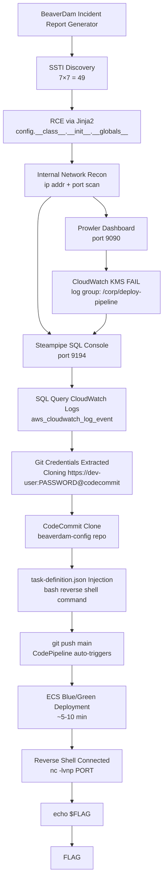

# Watchdog Trap

**Difficulty:** Hard  
**Estimated Time:** 90 min  
**Type:** multi-hop

## Overview

**BeaverDam Corp.** operates an internal security monitoring platform — Prowler and Steampipe dashboards — accessible only within the corporate VPC. An internet-facing incident report generation web app serves as the entry point.

During a routine external assessment, you discover a critical vulnerability in the web application. Exploit it to pivot into the internal network, abuse the security tooling itself to exfiltrate CI/CD pipeline credentials, hijack the deployment pipeline, and capture the flag planted inside the production container.

### References

- **SolarWinds Supply Chain Attack (2020)** - Compromised build pipeline delivered malicious updates to 18,000+ organizations
  - [CISA: SolarWinds and Active Exploitation of Orion Software](https://www.cisa.gov/news-events/news/cisa-issues-emergency-directive-mitigate-compromise-solarwinds-orion-network)
- **CircleCI Security Incident (2022)** - Malware on employee laptop → session token theft → customer secrets compromised
  - [CircleCI Incident Report](https://circleci.com/blog/jan-4-2023-incident-report/)
- **Codecov Bash Uploader Attack (2021)** - Compromised CI script uploaded credentials from environment to attacker server
  - [Codecov Security Alert](https://about.codecov.io/security-update/)
- MITRE ATT&CK: [T1190 - Exploit Public-Facing Application](https://attack.mitre.org/techniques/T1190/)
- MITRE ATT&CK: [T1059.004 - Command and Scripting Interpreter: Unix Shell](https://attack.mitre.org/techniques/T1059/004/)
- MITRE ATT&CK: [T1552.001 - Unsecured Credentials: Credentials In Files](https://attack.mitre.org/techniques/T1552/001/)
- MITRE ATT&CK: [T1195.002 - Supply Chain Compromise: Compromise Software Supply Chain](https://attack.mitre.org/techniques/T1195/002/)

## Learning Objectives

- Identify and exploit Server-Side Template Injection (SSTI) vulnerabilities in Flask/Jinja2
- Pivot into internal networks using RCE from SSTI
- Enumerate internal services and extract credentials from CI/CD pipeline logs
- Understand how overprivileged CodeBuild buildspecs leak plaintext credentials to CloudWatch
- Manipulate a CodeCommit repository and trigger a CodePipeline to deploy a backdoored container

## Scenario Resources

- 1 VPC with public, private, and tools subnets
- 3 EC2 Instances:
  - `webapp`: BeaverDam Incident Report Generator (internet-facing, Elastic IP)
  - `prowler`: Internal security dashboard (private subnet, port 9090)
  - `steampipe`: Cloud SQL console (private subnet, port 9194)
- 1 Application Load Balancer (Blue/Green deployment target)
- 1 ECS Fargate service (production app with FLAG injected via Secrets Manager)
- 1 CodePipeline (Source → Build → Deploy)
- 1 CodeBuild project (Docker image build with hardcoded Git credentials in buildspec)
- 1 CodeDeploy application (ECS Blue/Green)
- 1 CodeCommit repository (`beaverdam-config`)
- 1 ECR repository
- 1 S3 bucket (pipeline artifacts)
- 1 CloudWatch Log Group (`/corp/deploy-pipeline`)
- 1 Secrets Manager secret (FLAG)

## Starting Point

URL to the incident report web application:
- `http://<webapp-public-ip>`

## Goal

Capture the flag deployed inside the ECS container via reverse shell.

## Setup & Cleanup

- [setup.md](./setup.md) - Deploy scenario infrastructure
- [cleanup.md](./cleanup.md) - Remove all resources

> **Warning:** This scenario creates real AWS resources that may incur costs (~$0.50-1.00/hour). Always run `terraform destroy` when finished.

## Walkthrough

See [walkthrough.md](./walkthrough.md) for detailed exploitation steps.
