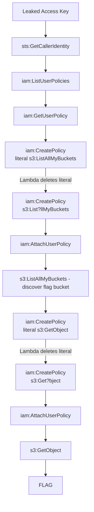

# Obfuscated Policy

**Difficulty:** Easy  
**Estimated Time:** 30 min  
**Type:** single-hop

## Overview

**Beaver Defense Inc.** operates an automated IAM policy detection system. Whenever any IAM user creates or attaches a customer-managed policy, an EventBridge rule invokes a Lambda function that scans the policy document and **deletes** it if it contains dangerous patterns.

You have obtained the credentials of an IAM user with `iam:CreatePolicy` and `iam:AttachUserPolicy` self permissions. The user cannot directly access the company's flag bucket.

The detection Lambda matches blocked patterns as **literal strings** (case-insensitive). However, AWS IAM evaluates `?` and `*` characters inside the **action name portion** of an Action value as wildcards (the service vendor portion before the colon must be a literal name like `s3`). By writing actions such as `s3:Get?bject`, the attacker can grant themselves `s3:GetObject` semantically while the detector sees a string that does not match any blocked literal.

### References

- **AWS IAM Policy Element: Action** - Wildcard support (`?`, `*`) in Action values
  - [AWS Docs: IAM JSON policy elements - Action](https://docs.aws.amazon.com/IAM/latest/UserGuide/reference_policies_elements_action.html)
- **Hacking the Cloud: Obfuscated Admin Policy** - Bypassing IAM policy detection via wildcard obfuscation
  - [Hacking the Cloud: Obfuscated Admin Policy](https://hackingthe.cloud/aws/exploitation/obfuscated_admin_policy/)

## Learning Objectives

- Understand how AWS IAM evaluates wildcard characters (`?`, `*`) inside Action values
- Identify the gap between syntactic (string match) and semantic (IAM-engine) policy evaluation
- Practice the full attacker workflow: identity confirmation → permission enumeration → exploit → flag capture
- Recognize why literal pattern detectors are insufficient and when ValidatePolicy / Access Analyzer should be used

## Scenario Resources

- 1 IAM User with leaked Access Key (limited permissions)
- 1 IAM Permission Boundary on the attacker user (single-account SCP equivalent)
- 1 S3 Bucket containing the flag (IP whitelisted)
- 1 S3 Bucket for CloudTrail log delivery
- 1 CloudTrail trail (management events)
- 1 EventBridge Rule (matches `CreatePolicy`, `AttachUserPolicy`)
- 1 Lambda function performing literal-pattern policy detection
- 1 IAM Role for the detection Lambda

## Starting Point

A leaked AWS Access Key is provided via Terraform output:
- AWS Access Key ID
- AWS Secret Access Key

## Goal

Read the flag stored at `s3://<flag_bucket>/flag.txt` despite the active policy detection system.

## Setup & Cleanup

- [setup.md](./setup.md) - Deploy scenario infrastructure
- [cleanup.md](./cleanup.md) - Remove all resources

> **Warning:** This scenario creates real AWS resources that may incur costs.

## Walkthrough

See [walkthrough.md](./walkthrough.md) for detailed exploitation steps.
