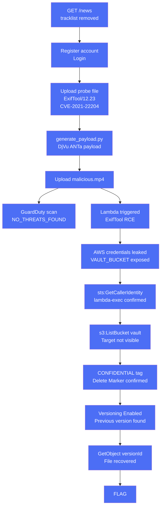

# Hidden Track

**Difficulty:** Medium  
**Estimated Time:** 60 min  
**Type:** multi-hop-combo

## Overview

**BeaverSound** is a music distribution platform that accepts unreleased masters from artists and delivers them to Spotify, Apple Music, and other platforms automatically. Anyone can register a free artist account and submit files.

Uploaded files are processed by a Lambda function — ExifTool extracts audio metadata, then the pipeline archives the file to a private vault bucket. The Lambda execution role holds a broad `s3:*` wildcard on the vault bucket, a convenience policy set during development that was never scoped down before production.

A confidential album tracklist was recently submitted through BeaverSound by an unknown party. The label demanded its immediate removal. The platform complied. The label assumed it was gone.

Nobody checked whether S3 Versioning was enabled.

### References

- **CVE-2021-22204** — ExifTool < 12.24, arbitrary code execution via DjVu annotation metadata. ExifTool identifies file type by magic bytes, not extension — a DjVu file with a `.mp4` extension is parsed as DjVu and triggers the vulnerability
  - [NVD: CVE-2021-22204](https://nvd.nist.gov/vuln/detail/CVE-2021-22204)
- **GitLab RCE via ExifTool (CVE-2021-22205)** — User image upload triggered ExifTool processing → unauthenticated RCE on GitLab. Real-world proof that automated ExifTool pipelines are high-value targets
  - [Invicti: GitLab ExifTool RCE CVE-2021-22205](https://www.invicti.com/web-application-vulnerabilities/gitlab-exiftool-rce-cve-2021-22205)
- **S3 Versioning & Delete Markers** — Deleting a versioned object creates a Delete Marker; the previous version remains accessible via `ListObjectVersions` + `GetObject` with `versionId`
  - [AWS Docs: Using versioning in S3 buckets](https://docs.aws.amazon.com/AmazonS3/latest/userguide/Versioning.html)
  - [AWS Docs: Working with Delete Markers](https://docs.aws.amazon.com/AmazonS3/latest/userguide/DeleteMarker.html)
- **Lambda Execution Role** — Lambda injects IAM role credentials as environment variables into every invocation
  - [AWS Docs: Lambda Execution Role](https://docs.aws.amazon.com/lambda/latest/dg/lambda-intro-execution-role.html)
- MITRE ATT&CK: [T1190 — Exploit Public-Facing Application](https://attack.mitre.org/techniques/T1190/)
- MITRE ATT&CK: [T1530 — Data from Cloud Storage](https://attack.mitre.org/techniques/T1530/)

## Learning Objectives

- Identify exposed version information in HTTP response headers
- Understand how ExifTool identifies file types by magic bytes, not extension
- Generate a DjVu exploit payload (ANTa chunk) that triggers RCE inside a Lambda pipeline
- Understand why GuardDuty Malware Protection for S3 does not block this attack
- Extract AWS IAM credentials from a Lambda execution environment via RCE
- Demonstrate that S3 Versioning preserves deleted objects and exploit the over-permissive IAM role to recover them

## Scenario Resources

- 1 S3 Bucket (`beaversound-uploads`) — upload target, GuardDuty Malware Protection enabled
- 1 S3 Bucket (`beaversound-vault`) — private, S3 Versioning enabled; target file deleted
- 1 Lambda Function (`process-upload`) — processes every upload with ExifTool 12.23; exposes `X-Processor: ExifTool/12.23` response header; archives files to vault bucket
- 1 Lambda Layer — ExifTool 12.23 (unpatched, CVE-2021-22204 affected)
- 1 IAM Role (`beaversound-lambda-exec`) — `s3:GetObject` + `s3:ListBucket` on `beaversound-uploads`; `s3:*` on `beaversound-vault` (over-permissive wildcard, never scoped down from development)
- 1 EC2 Instance — BeaverSound artist portal with `/news` page

## Starting Point

You have discovered a music distribution platform open to public registration.

```
Portal: http://<portal-ip>/
```

Register a free artist account and log in. Start by uploading any file and inspecting the response headers.

## Goal

Recover the deleted file from the vault bucket.

## Setup & Cleanup

- [setup.md](./setup.md) - Deploy scenario infrastructure with Terraform
- [cleanup.md](./cleanup.md) - Remove all resources

> **Warning:** This scenario creates real AWS resources that may incur costs.

## Walkthrough



See [walkthrough.md](./walkthrough.md) for detailed exploitation steps.
