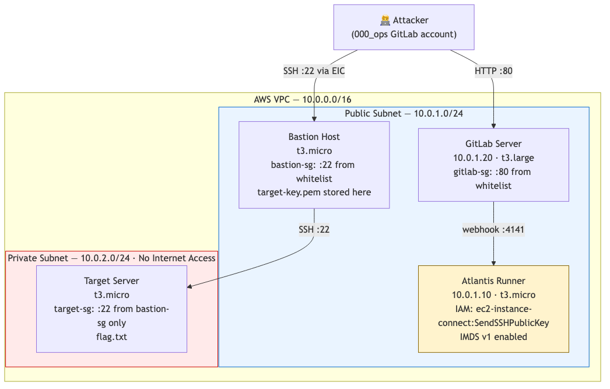

# supply_chain_eic_pivot

**Difficulty:** Hard
**Estimated Time:** 90 min
**Category:** ci-cd/multi-hop

## Overview

This scenario simulates a realistic AWS attack chain involving CI/CD pipeline exploitation and internal network pivoting. Many organizations adopt automation tools like GitLab and Atlantis to accelerate infrastructure deployment, but often grant excessive IAM permissions to pipeline compute resources without proper governance controls.

Starting from a compromised developer account, players must exploit the CI/CD pipeline to steal cloud credentials, abuse a legitimate AWS API to gain initial access, and pivot deep into a production environment completely isolated from the public internet.

## Scenario Resources

- 1 GitLab Account (`000_ops`)
- 1 Repository (`infra-repo`) with `atlantis.yaml`
- 1 Atlantis CI/CD Runner (EC2, overprivileged IAM Role)
- 1 Bastion Host (EC2, Public Subnet)
- 1 Target Server (EC2, Private Subnet — no internet access)
- 1 VPC (Public + Private Subnets, Security Groups)
- 4 IAM Roles / 2 IAM Instance Profiles
- 1 SSM Parameter (used internally for Atlantis token passing)

## Setup

See [setup.md](./setup.md) for deployment instructions.

> **Note:** This scenario creates real AWS resources that may incur costs. GitLab CE requires a `t3.large` instance and takes approximately 10–15 minutes to fully initialize after `terraform apply`.

## Starting Point

- **Start Identity:** GitLab Developer Account (`000_ops`)
- **Provided Credentials:** `assets/gitlab_credentials.txt` — contains the GitLab URL, username, and password after deployment

## Goal

Retrieve the flag from `/home/ubuntu/flag.txt` on the Target Server located in the private subnet.

## Infrastructure Architecture

## Real-world Reference

> [Praetorian](https://www.praetorian.com/blog/terraform-cloud-security-dangers/) — "Terraform CI/CD Supply Chain Attacks" — Demonstrates how `terraform plan` can execute arbitrary code via `external` data sources, enabling credential theft from overprivileged CI/CD runners.

> [Permiso](https://permiso.io/blog/lucr-3-scattered-spider-getting-saas-y-in-the-cloud) — "EC2 Instance Connect Abuse for Lateral Movement" — Documents real-world use of the `SendSSHPublicKey` API as an authentication bypass to gain shell access without pre-shared keys.

## Cleanup

When finished, see [cleanup.md](./cleanup.md) to remove all resources.

> **Warning:** Always verify cleanup to avoid unexpected AWS costs.

---

For the detailed solution, see [walkthrough.md](./walkthrough.md).
