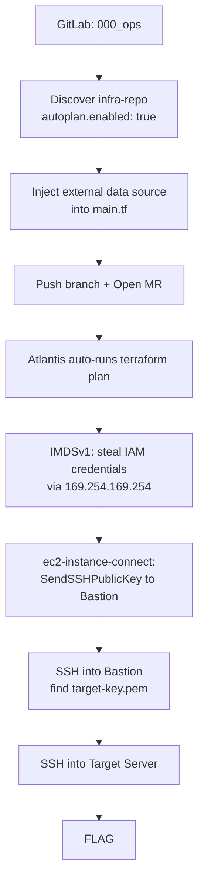

# Supply Chain EIC Pivot — Attack Path

```mermaid
flowchart TB
    A[GitLab: 000_ops] --> B[Discover infra-repo\nautoplan.enabled: true]
    B --> C[Inject external data source\ninto main.tf]
    C --> D[Push branch + Open MR]
    D --> E[Atlantis auto-runs terraform plan]
    E --> F[IMDSv1: steal IAM credentials\nvia 169.254.169.254]
    F --> G[ec2-instance-connect:\nSendSSHPublicKey to Bastion]
    G --> H[SSH into Bastion\nfind target-key.pem]
    H --> I[SSH into Target Server]
    I --> J[FLAG]
```
